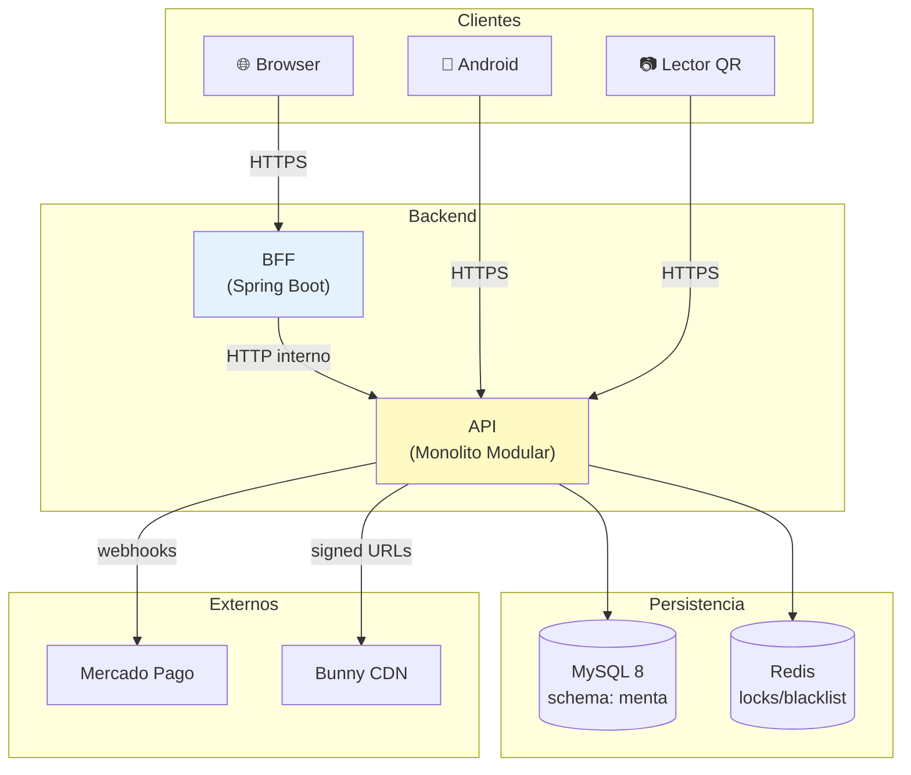
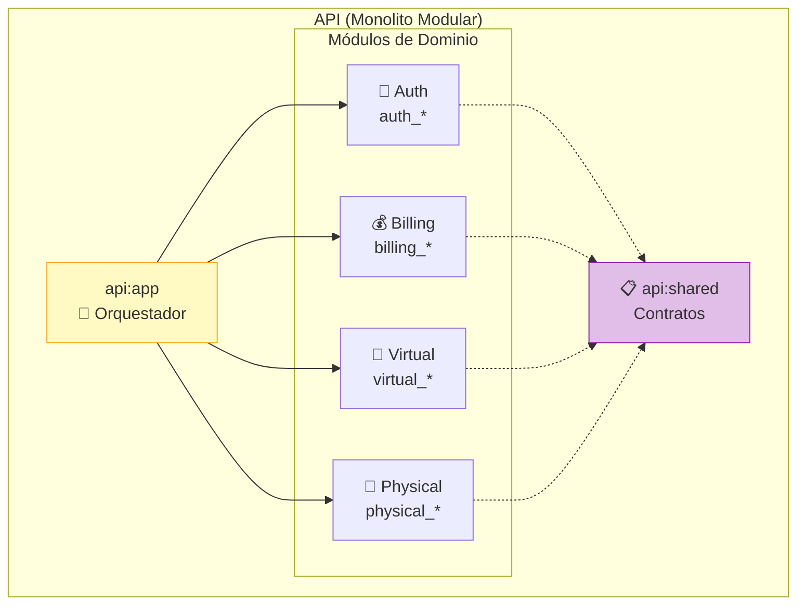
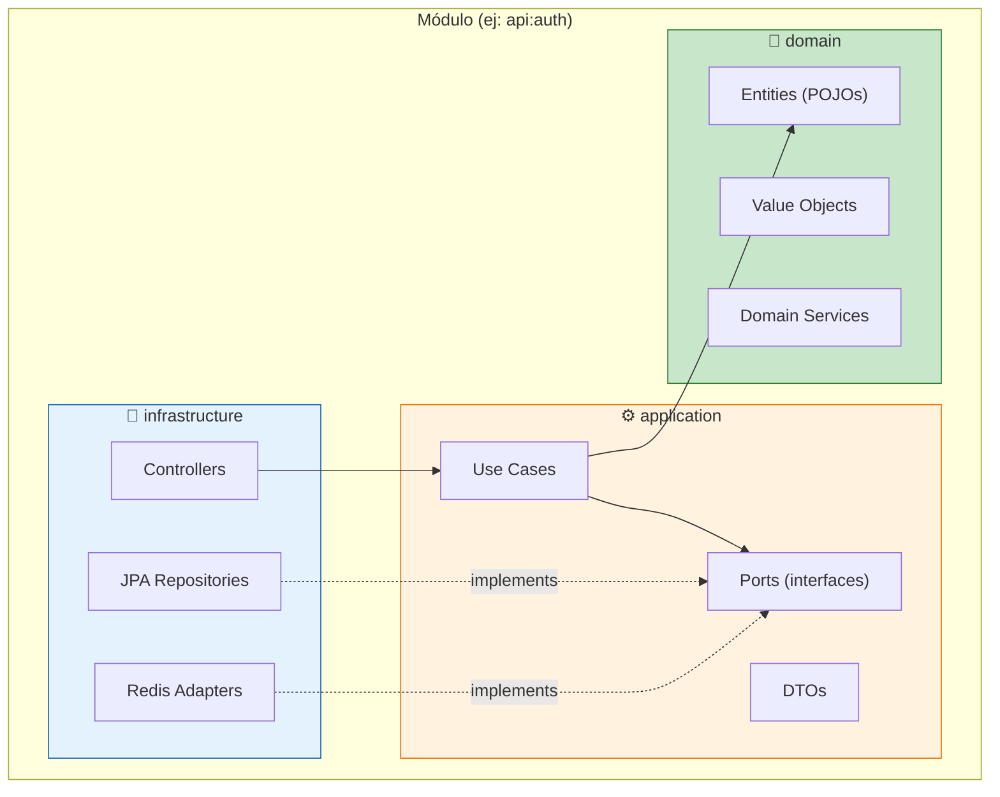
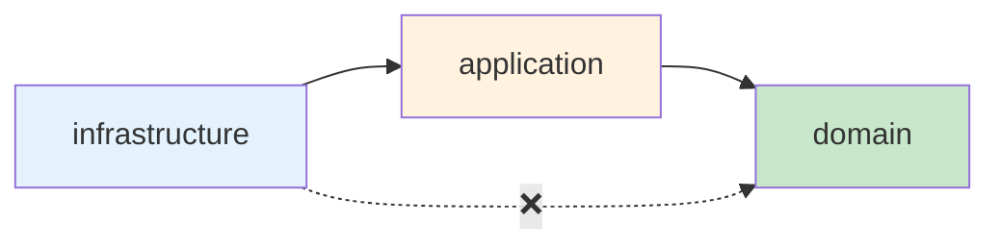
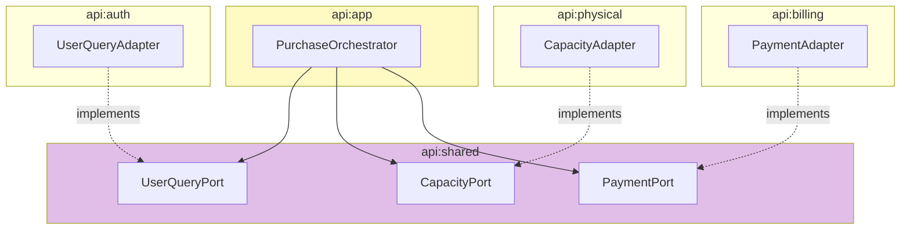
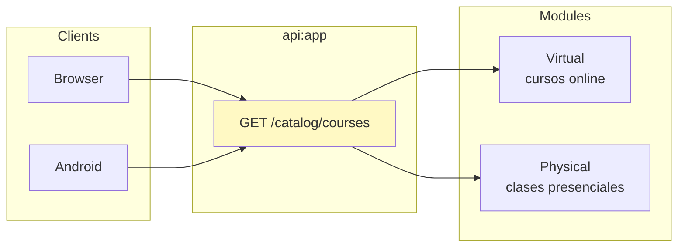
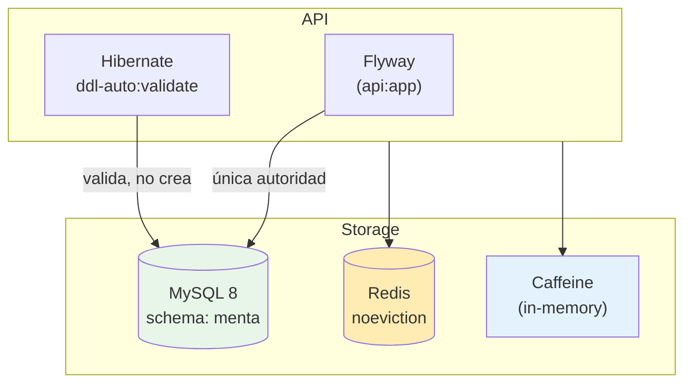
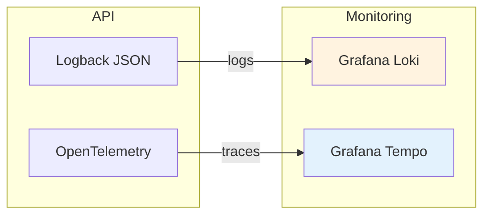

# Arquitectura del Proyecto

[← Volver al índice](./README.md)

---

## Visión General

Menta Dance es un **monolito modular** que gestiona una academia de danza con dos
líneas de negocio: cursos virtuales (video on-demand) y clases presenciales
(sesiones con cupo limitado).



**Principios clave:**
- El BFF es la única frontera web: el navegador nunca recibe tokens JWT
- Android guarda refresh tokens en Keystore; nunca los loguea
- La API centraliza toda la lógica de negocio en módulos aislados

---

## Estructura del Proyecto

```
menta-dance/
├── api/                          # Backend API (Spring Boot 3)
│   ├── app/                      # :api:app — composición y orquestación
│   ├── shared/                   # :api:shared — contratos entre módulos
│   ├── auth/                     # :api:auth — identidad y sesiones
│   ├── billing/                  # :api:billing — pagos y suscripciones
│   ├── virtual/                  # :api:virtual — cursos online
│   └── physical/                 # :api:physical — clases presenciales
├── bff/                          # Web frontend (Thymeleaf)
├── android/                      # App móvil (Kotlin + Compose)
└── docs/                         # Documentación técnica
```

---

## Módulos y Ownership



| Módulo | Es dueño de | Tablas |
|--------|-------------|--------|
| **Auth** | Identidad, roles, sesiones, tokens | `auth_users`, `auth_refresh_tokens`, `auth_outbox` |
| **Billing** | Planes, suscripciones, pagos, quotes | `billing_payments`, `billing_subscriptions`, `billing_outbox` |
| **Virtual** | Cursos online, lecciones, progreso | `virtual_courses`, `virtual_lessons`, `virtual_progress` |
| **Physical** | Clases presenciales, sesiones, cupos, QR | `physical_sessions`, `physical_attendance`, `physical_qr_devices` |

**Reglas de aislamiento:**
- Cada módulo es dueño exclusivo de sus tablas (prefijo `{módulo}_`)
- No se permiten FKs, JOINs ni queries entre módulos
- La comunicación es mediante **puertos Java** definidos en `api:shared`

---

## Clean Architecture

Cada módulo sigue la misma estructura de capas:



**Regla de dependencia:** `infrastructure → application → domain`



| Capa | Contiene | NO puede tener |
|------|----------|----------------|
| **domain** | Entidades, Value Objects, servicios de dominio | Spring, JPA, Redis, ningún framework |
| **application** | Use cases, puertos, DTOs | Controllers, repositories concretos |
| **infrastructure** | Controllers, JPA, adapters externos | Lógica de negocio |

> Validado con **ArchUnit** — los tests fallan si se viola la regla de dependencia.

---

## Comunicación entre Módulos

Los módulos **nunca** se comunican directamente. Usan puertos definidos en `api:shared`:



**Prohibido entre módulos:**
- HTTP interno, WebClient, RestTemplate
- RabbitMQ, Kafka o cualquier broker
- Service discovery o circuit breakers
- JOINs SQL o FKs cruzadas

---

## Catálogo Unificado

El catálogo de cursos es una **proyección de lectura** compuesta por `api:app`:



- `GET /api/v1/catalog/courses` — lista unificada de cursos
- `GET /api/v1/catalog/courses/{courseId}` — detalle de un curso
- Cada curso tiene modalidad `VIRTUAL` o `PHYSICAL` y UUID único
- `api:app` enruta por modalidad al módulo dueño
- No existe tabla compartida ni JOIN entre módulos

---

## Persistencia



| Componente | Rol | Política |
|------------|-----|----------|
| **MySQL** | Fuente de verdad | Schema único `menta`, prefijos por módulo |
| **Flyway** | Migraciones | Solo en `api:app`, inmutables, forward-only |
| **Hibernate** | ORM | `ddl-auto:validate` — nunca modifica schema |
| **Redis** | Blacklist, locks, rate limiting | `noeviction` — falla si lleno |
| **Caffeine** | Caché local | Solo datos reconstruibles, nunca seguridad |

**Fail-closed:** Si Redis no está disponible, toda ruta autenticada falla.

---

## Observabilidad



- **Logs:** JSON estructurado con `correlationId` en cada request
- **Trazas:** OpenTelemetry exporta a Grafana Cloud
- **Retención:** Mínimo 90 días para errores, auditoría de pagos e incidentes
- **Seguridad:** Nunca se loguean passwords, tokens, cookies ni datos de tarjeta

---

## Evolución Futura

La separación en microservicios requiere:
1. Un ADR nuevo que justifique la decisión
2. Migración explícita de datos
3. Infraestructura distribuida (service mesh, brokers)

**El MVP no anticipa esta complejidad.** El monolito modular permite escalar
verticalmente y mantener simplicidad operativa.

---

## Referencias

- [Clean Architecture Guide](./27-CLEAN-ARCHITECTURE-GUIDE.md)
- [Module Dependencies](./diagrams/MODULE-DEPENDENCIES.md)
- [C4 Diagrams](./diagrams/C4-SYSTEM.md)
- [ADR-0020: Modular Monolith](./adr/0020-modular-monolith.md)
- [ADR-0021: Clean Architecture Mandatory](./adr/0021-clean-architecture-mandatory.md)
