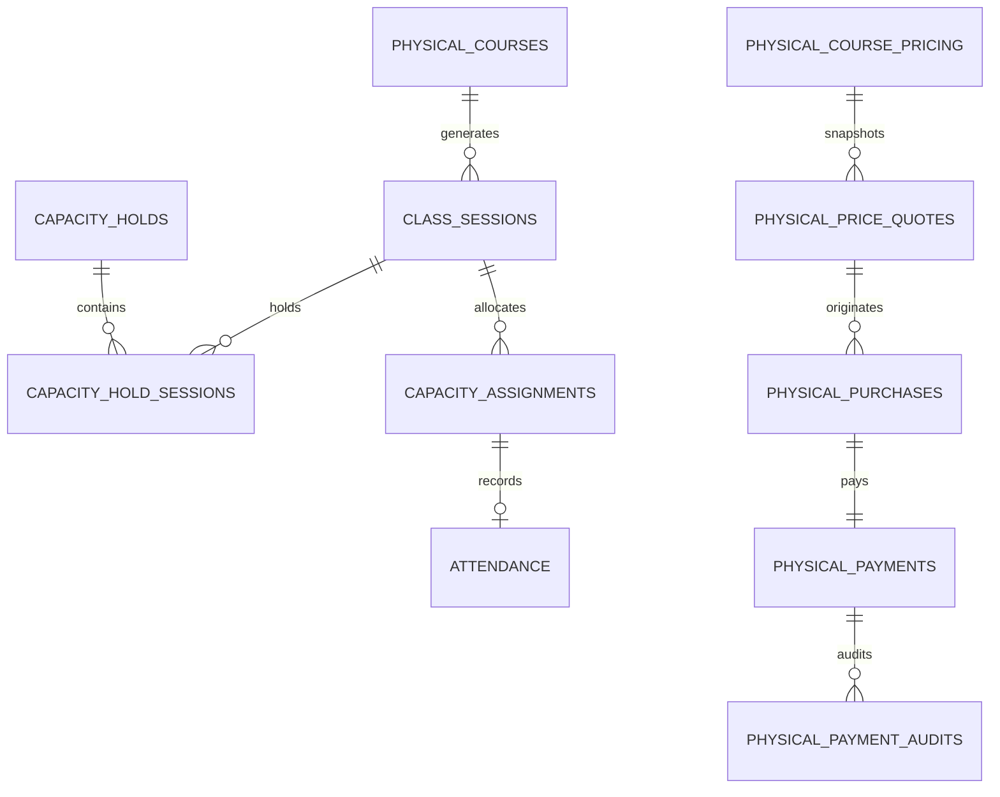

# Modelo de Datos

[← Volver al índice](./README.md) | [Reglas de pagos presenciales →](./28-PHYSICAL-CLASS-PAYMENTS.md)

> Ver [ADR-0027](./adr/0027-mysql-flyway-strategy.md) para la estrategia de
> esquemas y migraciones Flyway.

Este documento define el modelo lógico del único MySQL 8, con **schema único
`menta`** y tablas con prefijo por módulo.

## 1. Schema único y ownership

| Prefijo | Owner | Datos principales |
|---------|-------|-------------------|
| `auth_*` | Auth | Usuarios, roles y tokens |
| `billing_*` | Billing | Precios, cotizaciones, snapshots, compras y pagos |
| `virtual_*` | Virtual | Cursos online, contenido y progreso |
| `physical_*` | Physical | Cursos recurrentes, sesiones, capacidad y asistencia |

**Esquema:** `menta` (único)

## 2. Principios del modelo

- Un único MySQL 8 con schema `menta` y tablas prefijadas por módulo.
- Las asociaciones dentro de un módulo pueden usar FK.
- Las referencias cross-module son IDs validados por puertos Java, nunca FK,
  JOIN ni navegación de entidades.
- Los importes usan decimal exacto; no se almacenan en tipos binarios flotantes.

## 3. Módulo Auth (prefijo `auth_`)

### 3.1 Tabla: auth_users

```sql
CREATE TABLE auth_users (
    id BIGINT AUTO_INCREMENT PRIMARY KEY,
    email VARCHAR(255) NOT NULL UNIQUE,
    password_hash VARCHAR(255) NOT NULL,
    first_name VARCHAR(100),
    last_name VARCHAR(100),
    birthday DATE NULL,
    phone_number VARCHAR(20) NULL,
    status ENUM('PENDIENTE', 'ACTIVO', 'INACTIVO', 'BLOQUEADO') DEFAULT 'PENDIENTE',
    login_attempts INT DEFAULT 0,
    locked_until TIMESTAMP NULL,
    activation_token VARCHAR(255),
    activation_token_expires TIMESTAMP NULL,
    created_at TIMESTAMP DEFAULT CURRENT_TIMESTAMP,
    updated_at TIMESTAMP DEFAULT CURRENT_TIMESTAMP ON UPDATE CURRENT_TIMESTAMP,

    INDEX idx_users_email (email),
    INDEX idx_users_status (status)
) ENGINE=InnoDB DEFAULT CHARSET=utf8mb4 COLLATE=utf8mb4_unicode_ci;
```

> **Nota:** Los campos `birthday` y `phone_number` se agregaron según los requisitos
> de US-AUTH-001 para el registro de usuarios.

### 3.2 Tabla: auth_roles

```sql
CREATE TABLE auth_roles (
    id BIGINT AUTO_INCREMENT PRIMARY KEY,
    name VARCHAR(50) NOT NULL UNIQUE,
    description VARCHAR(255),
    created_at TIMESTAMP DEFAULT CURRENT_TIMESTAMP
) ENGINE=InnoDB DEFAULT CHARSET=utf8mb4 COLLATE=utf8mb4_unicode_ci;

-- Datos iniciales
INSERT INTO auth_roles (name, description) VALUES
('USER', 'Usuario estándar'),
('ADMIN', 'Administrador del sistema');
```

### 3.3 Tabla: auth_users_roles

```sql
CREATE TABLE auth_users_roles (
    user_id BIGINT NOT NULL,
    role_id BIGINT NOT NULL,
    PRIMARY KEY (user_id, role_id),
    FOREIGN KEY (user_id) REFERENCES auth_users(id) ON DELETE CASCADE,
    FOREIGN KEY (role_id) REFERENCES auth_roles(id) ON DELETE CASCADE
) ENGINE=InnoDB DEFAULT CHARSET=utf8mb4 COLLATE=utf8mb4_unicode_ci;
```

### 3.4 Tabla: auth_refresh_tokens

> El refresh token es un UUID opaco. Se almacena hasheado (SHA-256) según
> [ADR-0025](./adr/0025-auth-token-strategy.md).

```sql
CREATE TABLE auth_refresh_tokens (
    id BIGINT AUTO_INCREMENT PRIMARY KEY,
    user_id BIGINT NOT NULL,
    token_hash VARCHAR(64) NOT NULL UNIQUE,  -- SHA-256 del UUID opaco
    device_info VARCHAR(255),
    ip_address VARCHAR(45),
    expires_at TIMESTAMP NOT NULL,
    created_at TIMESTAMP DEFAULT CURRENT_TIMESTAMP,
    revoked_at TIMESTAMP NULL,

    FOREIGN KEY (user_id) REFERENCES auth_users(id) ON DELETE CASCADE,
    INDEX idx_refresh_tokens_hash (token_hash),
    INDEX idx_refresh_tokens_user (user_id)
) ENGINE=InnoDB DEFAULT CHARSET=utf8mb4 COLLATE=utf8mb4_unicode_ci;
```

### 3.5 Tabla: auth_password_reset_tokens

```sql
CREATE TABLE auth_password_reset_tokens (
    id BIGINT AUTO_INCREMENT PRIMARY KEY,
    user_id BIGINT NOT NULL,
    token VARCHAR(255) NOT NULL UNIQUE,
    expires_at TIMESTAMP NOT NULL,
    used_at TIMESTAMP NULL,
    created_at TIMESTAMP DEFAULT CURRENT_TIMESTAMP,

    FOREIGN KEY (user_id) REFERENCES auth_users(id) ON DELETE CASCADE,
    INDEX idx_password_reset_token (token)
) ENGINE=InnoDB DEFAULT CHARSET=utf8mb4 COLLATE=utf8mb4_unicode_ci;
```

---

## 4. Módulo Billing (prefijo `billing_`)

### 4.1 Tabla: billing_plans

```sql
CREATE TABLE billing_plans (
    id BIGINT AUTO_INCREMENT PRIMARY KEY,
    name VARCHAR(100) NOT NULL,
    description TEXT,
    price DECIMAL(10,2) NOT NULL,
    currency VARCHAR(3) DEFAULT 'ARS',
    duration_days INT NOT NULL,
    plan_type ENUM('VIRTUAL', 'PHYSICAL', 'COMBO') NOT NULL,
    status ENUM('ACTIVE', 'INACTIVE') DEFAULT 'ACTIVE',
    payment_url VARCHAR(500),
    features JSON,
    created_at TIMESTAMP DEFAULT CURRENT_TIMESTAMP,
    updated_at TIMESTAMP DEFAULT CURRENT_TIMESTAMP ON UPDATE CURRENT_TIMESTAMP,

    INDEX idx_plans_type (plan_type),
    INDEX idx_plans_status (status)
) ENGINE=InnoDB DEFAULT CHARSET=utf8mb4 COLLATE=utf8mb4_unicode_ci;
```

### 4.2 Tabla: billing_subscriptions

```sql
CREATE TABLE billing_subscriptions (
    id BIGINT AUTO_INCREMENT PRIMARY KEY,
    user_id BIGINT NOT NULL,
    plan_id BIGINT NOT NULL,
    status ENUM('PENDING', 'ACTIVE', 'EXPIRED', 'CANCELLED', 'SUSPENDED') DEFAULT 'PENDING',
    subscription_type ENUM('TRIAL', 'PAID') NOT NULL,
    starts_at TIMESTAMP NULL,
    expires_at TIMESTAMP NULL,
    cancelled_at TIMESTAMP NULL,
    created_at TIMESTAMP DEFAULT CURRENT_TIMESTAMP,
    updated_at TIMESTAMP DEFAULT CURRENT_TIMESTAMP ON UPDATE CURRENT_TIMESTAMP,

    FOREIGN KEY (plan_id) REFERENCES billing_plans(id),
    INDEX idx_subscriptions_user (user_id),
    INDEX idx_subscriptions_status (status),
    INDEX idx_subscriptions_expires (expires_at)
) ENGINE=InnoDB DEFAULT CHARSET=utf8mb4 COLLATE=utf8mb4_unicode_ci;
```

### 4.3 Tabla: payments

```sql
CREATE TABLE payments (
    id BIGINT AUTO_INCREMENT PRIMARY KEY,
    subscription_id BIGINT NOT NULL,
    user_id BIGINT NOT NULL,
    amount DECIMAL(10,2) NOT NULL,
    currency VARCHAR(3) DEFAULT 'ARS',
    payment_method ENUM('MERCADO_PAGO', 'BANK_TRANSFER', 'CASH') NOT NULL,
    status ENUM('PENDING_PAYMENT', 'PENDING_VERIFICATION', 'COMPLETED', 'FAILED', 'REJECTED') DEFAULT 'PENDING_PAYMENT',
    external_id VARCHAR(255),
    proof_url VARCHAR(500),
    rejection_reason TEXT,
    processed_at TIMESTAMP NULL,
    created_at TIMESTAMP DEFAULT CURRENT_TIMESTAMP,
    updated_at TIMESTAMP DEFAULT CURRENT_TIMESTAMP ON UPDATE CURRENT_TIMESTAMP,

    FOREIGN KEY (subscription_id) REFERENCES subscriptions(id),
    INDEX idx_payments_user (user_id),
    INDEX idx_payments_status (status),
    INDEX idx_payments_external (external_id)
) ENGINE=InnoDB DEFAULT CHARSET=utf8mb4 COLLATE=utf8mb4_unicode_ci;
```

### 4.4 Tabla: mercadopago_redirections

```sql
CREATE TABLE mercadopago_redirections (
    id BIGINT AUTO_INCREMENT PRIMARY KEY,
    user_id BIGINT NOT NULL,
    plan_id BIGINT NOT NULL,
    payment_id VARCHAR(100) NOT NULL UNIQUE,
    status ENUM('PENDING', 'VERIFIED', 'REJECTED', 'DUPLICATE', 'FRAUDULENT') DEFAULT 'PENDING',
    verification_notes TEXT,
    verified_at TIMESTAMP NULL,
    verified_by BIGINT,
    raw_data JSON,
    created_at TIMESTAMP DEFAULT CURRENT_TIMESTAMP,

    FOREIGN KEY (plan_id) REFERENCES plans(id),
    INDEX idx_mp_redirections_payment (payment_id),
    INDEX idx_mp_redirections_user (user_id)
) ENGINE=InnoDB DEFAULT CHARSET=utf8mb4 COLLATE=utf8mb4_unicode_ci;
```

---


### 4.5 Tabla: physical_course_pricing

```sql
CREATE TABLE physical_course_pricing (
    course_id BIGINT PRIMARY KEY,
    monthly_price DECIMAL(12,2) NOT NULL,
    individual_surcharge_percent DECIMAL(7,4) NOT NULL,
    currency CHAR(3) NOT NULL DEFAULT 'ARS',
    version BIGINT NOT NULL,
    updated_by BIGINT NOT NULL,
    updated_at TIMESTAMP NOT NULL,
    CHECK (monthly_price > 0),
    CHECK (individual_surcharge_percent > 0)
);

CREATE TABLE physical_course_pricing_revisions (
    id BIGINT AUTO_INCREMENT PRIMARY KEY,
    course_id BIGINT NOT NULL,
    version BIGINT NOT NULL,
    old_monthly_price DECIMAL(12,2) NULL,
    new_monthly_price DECIMAL(12,2) NOT NULL,
    old_individual_surcharge_percent DECIMAL(7,4) NULL,
    new_individual_surcharge_percent DECIMAL(7,4) NOT NULL,
    professor_id BIGINT NOT NULL,
    reason VARCHAR(500) NOT NULL,
    changed_at TIMESTAMP NOT NULL,
    UNIQUE KEY uk_pricing_revision (course_id, version),
    CHECK (new_monthly_price > 0),
    CHECK (new_individual_surcharge_percent > 0)
);
```

Las revisiones son append-only. `course_id` y `professor_id` son referencias
lógicas validadas por contratos neutrales de `shared` y orquestación de `api:app`.

### 4.6 Tabla: physical_price_quotes

```sql
CREATE TABLE physical_price_quotes (
    id VARCHAR(64) PRIMARY KEY,
    user_id BIGINT NULL,
    course_id BIGINT NOT NULL,
    professor_id BIGINT NOT NULL,
    purchase_type ENUM('MONTHLY', 'INDIVIDUAL') NOT NULL,
    selected_session_id BIGINT NULL,
    coverage_start_date DATE NOT NULL,
    coverage_end_exclusive DATE NOT NULL,
    scheduled_session_count INT NOT NULL,
    monthly_price DECIMAL(12,2) NOT NULL,
    effective_rounded DECIMAL(12,2) NOT NULL,
    individual_surcharge_percent DECIMAL(7,4) NOT NULL,
    individual_price DECIMAL(12,2) NOT NULL,
    quoted_total DECIMAL(12,2) NOT NULL,
    currency CHAR(3) NOT NULL,
    pricing_version BIGINT NOT NULL,
    session_ids JSON NOT NULL,
    expires_at TIMESTAMP NOT NULL,
    created_at TIMESTAMP NOT NULL,
    CHECK (coverage_end_exclusive > coverage_start_date),
    CHECK (scheduled_session_count > 0),
    CHECK (monthly_price > 0),
    CHECK (effective_rounded > 0),
    CHECK (individual_surcharge_percent > 0),
    CHECK (individual_price > 0),
    CHECK (currency <> 'ARS' OR individual_price >= effective_rounded + 0.01),
    CHECK (quoted_total > 0),
    CHECK (expires_at > created_at),
    CHECK (JSON_LENGTH(session_ids) > 0),
    CHECK (
      (purchase_type = 'MONTHLY' AND selected_session_id IS NULL
       AND scheduled_session_count = JSON_LENGTH(session_ids)
       AND quoted_total = monthly_price) OR
      (purchase_type = 'INDIVIDUAL' AND selected_session_id IS NOT NULL
       AND JSON_LENGTH(session_ids) = 1
       AND quoted_total = individual_price
       AND JSON_CONTAINS(session_ids, CAST(selected_session_id AS JSON), '$'))
    )
);
```

Cada fila representa una sola modalidad. Una mensualidad y cada sesión individual
requieren quotes distintos. Para `INDIVIDUAL`, la sesión seleccionada debe estar en
`session_ids`, mientras `scheduled_session_count` conserva la cantidad total del
período usada como divisor; para `MONTHLY`, `selected_session_id` está prohibido. Billing
calcula la división y el recargo con alta precisión en memoria, pero persiste los
operandos auditables `monthly_price`, `scheduled_session_count`,
`individual_surcharge_percent`, `effective_rounded` e `individual_price`; no
representa un cociente periódico como valor exacto.

### 4.7 Tablas: physical_purchases y physical_payments

```sql
CREATE TABLE physical_purchases (
    id BIGINT AUTO_INCREMENT PRIMARY KEY,
    user_id BIGINT NOT NULL,
    quote_id VARCHAR(64) NOT NULL,
    status ENUM('QUOTED', 'PAYMENT_PENDING', 'CAPACITY_ASSIGNED',
                'EXCEPTION', 'CANCELLED') NOT NULL,
    capacity_hold_id VARCHAR(64) NULL,
    idempotency_key VARCHAR(128) NOT NULL,
    created_at TIMESTAMP NOT NULL,
    updated_at TIMESTAMP NOT NULL,
    UNIQUE KEY uk_physical_purchase_quote_user (user_id, quote_id),
    UNIQUE KEY uk_physical_purchase_idempotency (user_id, idempotency_key),
    FOREIGN KEY (quote_id) REFERENCES physical_price_quotes(id)
);

CREATE TABLE physical_payments (
    id BIGINT AUTO_INCREMENT PRIMARY KEY,
    purchase_id BIGINT NOT NULL,
    status ENUM('PENDING', 'COMPLETED', 'FAILED',
                'REQUIRES_MANUAL_REVIEW') NOT NULL,
    payment_method ENUM('MERCADO_PAGO', 'BANK_TRANSFER', 'CASH') NOT NULL,
    amount DECIMAL(12,2) NOT NULL,
    currency CHAR(3) NOT NULL,
    external_id VARCHAR(255) NULL,
    proof_url VARCHAR(500) NULL,
    processed_at TIMESTAMP NULL,
    created_at TIMESTAMP NOT NULL,
    UNIQUE KEY uk_physical_payment_purchase (purchase_id),
    UNIQUE KEY uk_physical_payment_external (external_id),
    FOREIGN KEY (purchase_id) REFERENCES physical_purchases(id),
    CHECK (amount > 0)
);
```

Payment solo llega a `COMPLETED` después de que Physical confirma todas las
asignaciones. Si ya hubo movimiento externo y falla la capacidad, Payment queda
`REQUIRES_MANUAL_REVIEW` y Purchase queda `EXCEPTION`.

### 4.8 Tabla: payment_webhook_inbox

```sql
CREATE TABLE payment_webhook_inbox (
    id BIGINT AUTO_INCREMENT PRIMARY KEY,
    provider VARCHAR(40) NOT NULL,
    provider_event_id VARCHAR(255) NOT NULL,
    payload JSON NOT NULL,
    status ENUM('RECEIVED', 'PROCESSING', 'PROCESSED', 'FAILED') NOT NULL,
    attempts INT NOT NULL DEFAULT 0,
    next_attempt_at TIMESTAMP NULL,
    received_at TIMESTAMP NOT NULL,
    processed_at TIMESTAMP NULL,
    UNIQUE KEY uk_webhook_provider_event (provider, provider_event_id)
);
```

El inbox se persiste y deduplica antes del ACK. Su procesamiento admite reintentos
idempotentes.

### 4.9 Tabla: physical_payment_audits

```sql
CREATE TABLE physical_payment_audits (
    id BIGINT AUTO_INCREMENT PRIMARY KEY,
    payment_id BIGINT NOT NULL,
    purchase_id BIGINT NOT NULL,
    actor_user_id BIGINT NULL,
    action VARCHAR(50) NOT NULL,
    result VARCHAR(50) NOT NULL,
    details JSON,
    created_at TIMESTAMP NOT NULL,
    FOREIGN KEY (payment_id) REFERENCES physical_payments(id),
    FOREIGN KEY (purchase_id) REFERENCES physical_purchases(id)
);
```
## 5. Módulo Virtual (prefijo `virtual_`)

### 5.1 Tabla: courses

```sql
CREATE TABLE courses (
    id BIGINT AUTO_INCREMENT PRIMARY KEY,
    title VARCHAR(255) NOT NULL,
    description TEXT,
    slug VARCHAR(255) NOT NULL UNIQUE,
    thumbnail_url VARCHAR(500),
    status ENUM('DRAFT', 'PUBLISHED', 'ARCHIVED') DEFAULT 'DRAFT',
    difficulty ENUM('BEGINNER', 'INTERMEDIATE', 'ADVANCED'),
    duration_minutes INT,
    sort_order INT DEFAULT 0,
    created_at TIMESTAMP DEFAULT CURRENT_TIMESTAMP,
    updated_at TIMESTAMP DEFAULT CURRENT_TIMESTAMP ON UPDATE CURRENT_TIMESTAMP,

    INDEX idx_courses_status (status),
    INDEX idx_courses_slug (slug)
) ENGINE=InnoDB DEFAULT CHARSET=utf8mb4 COLLATE=utf8mb4_unicode_ci;
```

### 5.2 Tabla: modules

```sql
CREATE TABLE modules (
    id BIGINT AUTO_INCREMENT PRIMARY KEY,
    course_id BIGINT NOT NULL,
    title VARCHAR(255) NOT NULL,
    description TEXT,
    sort_order INT DEFAULT 0,
    is_free BOOLEAN DEFAULT FALSE,
    created_at TIMESTAMP DEFAULT CURRENT_TIMESTAMP,
    updated_at TIMESTAMP DEFAULT CURRENT_TIMESTAMP ON UPDATE CURRENT_TIMESTAMP,

    FOREIGN KEY (course_id) REFERENCES courses(id) ON DELETE CASCADE,
    INDEX idx_modules_course (course_id)
) ENGINE=InnoDB DEFAULT CHARSET=utf8mb4 COLLATE=utf8mb4_unicode_ci;
```

### 5.3 Tabla: lessons

```sql
CREATE TABLE lessons (
    id BIGINT AUTO_INCREMENT PRIMARY KEY,
    module_id BIGINT NOT NULL,
    title VARCHAR(255) NOT NULL,
    description TEXT,
    sort_order INT DEFAULT 0,
    is_free BOOLEAN DEFAULT FALSE,
    duration_seconds INT,
    created_at TIMESTAMP DEFAULT CURRENT_TIMESTAMP,
    updated_at TIMESTAMP DEFAULT CURRENT_TIMESTAMP ON UPDATE CURRENT_TIMESTAMP,

    FOREIGN KEY (module_id) REFERENCES modules(id) ON DELETE CASCADE,
    INDEX idx_lessons_module (module_id)
) ENGINE=InnoDB DEFAULT CHARSET=utf8mb4 COLLATE=utf8mb4_unicode_ci;
```

### 5.4 Tabla: videos

```sql
CREATE TABLE videos (
    id BIGINT AUTO_INCREMENT PRIMARY KEY,
    lesson_id BIGINT NOT NULL UNIQUE,
    bunny_video_id VARCHAR(100) NOT NULL,
    bunny_library_id VARCHAR(100) NOT NULL,
    duration_seconds INT,
    thumbnail_url VARCHAR(500),
    status ENUM('PROCESSING', 'READY', 'ERROR') DEFAULT 'PROCESSING',
    created_at TIMESTAMP DEFAULT CURRENT_TIMESTAMP,
    updated_at TIMESTAMP DEFAULT CURRENT_TIMESTAMP ON UPDATE CURRENT_TIMESTAMP,

    FOREIGN KEY (lesson_id) REFERENCES lessons(id) ON DELETE CASCADE,
    INDEX idx_videos_bunny (bunny_video_id)
) ENGINE=InnoDB DEFAULT CHARSET=utf8mb4 COLLATE=utf8mb4_unicode_ci;
```

### 5.5 Tabla: user_progress

```sql
CREATE TABLE user_progress (
    id BIGINT AUTO_INCREMENT PRIMARY KEY,
    user_id BIGINT NOT NULL,
    lesson_id BIGINT NOT NULL,
    progress_percent INT DEFAULT 0,
    completed BOOLEAN DEFAULT FALSE,
    last_position_seconds INT DEFAULT 0,
    completed_at TIMESTAMP NULL,
    created_at TIMESTAMP DEFAULT CURRENT_TIMESTAMP,
    updated_at TIMESTAMP DEFAULT CURRENT_TIMESTAMP ON UPDATE CURRENT_TIMESTAMP,

    FOREIGN KEY (lesson_id) REFERENCES lessons(id) ON DELETE CASCADE,
    UNIQUE KEY uk_user_lesson (user_id, lesson_id),
    INDEX idx_progress_user (user_id)
) ENGINE=InnoDB DEFAULT CHARSET=utf8mb4 COLLATE=utf8mb4_unicode_ci;
```

---

## 6. Módulo Physical (prefijo `physical_`)

### Cursos recurrentes y sesiones

```sql
CREATE TABLE physical_courses (
    id BIGINT AUTO_INCREMENT PRIMARY KEY,
    name VARCHAR(120) NOT NULL,
    professor_id BIGINT NOT NULL,
    day_of_week ENUM('MONDAY','TUESDAY','WEDNESDAY','THURSDAY',
                     'FRIDAY','SATURDAY','SUNDAY') NOT NULL,
    start_time TIME NOT NULL,
    end_time TIME NOT NULL,
    valid_from DATE NOT NULL,
    valid_until DATE NULL,
    capacity INT NOT NULL,
    status ENUM('ACTIVE', 'INACTIVE') NOT NULL,
    CHECK (capacity > 0),
    CHECK (end_time > start_time)
);

CREATE TABLE class_sessions (
    id BIGINT AUTO_INCREMENT PRIMARY KEY,
    course_id BIGINT NOT NULL,
    professor_id BIGINT NOT NULL,
    starts_at TIMESTAMP NOT NULL,
    ends_at TIMESTAMP NOT NULL,
    capacity INT NOT NULL,
    status ENUM('SCHEDULED', 'COMPLETED', 'CANCELLED', 'RESCHEDULED') NOT NULL,
    FOREIGN KEY (course_id) REFERENCES physical_courses(id),
    UNIQUE KEY uk_course_session_start (course_id, starts_at),
    INDEX idx_sessions_period (course_id, starts_at, status),
    CHECK (capacity > 0),
    CHECK (ends_at > starts_at)
);
```

Physical no almacena precios. Las sesiones `SCHEDULED` con inicio en
`[coverageStartDate, coverageEndExclusive)` son las que Billing incluye al cotizar.

### Hold técnico

```sql
CREATE TABLE capacity_holds (
    id VARCHAR(64) PRIMARY KEY,
    quote_id VARCHAR(64) NOT NULL,
    user_id BIGINT NOT NULL,
    status ENUM('ACTIVE', 'CONVERTED', 'EXPIRED', 'RELEASED') NOT NULL,
    expires_at TIMESTAMP NOT NULL,
    created_at TIMESTAMP NOT NULL,
    UNIQUE KEY uk_hold_quote_user (quote_id, user_id),
    CHECK (expires_at > created_at)
);

CREATE TABLE capacity_hold_sessions (
    hold_id VARCHAR(64) NOT NULL,
    session_id BIGINT NOT NULL,
    PRIMARY KEY (hold_id, session_id),
    FOREIGN KEY (hold_id) REFERENCES capacity_holds(id),
    FOREIGN KEY (session_id) REFERENCES class_sessions(id)
);
```

El hold es interno, breve y no visible ni accionable por el alumno. No existen
tablas de reserva manual ni lista de espera.

### Asignaciones y asistencia

```sql
CREATE TABLE capacity_assignments (
    id BIGINT AUTO_INCREMENT PRIMARY KEY,
    payment_id BIGINT NOT NULL,
    quote_id VARCHAR(64) NOT NULL,
    user_id BIGINT NOT NULL,
    session_id BIGINT NOT NULL,
    assignment_type ENUM('MONTHLY', 'INDIVIDUAL') NOT NULL,
    assigned_at TIMESTAMP NOT NULL,
    UNIQUE KEY uk_payment_session (payment_id, session_id),
    UNIQUE KEY uk_user_session (user_id, session_id),
    FOREIGN KEY (session_id) REFERENCES class_sessions(id)
);

CREATE TABLE attendance (
    id BIGINT AUTO_INCREMENT PRIMARY KEY,
    assignment_id BIGINT NOT NULL,
    user_id BIGINT NOT NULL,
    session_id BIGINT NOT NULL,
    qr_jti VARCHAR(64) NULL,
    status ENUM('PRESENT', 'ABSENT', 'LATE', 'EXCUSED') NOT NULL,
    checked_in_at TIMESTAMP NULL,
    checked_out_at TIMESTAMP NULL,
    UNIQUE KEY uk_attendance_assignment (assignment_id),
    UNIQUE KEY uk_attendance_user_session (user_id, session_id),
    UNIQUE KEY uk_attendance_qr_jti (qr_jti),
    FOREIGN KEY (assignment_id) REFERENCES capacity_assignments(id),
    FOREIGN KEY (session_id) REFERENCES class_sessions(id)
);
```

`payment_id` y `quote_id` son referencias lógicas a Billing. Convertir un hold
crea asignaciones y elimina/libera el hold idempotentemente.

Para check-in QR, `qr_jti` permite reconocer el mismo intento. Physical valida
lector, firma, ventana, asignación y sesión antes del lock Redis. Si el `INSERT`
falla, libera mediante compare-and-delete solo el lock que posee; una asistencia
existente para el mismo `qr_jti` se devuelve idempotentemente.

## 7. Concurrencia e índices

```text
availableSpots = capacity - confirmedAssignments - activeCapacityHolds
```

- Bloquear las sesiones del snapshot en orden estable durante la confirmación.
- Verificar capacidad para todas antes de escribir cualquier asignación.
- Índices requeridos: `class_sessions(course_id, starts_at, status)`,
  `capacity_assignments(session_id)` y `capacity_holds(status, expires_at)`.
- `payment_id + session_id` impide consumir el mismo cupo dos veces.

## 8. Diagrama ER funcional



Las relaciones entre objetos de Billing y Physical son referencias lógicas; el
diagrama no implica FK cross-module.
