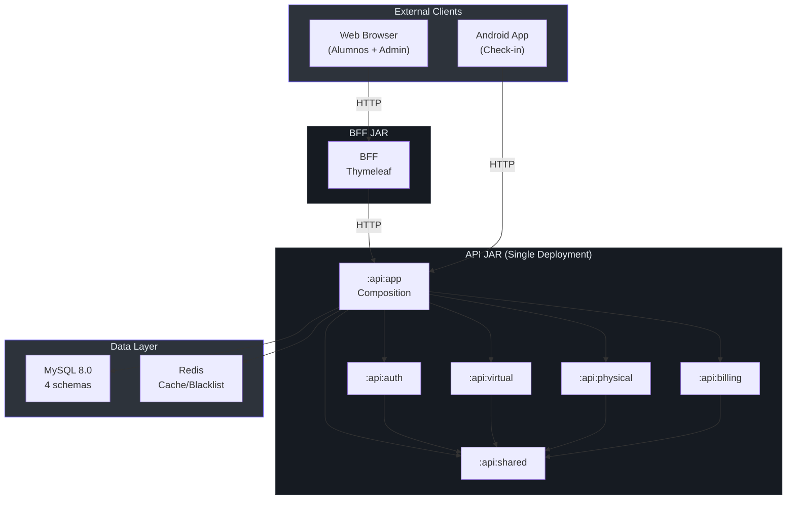
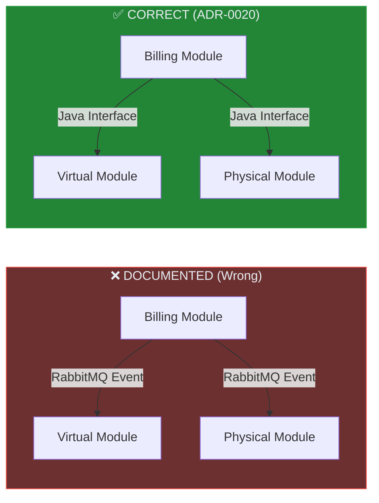
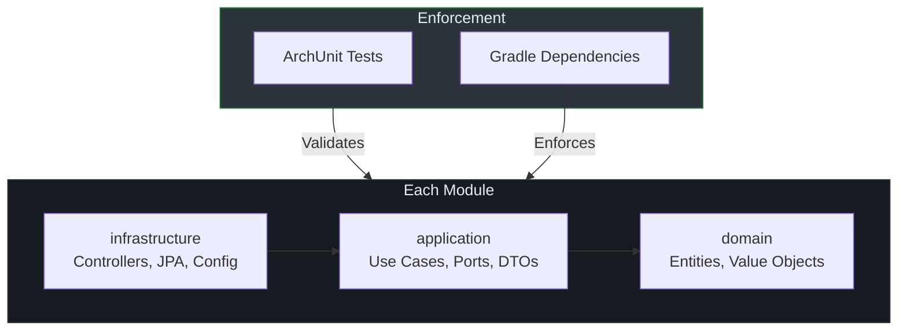
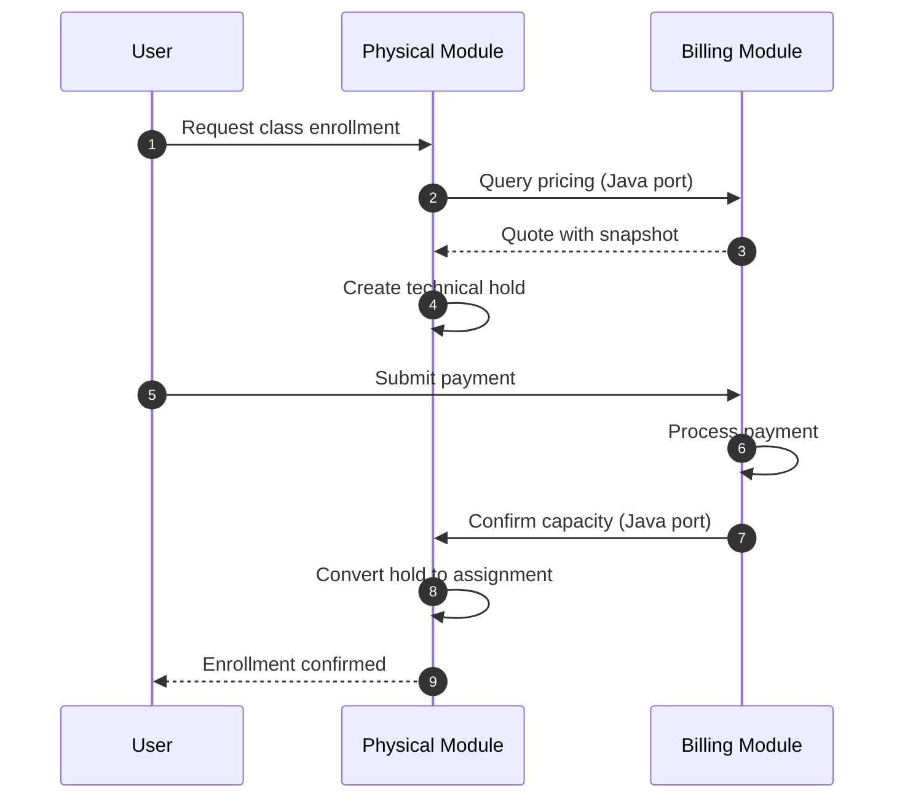
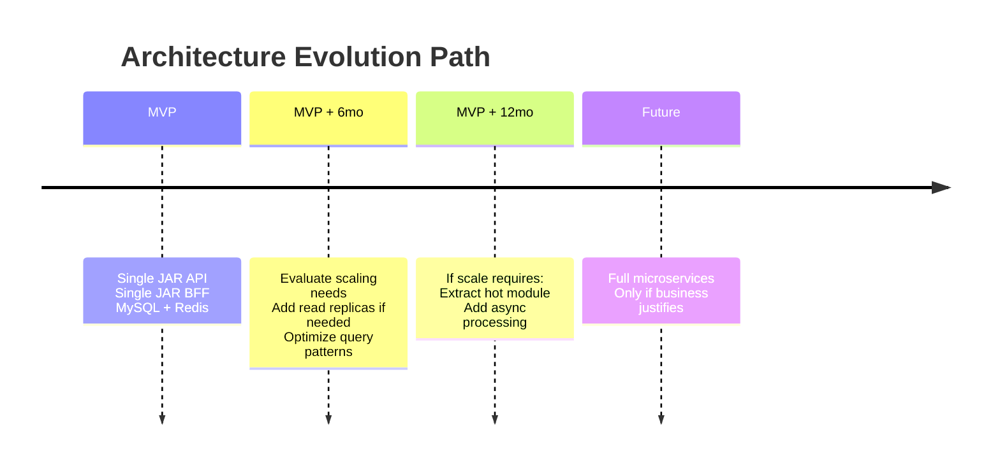

# Architecture Review Report

**Date:** 2026-07-20
**Reviewer:** Software Architect
**Scope:** Full system architecture based on documentation analysis

---

## Executive Summary

The Menta Dance architecture underwent a significant pivot from **distributed microservices** to a **modular monolith**. While the core architectural decisions (ADR-0019/0020/0021) are sound and well-justified, **the documentation retains significant technical debt** from the previous architecture, creating confusion and potential implementation errors.

### Overall Assessment

| Category | Score | Status |
|----------|-------|--------|
| **Architectural Coherence** | 7/10 | Good decisions, poor documentation alignment |
| **Clean Architecture Compliance** | 9/10 | Well-defined, ArchUnit enforced |
| **Module Boundaries** | 8/10 | Clear ownership, minor cross-cutting concerns |
| **Security Design** | 6/10 | JWT defined, but signature strategy incomplete |
| **Data Architecture** | 8/10 | Schema separation appropriate for module isolation |
| **Documentation Debt** | 4/10 | Significant misalignment requires urgent attention |

---

## Architecture Topology Analysis

### Current Authority (ADR-0019/0020/0021)



### Module Communication Contract

**Mandated by ADR-0020:**
- Modules communicate via **Java interfaces (ports)** only
- **NO HTTP, RabbitMQ, circuit breakers, or M2M credentials** between modules
- BFF → API: HTTP with JWT
- Android → API: HTTP with JWT

---

## Critical Inconsistencies Detected

### 1. RabbitMQ Ghost Infrastructure

**Severity: HIGH** — Documentation describes infrastructure that should NOT be implemented.

| Document | Line(s) | Issue |
|----------|---------|-------|
| 07-TECHNICAL-CONSIDERATIONS.md | 144-171 | Full RabbitMQ exchange/queue configuration |
| 07-TECHNICAL-CONSIDERATIONS.md | 175-226 | Event definitions for inter-service messaging |
| 07-TECHNICAL-CONSIDERATIONS.md | 228-312 | Spring AMQP configuration with DLQ |
| 08-MVP-SIMPLIFIED.md | 143-166 | "HTTP sync as alternative to RabbitMQ" |
| ADR-0004 | 111-120 | Data sync via `user.created` events |
| ADR-0010 | 139-161 | Billing publishes events to Virtual/Physical |

**Impact:** A developer following these documents would implement RabbitMQ infrastructure that contradicts ADR-0020.



**Recommendation:**
1. Add CAUTION banner to 07-TECHNICAL-CONSIDERATIONS.md
2. Remove or clearly mark RabbitMQ sections as "historical/not applicable"
3. Update ADR-0004 and ADR-0010 vigencia sections to explicitly prohibit event sync

---

### 2. Docker Compose Describes Microservices

**Severity: HIGH** — Would lead to wrong deployment topology.

**File:** 08-MVP-SIMPLIFIED.md (lines 334-463)

```yaml
# DOCUMENTED (WRONG)
services:
  auth-api:
    ports: ["8081:8081"]
  virtual-api:
    ports: ["8082:8082"]
  physical-api:
    ports: ["8083:8083"]
  billing-api:
    ports: ["8084:8084"]
  bff-web:
    ports: ["8080:8080"]
```

**Correct topology per ADR-0020:**

```yaml
# CORRECT
services:
  api:
    build: ./api/app
    ports: ["8081:8081"]
  bff:
    build: ./bff
    ports: ["8080:8080"]
  mysql:
    image: mysql:8.0
```

**Recommendation:** Rewrite 08-MVP-SIMPLIFIED.md with correct single-JAR deployment.

---

### 3. JWT Signature Strategy Undefined

**Severity: MEDIUM** — Security implementation incomplete.

ADR-0001 specifies RS256 with JWKS endpoint, but ADR-0020 changes the context:

| Aspect | ADR-0001 (Historical) | Current Reality |
|--------|----------------------|-----------------|
| Topology | 4 separate APIs verify JWT | Single API JAR |
| Key Distribution | JWKS endpoint, cached 24h | Not needed internally |
| Audience | `["menta-virtual-api", "menta-physical-api", ...]` | Single audience? |

**Open Questions:**
1. Does the single API JAR still need RS256, or is HS256 sufficient?
2. What is the JWT audience for a monolithic API?
3. How does BFF authenticate to API? (User's token forwarded? Service token?)

**Recommendation:** Create ADR-0022 to resolve JWT strategy for monolith architecture.

---

### 4. Schema Separation Complexity vs. Value

**Severity: LOW** — Design is valid but may be over-engineered for monolith.

ADR-0004 mandates 4 separate MySQL users with schema-restricted permissions:

```sql
CREATE USER 'auth_user'@'%' IDENTIFIED BY '${AUTH_DB_PASSWORD}';
GRANT ALL PRIVILEGES ON auth_schema.* TO 'auth_user'@'%';
-- ... repeated for virtual, physical, billing
```

**In a monolith context:**
- All modules run in the same JVM with single DataSource
- ArchUnit already enforces module boundaries at compile time
- Multiple DB users add operational complexity without runtime isolation

**Alternatives:**

| Option | Pros | Cons |
|--------|------|------|
| **Keep separate users** | Future-proof for service extraction | Operational complexity, credential management |
| **Single user, schema prefixes** | Simpler ops, same logical separation | Less strict isolation |
| **Single user, ArchUnit only** | Simplest, compile-time enforcement | No DB-level boundary |

**Recommendation:** Evaluate whether DB user separation is worth the operational overhead. If extraction to microservices is not planned for MVP+12 months, simplify to single user with ArchUnit enforcement.

---

### 5. Missing Billing API Specification

**Severity: MEDIUM** — Module lacks primary documentation.

All other modules have API specification documents:
- 03-AUTH-API.md
- 04-VIRTUAL-API.md
- 05-PHYSICAL-API.md
- ❌ 06-BILLING-API.md (MISSING)

User stories exist (US-BILLING-001 through US-BILLING-005), but no consolidated endpoint specification.

**Recommendation:** Create 06-BILLING-API.md following the same structure as other API docs.

---

## Clean Architecture Compliance

### Assessment: EXCELLENT (9/10)

The Clean Architecture implementation is well-designed:



**Strengths:**
- Domain layer explicitly prohibited from Spring/JPA imports (27-CLEAN-ARCHITECTURE-GUIDE.md:49-50)
- Application layer depends only on domain (27-CLEAN-ARCHITECTURE-GUIDE.md:98-101)
- Controllers cannot access repositories directly (25-ARCHITECTURE-RULES.md:47)
- Cross-module infrastructure access prohibited (25-ARCHITECTURE-RULES.md:49-64)

**Minor Issue:** The guide shows `@RequiredArgsConstructor` in application layer (27-CLEAN-ARCHITECTURE-GUIDE.md:107), which is a Lombok annotation. While not Spring, it's a framework dependency in a "framework-free" layer.

**Recommendation:** Clarify whether Lombok is acceptable in application layer or restrict to infrastructure only.

---

## Module Boundary Analysis

### Billing ↔ Physical Interaction

**Documented in:** 28-PHYSICAL-CLASS-PAYMENTS.md



**Assessment:** Well-designed interaction with clear ownership:
- **Physical owns:** Courses, sessions, capacity, holds, assignments
- **Billing owns:** Prices, quotes, payments, audit

**Potential Issue:** The technical hold TTL and payment confirmation are time-sensitive. If the hold expires before payment completes:

```
Hold expires → Capacity released → Payment succeeds → No capacity → ???
```

**Documented handling:** 28-PHYSICAL-CLASS-PAYMENTS.md line 134-135 states the payment is not completed automatically and requires a new quote. This is correct but should be explicitly tested.

---

## Security Architecture Review

### Current Design (ADR-0001)

| Aspect | Design | Status |
|--------|--------|--------|
| Token Type | JWT with RS256 | ⚠️ Needs confirmation for monolith |
| Access Token TTL | 15 minutes | ✅ Appropriate |
| Refresh Token TTL | 7 days | ✅ Appropriate |
| Refresh Storage | HttpOnly cookie (web), EncryptedSharedPrefs (Android) | ✅ Secure |
| Token Revocation | Redis blacklist | ⚠️ Not detailed for monolith |
| Key Rotation | Every 90 days via JWKS | ⚠️ Overkill for single JAR? |

### Security Gaps

1. **BFF → API Authentication**
   - BFF serves authenticated pages (alumnos + admin)
   - How does BFF prove user identity to API?
   - Options: Forward user JWT, service account, session

2. **Admin Panel Authorization**
   - Admin is part of BFF (same JAR as student portal)
   - Role-based access control (RBAC) not fully documented
   - Need: Admin role definitions, permission matrix

3. **Rate Limiting Scope**
   - 07-TECHNICAL-CONSIDERATIONS.md describes Redis-based rate limiting
   - Should apply at BFF/API entry point, not between modules
   - Current docs show per-endpoint limits but implementation unclear

**Recommendation:** Create security-focused ADR covering:
1. Monolith JWT strategy (RS256 vs HS256)
2. BFF authentication mechanism
3. Admin RBAC model
4. Rate limiting implementation

---

## Data Architecture Review

### Schema Design: APPROPRIATE

22-DATA-MODEL.md correctly implements module ownership:

| Schema | Owner | Cross-Module References |
|--------|-------|------------------------|
| `menta_auth` | Auth | None (source of truth for users) |
| `menta_billing` | Billing | `course_id`, `user_id` as logical refs |
| `menta_virtual` | Virtual | `user_id` as logical ref |
| `menta_physical` | Physical | `user_id`, `professor_id`, `payment_id` as logical refs |

**Good Pattern:** Billing stores `session_ids` as JSON in quotes table (22-DATA-MODEL.md:58). This creates an immutable snapshot without FK to Physical.

**Concern:** No FK enforcement between modules is correct, but validation must happen at port boundaries:

```java
// In Billing module
public Quote createQuote(Long courseId, ...) {
    // Must validate courseId exists via PhysicalQueryPort
    Course course = physicalQueryPort.findCourseById(courseId)
        .orElseThrow(() -> new CourseNotFoundException(courseId));
    // ...
}
```

**Recommendation:** Document port validation requirements explicitly.

---

## Recommendations Summary

### Immediate Actions (Before Implementation)

| Priority | Action | Effort | Impact |
|----------|--------|--------|--------|
| **P0** | Add CAUTION banners to 07 and 08 | 10 min | Prevents wrong implementation |
| **P0** | Remove/mark RabbitMQ sections as N/A | 1 hour | Documentation clarity |
| **P1** | Create 06-BILLING-API.md | 2 hours | Completes API documentation |
| **P1** | Rewrite docker-compose for single JAR | 1 hour | Correct deployment model |

### Short-term (Before Beta)

| Priority | Action | Effort | Impact |
|----------|--------|--------|--------|
| **P2** | Create ADR-0022: JWT for Monolith | 2 hours | Security clarity |
| **P2** | Create ADR-0023: BFF Authentication | 2 hours | Security clarity |
| **P2** | Simplify DB user strategy | 1 hour | Operational simplicity |
| **P2** | Align all API docs with module terminology | 4 hours | Consistency |

### Architecture Evolution Considerations



---

## Appendix: Document Cross-Reference Matrix

| Document | ADR-0019 | ADR-0020 | ADR-0021 | Status |
|----------|----------|----------|----------|--------|
| 02-ARCHITECTURE.md | ✅ | ✅ | ✅ | Aligned |
| 03-AUTH-API.md | ⚠️ | ⚠️ | ✅ | Needs module framing |
| 04-VIRTUAL-API.md | ⚠️ | ⚠️ | ✅ | Needs module framing |
| 05-PHYSICAL-API.md | ⚠️ | ⚠️ | ✅ | Needs module framing |
| 07-TECHNICAL-CONSIDERATIONS.md | ❌ | ❌ | ✅ | RabbitMQ contradicts |
| 08-MVP-SIMPLIFIED.md | ❌ | ❌ | N/A | Microservices contradicts |
| 22-DATA-MODEL.md | ✅ | ✅ | ✅ | Aligned |
| 25-ARCHITECTURE-RULES.md | ✅ | ✅ | ✅ | Aligned |
| 27-CLEAN-ARCHITECTURE-GUIDE.md | ✅ | ✅ | ✅ | Aligned |
| 28-PHYSICAL-CLASS-PAYMENTS.md | ✅ | ✅ | ✅ | Aligned |

---

*Generated: 2026-07-20 | Architecture Review based on documentation analysis*
