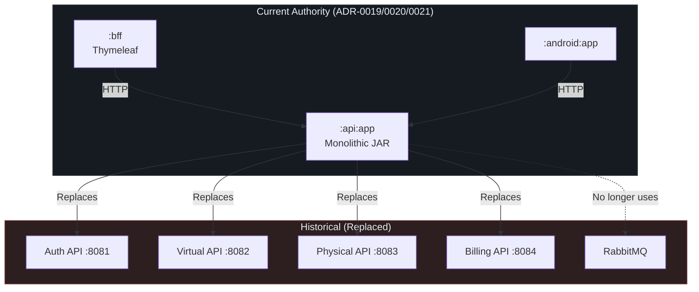
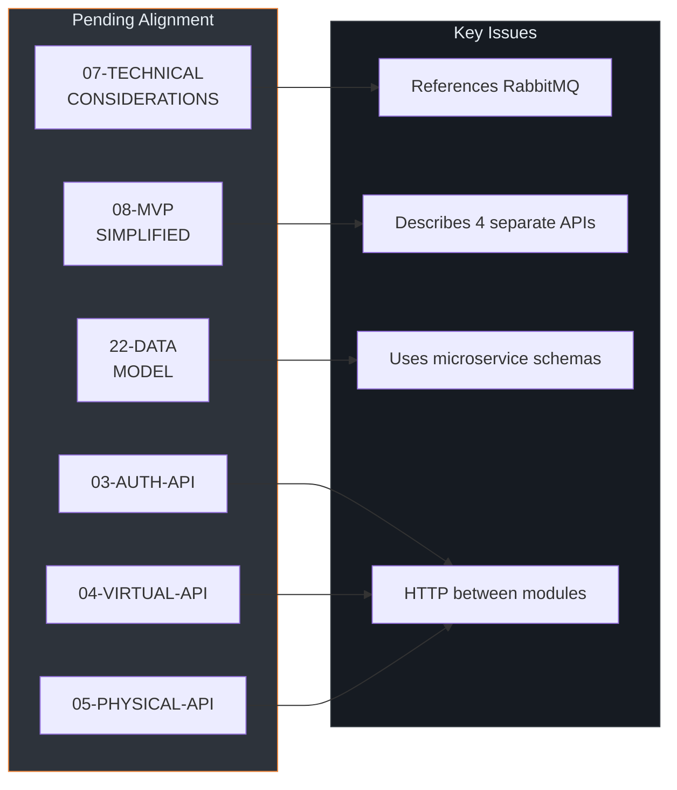
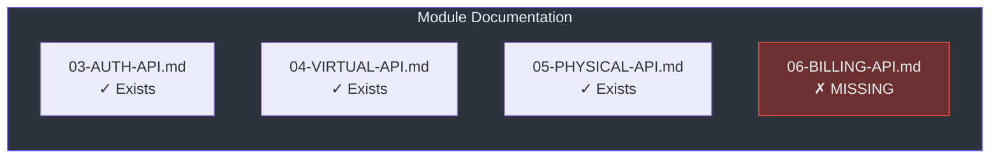
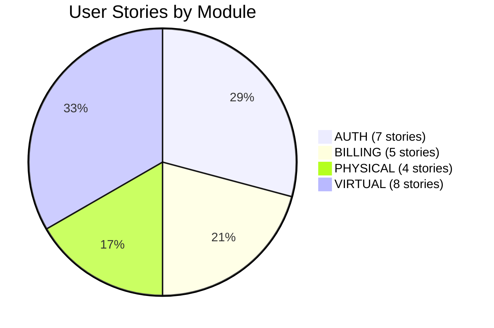
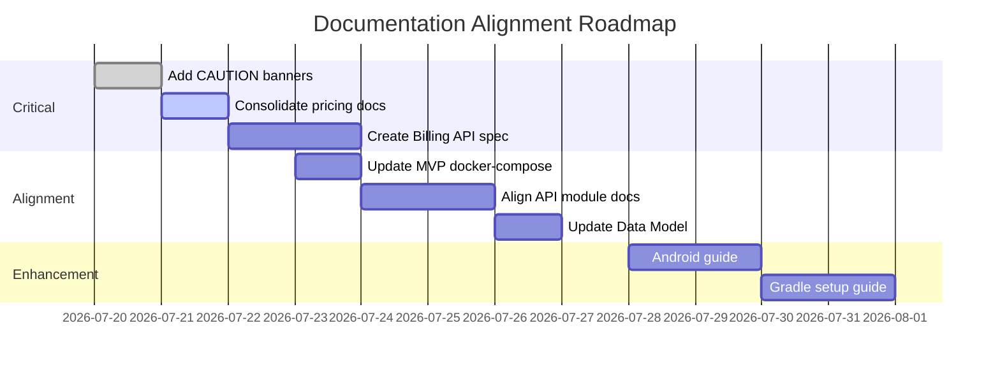

# Documentation Analysis Report

[← Back to index](./README.md)

---

## Executive Summary

This document provides a comprehensive audit of the Menta Dance documentation as of 2026-07-20. The documentation underwent a significant architectural pivot from **microservices** to **monolithic modular** architecture, leaving several documents misaligned.

| Category | Count | Status |
|----------|-------|--------|
| **Authoritative (Vigente)** | 8 | Ready for implementation |
| **Pending alignment** | 12 | Requires revision before use |
| **Historical** | 4 | Preserved for context only |
| **Duplicated content** | 2 | Needs consolidation |

---

## Architecture Overview



---

## Document Inventory

### Authoritative Documents (Vigente)

These documents align with ADR-0019/0020/0021 and are ready for implementation.

| Document | Purpose | Last Updated | Evidence |
|----------|---------|--------------|----------|
| [02-ARCHITECTURE.md](./02-ARCHITECTURE.md) | Monorepo + modular monolith topology | 2026-07-20 | Lines 20-67: main architecture diagram |
| [25-ARCHITECTURE-RULES.md](./25-ARCHITECTURE-RULES.md) | ArchUnit enforcement rules | 2026-07-19 | Lines 10-17: topology mandate |
| [27-CLEAN-ARCHITECTURE-GUIDE.md](./27-CLEAN-ARCHITECTURE-GUIDE.md) | Clean Architecture implementation guide | 2026-07-19 | Full document aligned |
| [10-ADRS.md](./10-ADRS.md) | ADR index entry point | 2026-07-19 | Lines 1-42: authority structure |
| [adr/README.md](./adr/README.md) | Canonical ADR index | 2026-07-19 | Lines 7-14: authoritative decisions |
| [diagrams/C4-DIAGRAMS.md](./diagrams/C4-DIAGRAMS.md) | C4 architecture diagrams | 2026-07-19 | (Unknown – verify alignment) |
| [09-PHYSICAL-PRICING-LOGIC.md](./09-PHYSICAL-PRICING-LOGIC.md) | Physical class pricing rules | 2026-07-20 | Lines 37-58: business rules |
| [28-PHYSICAL-CLASS-PAYMENTS.md](./28-PHYSICAL-CLASS-PAYMENTS.md) | Physical payments formal spec | 2026-07-20 | Lines 1-137: authoritative contract |

### Documents Pending Alignment

These documents contain valuable content but reference the **old microservices architecture**.



| Document | Issue | Required Action |
|----------|-------|-----------------|
| [07-TECHNICAL-CONSIDERATIONS.md](./07-TECHNICAL-CONSIDERATIONS.md) | References Redis cluster, RabbitMQ exchanges, multi-service CORS, and HashIDs per service (docs/07-TECHNICAL-CONSIDERATIONS.md:27-34, 144-171, 497-503) | Remove RabbitMQ sections; consolidate HashIDs |
| [08-MVP-SIMPLIFIED.md](./08-MVP-SIMPLIFIED.md) | Describes 4 separate APIs + VPS deployment (docs/08-MVP-SIMPLIFIED.md:54-90) | Rewrite for single JAR deployment |
| [22-DATA-MODEL.md](./22-DATA-MODEL.md) | Uses microservice cross-schema references (docs/22-DATA-MODEL.md:13-16) | Align with module ownership model |
| [03-AUTH-API.md](./03-AUTH-API.md) | Implies standalone API deployment | Mark as module contract, not deployable |
| [04-VIRTUAL-API.md](./04-VIRTUAL-API.md) | Implies standalone API deployment | Mark as module contract |
| [05-PHYSICAL-API.md](./05-PHYSICAL-API.md) | Implies standalone API deployment | Mark as module contract |
| [14-TEST-STRATEGY.md](./14-TEST-STRATEGY.md) | May reference separate services | Verify alignment |
| [16-CICD-PIPELINE.md](./16-CICD-PIPELINE.md) | May describe multi-artifact builds | Align with monorepo Gradle |
| [24-LOCAL-DEV-SETUP.md](./24-LOCAL-DEV-SETUP.md) | Likely describes multiple containers | Simplify for single JAR |

### Historical Documents (Preserved for Context)

| Document | Status | Note |
|----------|--------|------|
| [06-MIGRATION-STRATEGY.md](./06-MIGRATION-STRATEGY.md) | Historical | Previous migration approach |
| [13-DEVELOPMENT-PLAN.md](./13-DEVELOPMENT-PLAN.md) | Historical | Previous timeline |
| Deleted ADRs (0003, 0005, 0011, 0012, 0014) | Eliminated | Event bus, service discovery, circuit breakers |

---

## Critical Inconsistencies

### 1. Duplicate Pricing Documentation

Two documents cover physical class pricing logic:

| Aspect | 09-PHYSICAL-PRICING-LOGIC.md | 28-PHYSICAL-CLASS-PAYMENTS.md |
|--------|------------------------------|-------------------------------|
| **Style** | Tutorial with examples | Formal specification |
| **Scope** | Pricing calculation only | Full payment lifecycle |
| **Authority** | General reference | "Autoridad funcional" declared |
| **Glosario** | No | Yes (docs/28-PHYSICAL-CLASS-PAYMENTS.md:9-24) |
| **Module ownership** | Implicit | Explicit (docs/28-PHYSICAL-CLASS-PAYMENTS.md:26-36) |

**Recommendation:** Consolidate into 28-PHYSICAL-CLASS-PAYMENTS.md or deprecate 09.

### 2. Missing Billing API Document

The billing module lacks a primary API specification document. User stories exist (US-BILLING-001 through US-BILLING-005), but there is no `06-BILLING-API.md` equivalent to the other modules.



### 3. RabbitMQ References Still Present

| File | Line | Content |
|------|------|---------|
| 07-TECHNICAL-CONSIDERATIONS.md | 144-171 | Full RabbitMQ exchange configuration |
| 07-TECHNICAL-CONSIDERATIONS.md | 175-226 | Event definitions for inter-service messaging |
| 08-MVP-SIMPLIFIED.md | 143-166 | HTTP sync described as alternative to RabbitMQ |

These contradict ADR-0020 (docs/adr/0020-modular-monolith.md) which mandates Java interfaces for module communication.

### 4. Docker Compose Describes Microservices

`08-MVP-SIMPLIFIED.md` lines 334-463 show a `docker-compose.yml` with 4 separate API containers. This contradicts the current single-JAR deployment model.

---

## Coverage Gaps

### Documentation Not Yet Created

| Topic | Priority | Dependencies |
|-------|----------|--------------|
| **Billing API Specification** | High | Review US-BILLING-* stories |
| **Android Architecture Guide** | Medium | Follow 27-CLEAN-ARCHITECTURE-GUIDE.md |
| **BFF Implementation Guide** | Medium | Thymeleaf + API consumption |
| **Gradle Multi-Module Setup** | High | settings.gradle.kts, build conventions |
| **Security Configuration Guide** | Medium | JWT, Spring Security per module |

### User Stories Alignment Status



All user stories are marked "Pendiente de alineación funcional" in README.md:77.

---

## Recommended Actions

### Immediate (Before Implementation)

| Priority | Action | Effort |
|----------|--------|--------|
| **P0** | Add CAUTION banner to 07-TECHNICAL-CONSIDERATIONS.md | 5 min |
| **P0** | Consolidate 09 and 28 pricing docs | 30 min |
| **P1** | Create 06-BILLING-API.md skeleton | 1 hour |
| **P1** | Update 08-MVP-SIMPLIFIED.md docker-compose for single JAR | 1 hour |

### Short-term (During Phase 1)

| Priority | Action | Effort |
|----------|--------|--------|
| **P2** | Align 03/04/05 API docs with module terminology | 2 hours |
| **P2** | Verify 22-DATA-MODEL.md schema ownership | 1 hour |
| **P2** | Update 24-LOCAL-DEV-SETUP.md for Gradle multi-module | 1 hour |

### Documentation Debt Tracking



---

## Metrics Summary

| Metric | Value |
|--------|-------|
| Total documents scanned | 28 |
| Files in `docs/` root | 21 |
| Files in `docs/adr/` | 16 |
| Files in `docs/user-stories/` | 24 |
| Documents fully aligned | 8 (28.5%) |
| Documents pending alignment | 12 (42.8%) |
| Historical/archived | 4 (14.3%) |
| Missing expected docs | 4 (Billing API, Android guide, BFF guide, Gradle guide) |

---

## Appendix: File Manifest

```
docs/
├── 02-ARCHITECTURE.md          # ✓ Vigente
├── 03-AUTH-API.md              # ⚠ Pending alignment
├── 04-VIRTUAL-API.md           # ⚠ Pending alignment
├── 05-PHYSICAL-API.md          # ⚠ Pending alignment
├── 06-MIGRATION-STRATEGY.md    # ⏸ Historical
├── 07-TECHNICAL-CONSIDERATIONS.md  # ⚠ Pending alignment (RabbitMQ)
├── 08-MVP-SIMPLIFIED.md        # ⚠ Pending alignment (microservices)
├── 09-PHYSICAL-PRICING-LOGIC.md    # ✓ Vigente (duplicate with 28)
├── 10-ADRS.md                  # ✓ Vigente
├── 11-APPENDICES.md            # ? Unknown
├── 12-COST-ANALYSIS.md         # ? Unknown
├── 13-DEVELOPMENT-PLAN.md      # ⏸ Historical
├── 14-TEST-STRATEGY.md         # ⚠ Pending alignment
├── 15-RISK-MATRIX.md           # ? Unknown
├── 16-CICD-PIPELINE.md         # ⚠ Pending alignment
├── 18-SLA-DEFINITION.md        # ? Unknown
├── 21-NFR-REQUIREMENTS.md      # ? Unknown
├── 22-DATA-MODEL.md            # ⚠ Pending alignment
├── 24-LOCAL-DEV-SETUP.md       # ⚠ Pending alignment
├── 25-ARCHITECTURE-RULES.md    # ✓ Vigente
├── 27-CLEAN-ARCHITECTURE-GUIDE.md  # ✓ Vigente
├── 28-PHYSICAL-CLASS-PAYMENTS.md   # ✓ Vigente
├── README.md                   # ✓ Index
├── TESTING-GUIDE.md            # ⚠ Pending alignment
├── TRIVY.md                    # ⚠ Pending alignment
├── adr/                        # ✓ Vigente (canonical index)
├── diagrams/                   # ✓ Vigente
└── user-stories/               # ⚠ Pending alignment
```

Legend:
- ✓ Vigente — aligned with current architecture
- ⚠ Pending alignment — contains outdated references
- ⏸ Historical — preserved for context only
- ? Unknown — not reviewed in this analysis

---

*Generated: 2026-07-20 | Analysis based on files read during this session*
