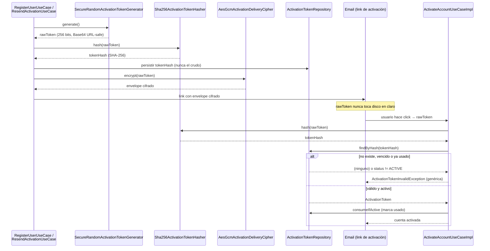

# ADR-0034: Generación y Hashing del Token de Activación de Cuenta

**Estado:** Aceptado

## Contexto

El registro (`RegisterUserUseCaseImpl`) y el reenvío de activación
(`ResendActivationUseCaseImpl`) necesitan emitir una credencial de un solo
uso que el usuario recibe por email y usa para activar su cuenta
(`ActivateAccountUseCaseImpl`). Esa credencial viaja embebida en un link de
email — un canal que no es confidencial (puede quedar en logs de servidor de
correo, en el historial del cliente de mail, reenviarse por error, etc.) — y
además queda persistida en base de datos para poder validarla después.

Cómo se genera ese token y qué se guarda en base de datos son decisiones de
seguridad explícitas: si el token fuera predecible, o si se guardara en
texto plano, una filtración de base de datos o un token adivinado
comprometería cuentas sin necesitar ninguna otra falla.

## Decisión

**Generación: 256 bits de un CSPRNG.**
`SecureRandomActivationTokenGenerator`
(`api/auth/src/main/java/com/menta/auth/infrastructure/activation/`)
genera 32 bytes con `java.security.SecureRandom` (no `java.util.Random`,
que es un LCG predecible si se conocen algunos outputs) y los codifica en
Base64 URL-safe sin padding (43 caracteres, sin `+`, `/` ni `=` que
requerirían escapar la URL del email). 256 bits de entropía hacen que
adivinar el token por fuerza bruta sea inviable incluso sin el rate
limiting de [ADR-0033](0033-activation-rate-limiting-strategy.md), que
igual actúa como segunda capa.

**Persistencia: sólo el hash SHA-256, nunca el token crudo.**
`Sha256ActivationTokenHasher` calcula el digest SHA-256 del token y es ese
hash — no el token — lo que `ActivateAccountUseCaseImpl` busca en
`ActivationTokenRepository.findByHash(...)`. El cálculo del digest en sí
(`MessageDigest` fresco por llamada + codificación hex en minúscula) vive en
`Sha256Hex` (`api/auth/src/main/java/com/menta/auth/domain/crypto/`), una
primitiva pura sin dependencias externas. Vive en `auth.domain` — no en
`auth.infrastructure`, donde vivió originalmente — porque además de
`Sha256ActivationTokenHasher` y `Sha256TokenHasher` (refresh tokens,
[ADR-0025](0025-auth-token-strategy.md)), también la usan
`RegisterUserUseCaseImpl` y `ResendActivationUseCaseImpl` para el
fingerprint no reversible del email que alimenta el rate limiting
([ADR-0033](0033-activation-rate-limiting-strategy.md)); ambos son
`application`, que por regla de dependencia de Clean Architecture no puede
importar `infrastructure`. Los dos hashers son adapters de puertos distintos
(`ActivationTokenHasher` vs. `TokenHasher`) porque protegen credenciales con
ciclos de vida diferentes, pero la primitiva criptográfica de fondo es la
misma y no tiene sentido mantenerla duplicada — la reutilización queda
dentro de `:api:auth` (domain + application + infrastructure), no se sube a
`api:shared`, porque ninguna otra bounded context necesita hoy hashear
credenciales opacas SHA-256. El token crudo generado por
`RegisterUserUseCaseImpl` / `ResendActivationUseCaseImpl` sólo existe en
memoria durante el request y se cifra para su entrega vía
`AesGcmActivationDeliveryCipher` ([ADR-0032](0032-activation-delivery-cipher-nonce-policy.md));
nunca se persiste en claro. Es el mismo patrón que credenciales de sesión:
si la base de datos se filtra, el atacante obtiene hashes de un solo
sentido de valores con 256 bits de entropía — computacionalmente inviable
de revertir o de fuerza-brutear.

**Expiración: TTL de 24h, de un solo uso.** El token generado tiene una
ventana de validez configurable (`auth.activation.token-ttl`, default
`PT24H`) y `ActivationToken.consume()` lo marca usado en la misma
transacción que activa la cuenta (`ActivateAccountUseCaseImpl.activate()`),
evitando reutilización. Un token vencido o ya usado colapsa al mismo
`ActivationTokenInvalidException` genérico que un token inexistente — no
hay respuesta diferenciada que permita a un atacante distinguir "no
existe" de "venció" de "ya se usó".

## Consecuencias

### Positivas

* 256 bits de entropía + CSPRNG hacen la adivinanza del token
  computacionalmente inviable sin depender únicamente del rate limiting.
* Guardar sólo el hash limita el daño de una filtración de base de datos al
  mismo nivel que una filtración de hashes de contraseña bien salados —
  con la ventaja adicional de que acá no hace falta salt porque la entrada
  ya tiene 256 bits de entropía propia (no es un valor de baja entropía
  como una contraseña humana).
* El colapso a una única excepción genérica en `activate()` evita que un
  atacante use la respuesta del endpoint como oráculo para distinguir
  tokens inexistentes, vencidos o consumidos.
* Consolidar el cálculo del digest en `Sha256Hex` eliminó una duplicación
  real entre `Sha256ActivationTokenHasher` y `Sha256TokenHasher`, y de paso
  destapó un bug preexistente: `Sha256TokenHasher` tenía `@Component` *y*
  `AuthConfiguration` lo registraba también vía `@Bean tokenHasher()` —
  dos bean definitions de `TokenHasher` compitiendo. Se eliminó el
  `@Component` redundante, dejando un único bean explícito.
* Mover `Sha256Hex` a `auth.domain.crypto` (originalmente en
  `auth.infrastructure.security`) eliminó una tercera duplicación: los
  fingerprints de email de `RegisterUserUseCaseImpl` y
  `ResendActivationUseCaseImpl` (Fase 3, activación de cuentas)
  reimplementaban el mismo `MessageDigest` + hex a mano porque
  `application` no puede depender de `infrastructure`.

### Negativas / Deuda Técnica

* `findByHash` es una búsqueda por igualdad indexada en base de datos, no
  una comparación en tiempo constante. No se considera un riesgo real
  porque lo que protege esa comparación es un valor de 256 bits — un
  atacante necesitaría adivinar el token completo, no explotar una
  diferencia de timing en la búsqueda por hash, que en la práctica es
  ruido frente al costo de fuerza-brutear 2^256 posibilidades.
* El TTL de 24h es fijo por configuración global; no hay TTL diferenciado
  por tipo de flujo (registro vs. reenvío) ni acortamiento automático ante
  señales de abuso.

### Riesgos y Reversibilidad

* **Riesgo Principal:** que el token crudo termine escribiéndose en algún
  log de aplicación o de proxy antes de llegar al `encrypt()` de
  ADR-0032, lo que anularía todo lo anterior.
* **Plan de Mitigación:** los tests (`SecureActivationTokenAdaptersTest`,
  `Sha256TokenHasherTest`) cubren generador y ambos hashers de forma
  aislada — `Sha256Hex` no tiene test dedicado propio, pero queda cubierto
  transitivamente por los dos. Sigue faltando un chequeo explícito (lint de
  logging o revisión de PR dirigida) que garantice que el token crudo nunca
  se loguea end-to-end.
* **Reversibilidad:** alta — generador y hasher están detrás de puertos
  (`ActivationTokenGenerator`, `ActivationTokenHasher`); cambiar el
  algoritmo de hash o el tamaño del token no afecta al resto del dominio.

## Diagrama: ciclo de vida del token

## Referencias y Decisiones Relacionadas

* `api/auth/src/main/java/com/menta/auth/infrastructure/activation/SecureRandomActivationTokenGenerator.java`
* `api/auth/src/main/java/com/menta/auth/infrastructure/activation/Sha256ActivationTokenHasher.java`
* `api/auth/src/main/java/com/menta/auth/domain/crypto/Sha256Hex.java` —
  primitiva SHA-256 compartida por `Sha256ActivationTokenHasher`,
  `Sha256TokenHasher`, `RegisterUserUseCaseImpl` y
  `ResendActivationUseCaseImpl`.
* `api/auth/src/main/java/com/menta/auth/application/usecase/ActivateAccountUseCaseImpl.java`
* Complementa a: [ADR-0025](0025-auth-token-strategy.md) (hasher de refresh
  tokens, hoy comparte primitiva con `Sha256Hex`),
  [ADR-0032](0032-activation-delivery-cipher-nonce-policy.md) (cifrado del
  token en tránsito hacia el email) y
  [ADR-0033](0033-activation-rate-limiting-strategy.md) (rate limiting como
  segunda capa contra fuerza bruta del token).
