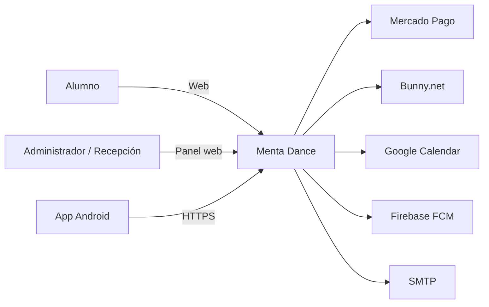
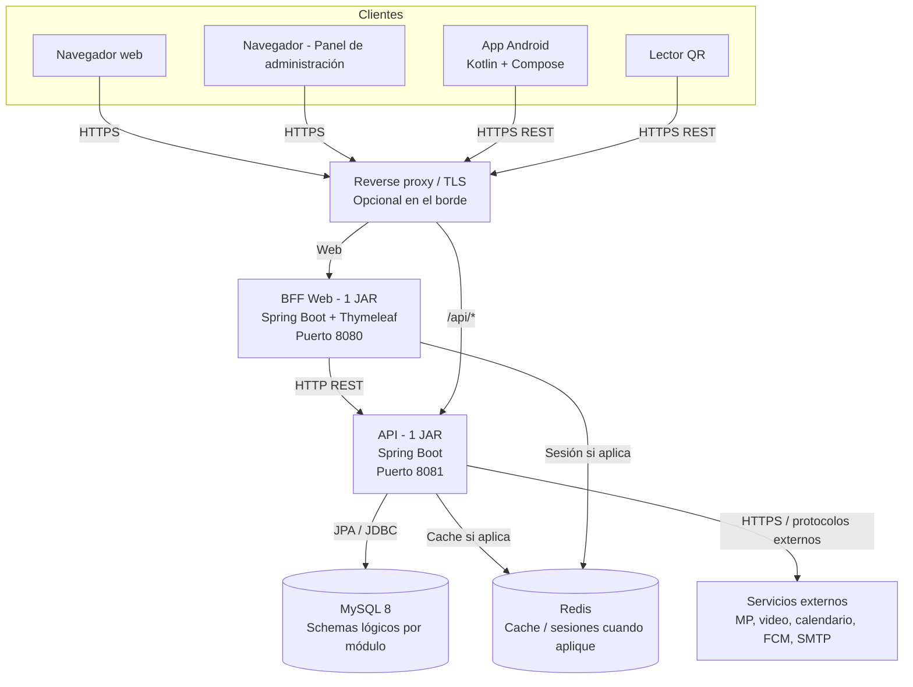
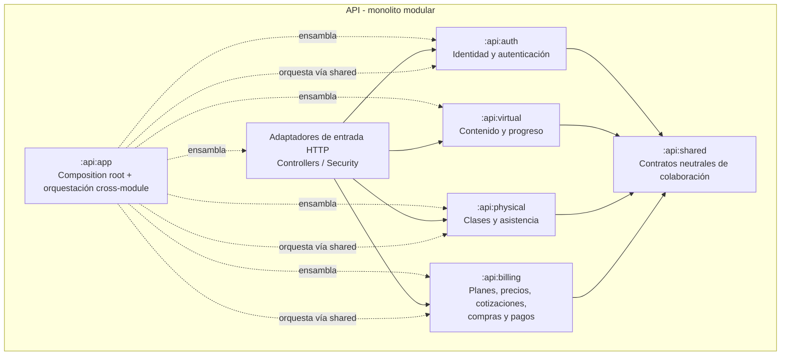
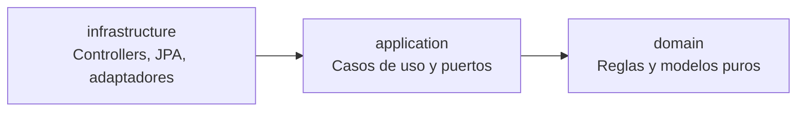
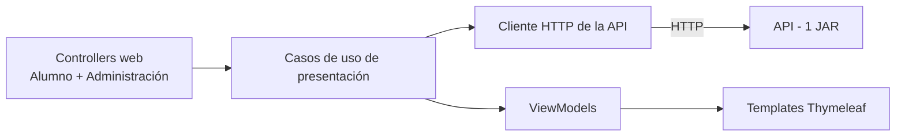
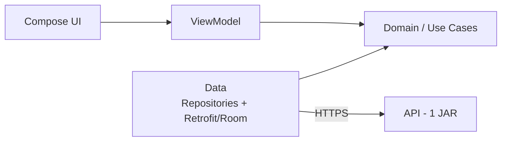
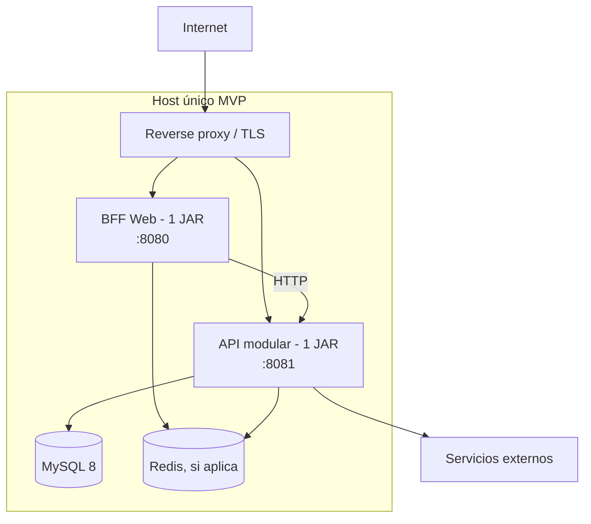
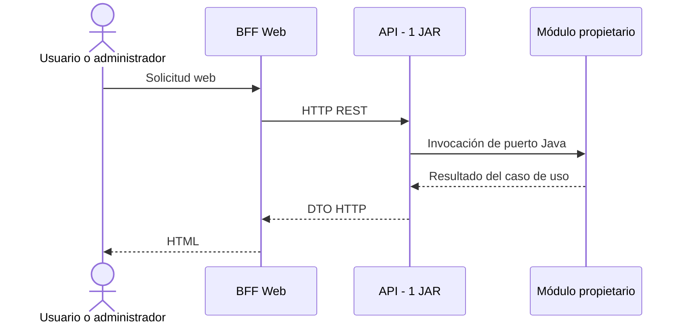
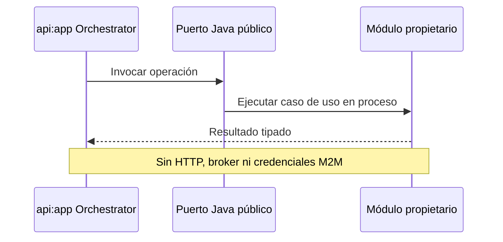
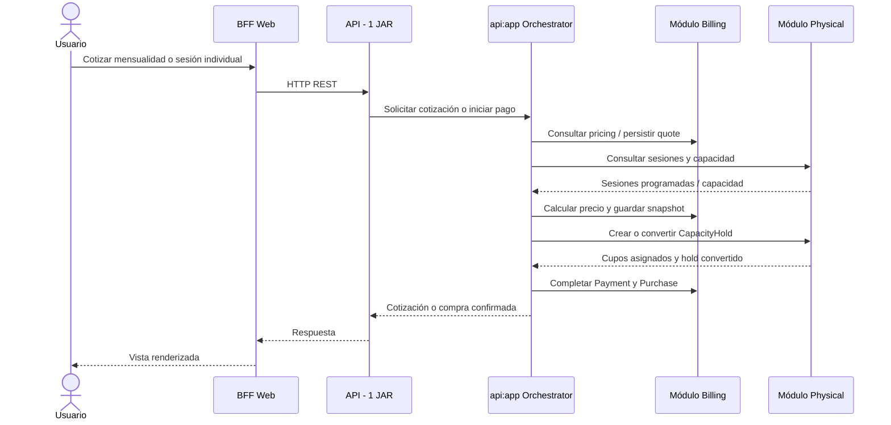

# Diagramas C4 - Arquitectura Menta Dance

[← Volver al índice](../README.md)

Estos diagramas representan la arquitectura vigente definida por
[ADR-0019](../adr/0019-monorepo-structure.md),
[ADR-0020](../adr/0020-modular-monolith.md) y
[ADR-0021](../adr/0021-clean-architecture-mandatory.md).

## Level 1: Contexto del Sistema

| Actor o sistema | Relación vigente |
|-----------------|------------------|
| Alumno | Usa la web servida por el BFF o la app Android |
| Administrador / recepción | Usa una página web servida por el BFF |
| Sistemas externos | Son adaptadores de infraestructura del módulo propietario |

## Level 2: Contenedores

### Responsabilidades

| Contenedor | Responsabilidad | Regla de comunicación |
|------------|-----------------|-----------------------|
| BFF | SSR, sesión web, ViewModels y adaptación para la UI | Consume únicamente la API por HTTP; no contiene reglas de negocio |
| API | Casos de uso y reglas de Auth, Virtual, Physical y Billing | Un JAR; módulos internos mediante interfaces Java |
| Android | Cliente móvil con Clean Architecture + MVVM | Consume la API pública por HTTPS |
| MySQL | Persistencia con ownership lógico por módulo | Sin consultas directas entre módulos |
| Reverse proxy | TLS y routing perimetral | No es service discovery ni comunica módulos |

## Level 3: Componentes del JAR API

Las flechas punteadas son llamadas en proceso mediante interfaces Java. No
representan HTTP, mensajería ni autenticación M2M. La dirección concreta depende
del caso de uso y debe respetar el ownership del contrato.

### Responsabilidades, puertos y adaptadores por módulo

| Módulo | Responsabilidad | Puertos publicados | Puertos consumidos | Adaptadores propietarios |
|--------|-----------------|--------------------|-------------------|--------------------------|
| `shared` | Contratos neutrales e inmutables de colaboración | Comandos, resultados e IDs; sin entidades ni repositorios | Ninguno | Ninguno |
| `auth` | Identidad y autenticación | Consultas de identidad y capacidades de autenticación | Persistencia, email y seguridad | JPA, JWT y SMTP |
| `virtual` | Contenido online y progreso | Consultas/comandos de contenido y progreso | Acceso financiero de Billing y video | JPA y Bunny.net |
| `physical` | Cursos recurrentes, profesor, sesiones, capacidad, holds técnicos, asignaciones y asistencia | Calendario y asignación idempotente de cupo | Solo infraestructura propia | JPA, Google Calendar y FCM |
| `billing` | Planes, precios, cotizaciones, snapshots, compras y pagos | Cotización y estado financiero | Solo infraestructura propia | JPA, Mercado Pago, archivos y SMTP |
| `app` | Arranque, composición y orquestación cross-module | Casos coordinados de compra | Contratos neutrales de `shared` implementados por los módulos | Configuración de Spring únicamente |

Un puerto consumido que representa una capacidad de otro módulo se resuelve en
proceso mediante una interfaz Java. Los puertos de infraestructura se
implementan dentro del módulo propietario; `api:app` no adquiere ownership de
persistencia ni integraciones externas.

### Estructura interna de cada módulo API

ArchUnit verifica la dirección de capas y que ningún módulo acceda a la
infraestructura de otro. Ver
[Reglas de Arquitectura](../25-ARCHITECTURE-RULES.md).

## Componentes del BFF

El BFF puede agregar respuestas para una vista, pero precios, descuentos,
combos, permisos y estados financieros se calculan en el módulo propietario de
la API.

## Android: Clean Architecture + MVVM

`domain` no depende del Android SDK. `presentation` no accede directamente a
Retrofit o Room.

## Deployment MVP

| Unidad desplegable | Cantidad MVP | Contenido |
|--------------------|--------------|-----------|
| API | 1 | `shared`, `auth`, `virtual`, `physical`, `billing`, `app` |
| BFF | 1 | Web de alumnos y panel de administración |
| Android | Distribuida | Aplicación cliente |

No se despliegan procesos separados por módulo. RabbitMQ, service discovery,
circuit breakers y API keys M2M no forman parte de la comunicación interna.

## Secuencias arquitectónicas de referencia

### Web y panel de administración

### Colaboración entre módulos

### Billing como owner financiero

Los detalles funcionales de endpoints, QR, refresh tokens y proveedores se
mantienen en sus documentos específicos y no se redefinen aquí. Para clases
presenciales, véase
[Pagos de Clases Presenciales](../28-PHYSICAL-CLASS-PAYMENTS.md). Billing conserva
el ownership de precios y pagos; Physical conserva calendario y capacidad.

[Siguiente: ADRs →](../10-ADRS.md)
