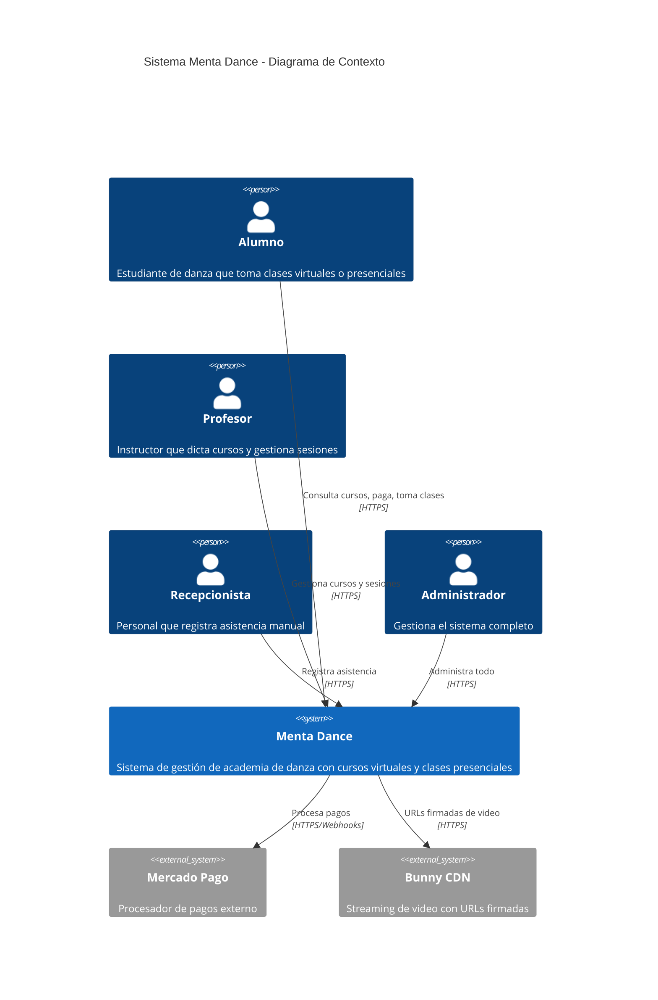
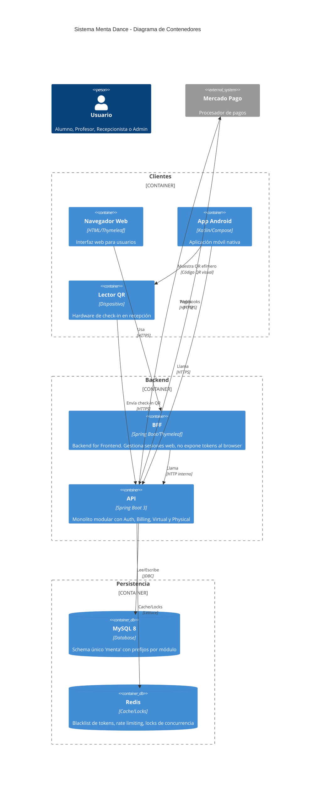
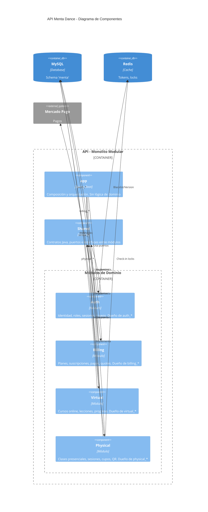
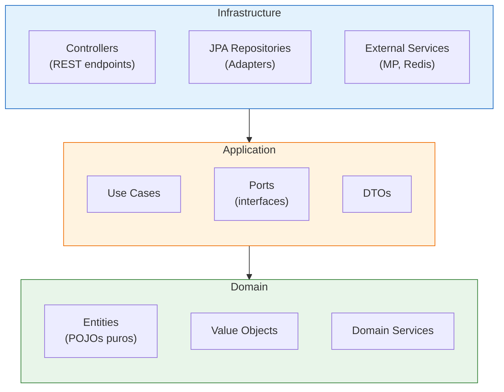
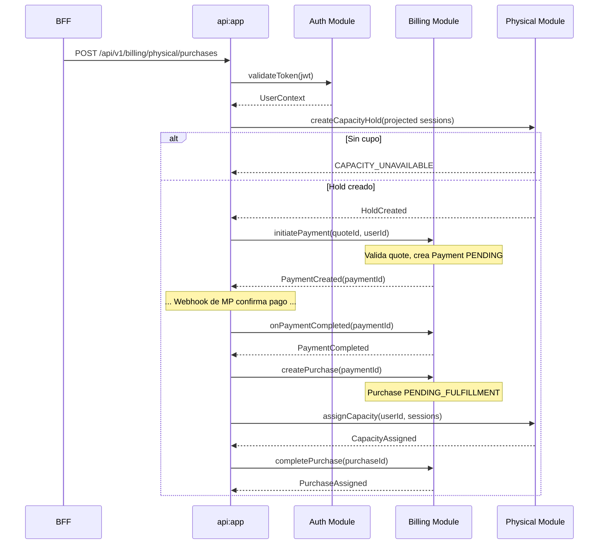

# Diagramas C4 de Menta Dance

Este documento contiene los diagramas C4 del sistema usando sintaxis Mermaid.

## Nivel 1: Contexto del Sistema

## Nivel 2: Contenedores

## Nivel 3: Componentes (API)

## Arquitectura Interna de un Módulo

Cada módulo sigue Clean Architecture con tres capas:

**Regla de dependencia**: `domain ← application ← infrastructure`

- **Domain** no tiene dependencias externas (sin Spring, sin JPA)
- **Application** solo depende de Domain
- **Infrastructure** depende de Application y Domain

## Flujo de Comunicación entre Módulos

> **Nota**: Este es un diagrama simplificado para mostrar la comunicación entre módulos.
> Para el flujo completo con webhooks, holds y manejo de errores, ver [SEQUENCE-DIAGRAMS.md](SEQUENCE-DIAGRAMS.md).

## Notas de Implementación

1. **Sin HTTP interno**: Los módulos se comunican mediante interfaces Java, no llamadas HTTP.
2. **Sin JOINs entre módulos**: Cada módulo solo accede a sus propias tablas (`auth_*`, `billing_*`, etc.).
3. **Orquestación en app**: `api:app` coordina flujos multi-módulo usando puertos de `shared`.
4. **MySQL como fuente de verdad**: Redis es caché y locks; ante falla, se cierra el acceso.
