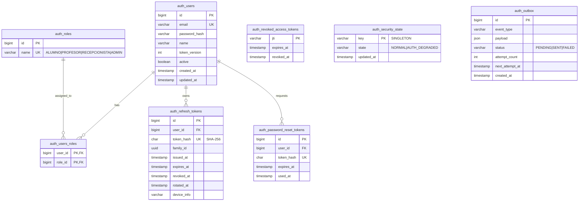
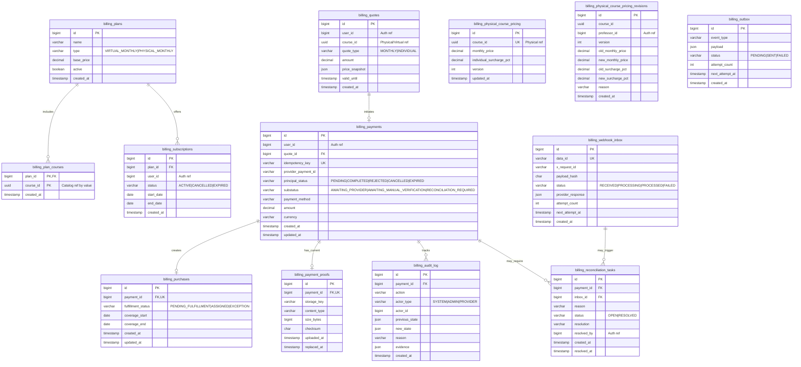
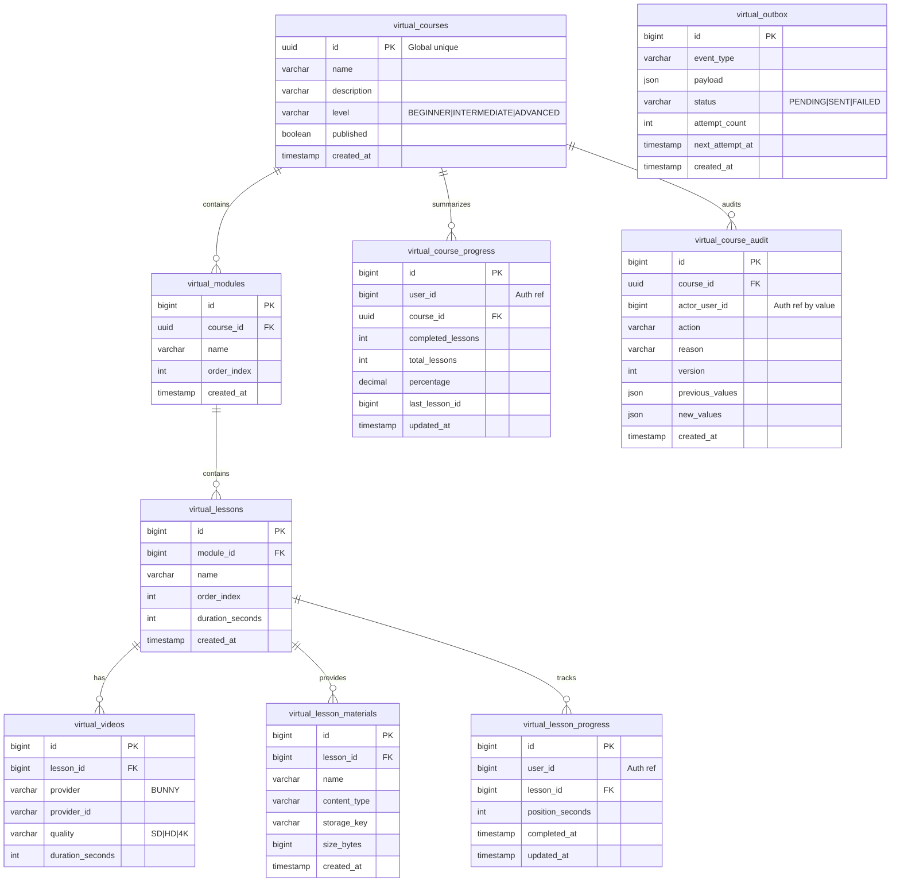
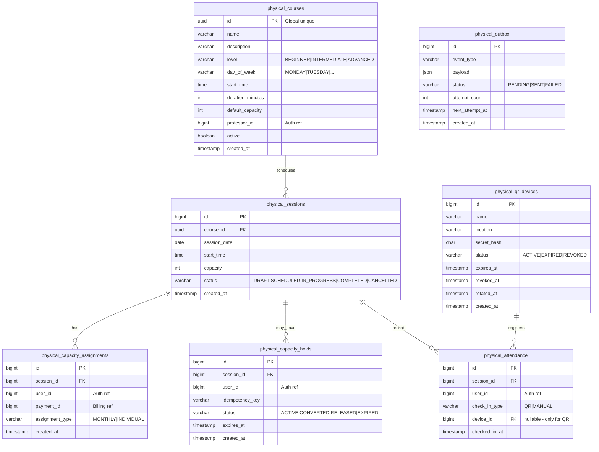

# Diagrama Entidad-Relación

Modelo de datos del sistema Menta Dance con boundaries de módulos.

## Visión General por Módulos

```mermaid
flowchart TB
    subgraph AUTH["Auth Module (auth_*)"]
        direction TB
        auth_users
        auth_roles
        auth_users_roles
        auth_refresh_tokens
        auth_revoked_access_tokens
        auth_password_reset_tokens
        auth_security_state
        auth_outbox
    end

    subgraph BILLING["Billing Module (billing_*)"]
        direction TB
        billing_plans
        billing_plan_courses
        billing_subscriptions
        billing_payments
        billing_payment_proofs
        billing_purchases
        billing_quotes
        billing_webhook_inbox
        billing_reconciliation_tasks
        billing_audit_log
        billing_physical_course_pricing
        billing_physical_course_pricing_revisions
    end

    subgraph VIRTUAL["Virtual Module (virtual_*)"]
        direction TB
        virtual_courses
        virtual_modules
        virtual_lessons
        virtual_videos
        virtual_lesson_materials
        virtual_lesson_progress
        virtual_course_progress
        virtual_course_audit
    end

    subgraph PHYSICAL["Physical Module (physical_*)"]
        direction TB
        physical_courses
        physical_sessions
        physical_capacity_assignments
        physical_capacity_holds
        physical_attendance
        physical_qr_devices
    end

    AUTH -.->|"user_id (valor)"| BILLING
    AUTH -.->|"user_id (valor)"| VIRTUAL
    AUTH -.->|"user_id (valor)"| PHYSICAL
    BILLING -.->|"course_id (valor)"| PHYSICAL

    style AUTH fill:#e3f2fd
    style BILLING fill:#fff3e0
    style VIRTUAL fill:#e8f5e9
    style PHYSICAL fill:#fce4ec
```

**Nota**: Las líneas punteadas indican referencias por valor (no FK). Cada módulo solo tiene FKs hacia sus propias tablas.

---

## Auth Module

---

## Billing Module

---

## Virtual Module

---

## Physical Module

---

## Constraints y Unique Keys

### Auth
| Tabla | Constraint |
|-------|------------|
| `auth_users` | `UNIQUE(email)` |
| `auth_refresh_tokens` | `UNIQUE(token_hash)` |
| `auth_users_roles` | `PK(user_id, role_id)` |

### Billing
| Tabla | Constraint |
|-------|------------|
| `billing_payments` | `UNIQUE(idempotency_key)` |
| `billing_purchases` | `UNIQUE(payment_id)` |
| `billing_webhook_inbox` | `UNIQUE(data_id)` |
| `billing_physical_course_pricing` | `UNIQUE(course_id)` |

### Virtual
| Tabla | Constraint |
|-------|------------|
| `virtual_lesson_progress` | `UNIQUE(user_id, lesson_id)` |
| `virtual_course_progress` | `UNIQUE(user_id, course_id)` |

### Physical
| Tabla | Constraint |
|-------|------------|
| `physical_capacity_assignments` | `UNIQUE(session_id, user_id)` |
| `physical_attendance` | `UNIQUE(session_id, user_id)` |

---

## Referencias Cross-Module (por valor)

Estas columnas guardan IDs de otros módulos **sin FK**. La validación se hace mediante puertos.

| Tabla | Columna | Referencia a |
|-------|---------|--------------|
| `billing_subscriptions` | `user_id` | `auth_users.id` |
| `billing_quotes` | `user_id` | `auth_users.id` |
| `billing_quotes` | `course_id` | `physical_courses.id` o `virtual_courses.id` |
| `billing_payments` | `user_id` | `auth_users.id` |
| `billing_reconciliation_tasks` | `resolved_by` | `auth_users.id` |
| `billing_physical_course_pricing` | `course_id` | `physical_courses.id` |
| `billing_physical_course_pricing_revisions` | `professor_id` | `auth_users.id` |
| `virtual_lesson_progress` | `user_id` | `auth_users.id` |
| `virtual_course_progress` | `user_id` | `auth_users.id` |
| `physical_courses` | `professor_id` | `auth_users.id` |
| `physical_capacity_assignments` | `user_id` | `auth_users.id` |
| `physical_capacity_assignments` | `payment_id` | `billing_payments.id` |
| `physical_capacity_holds` | `user_id` | `auth_users.id` |
| `physical_attendance` | `user_id` | `auth_users.id` |
