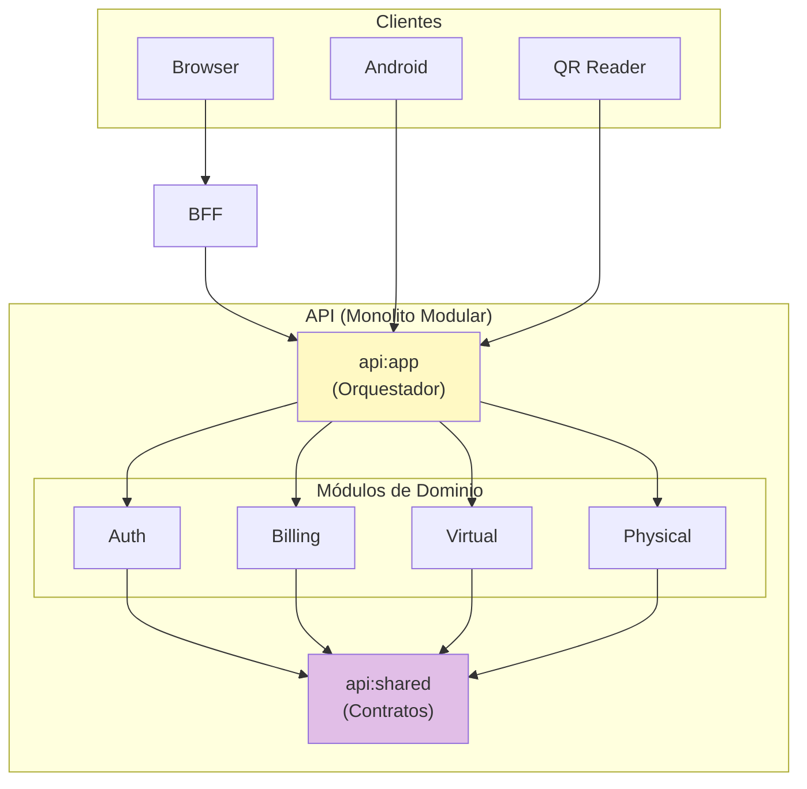
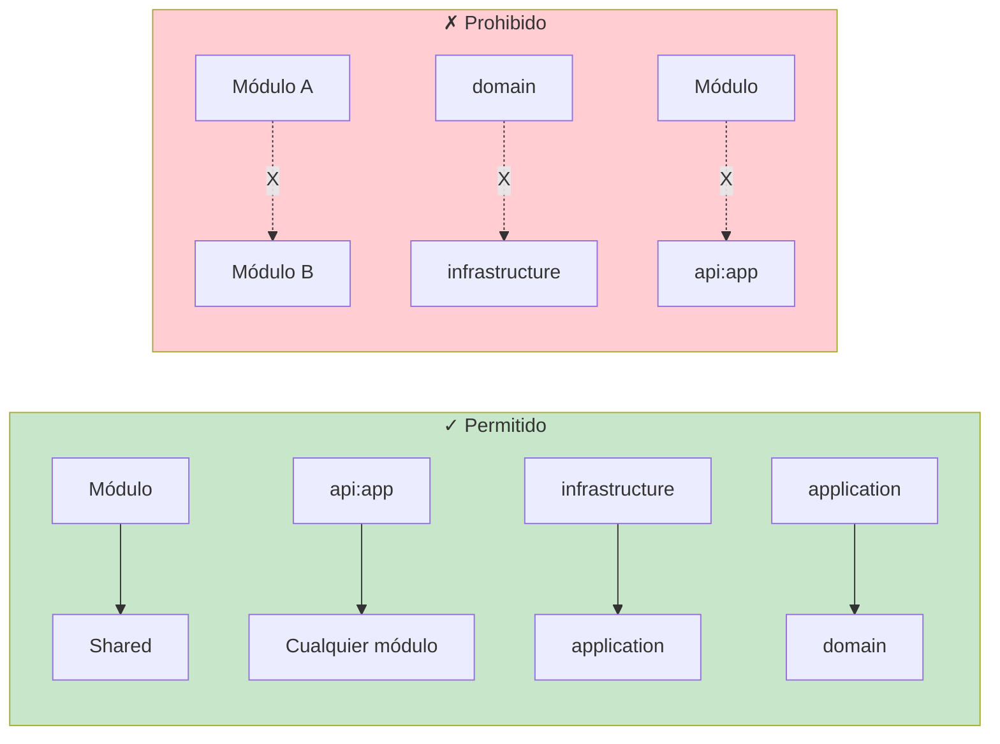
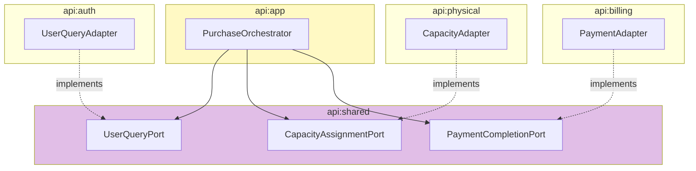
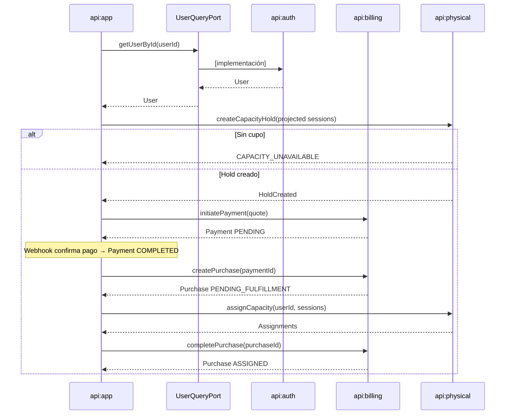
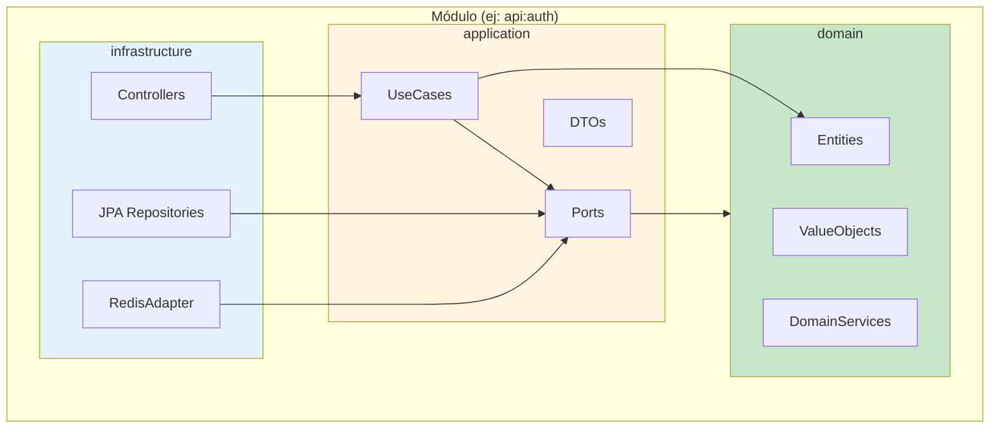
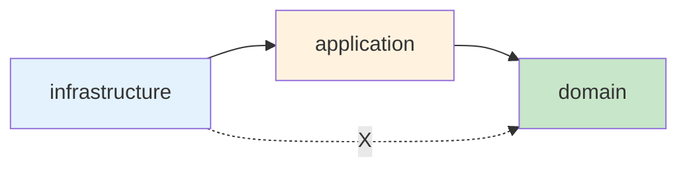
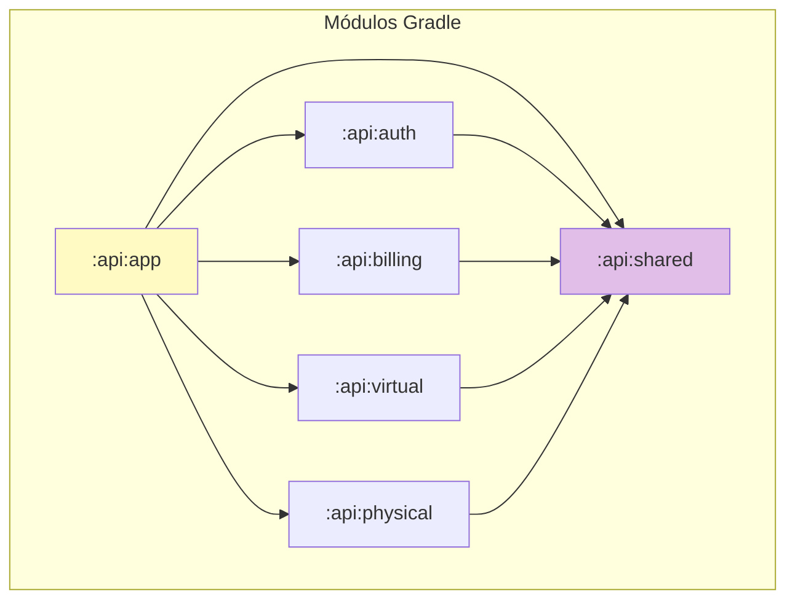
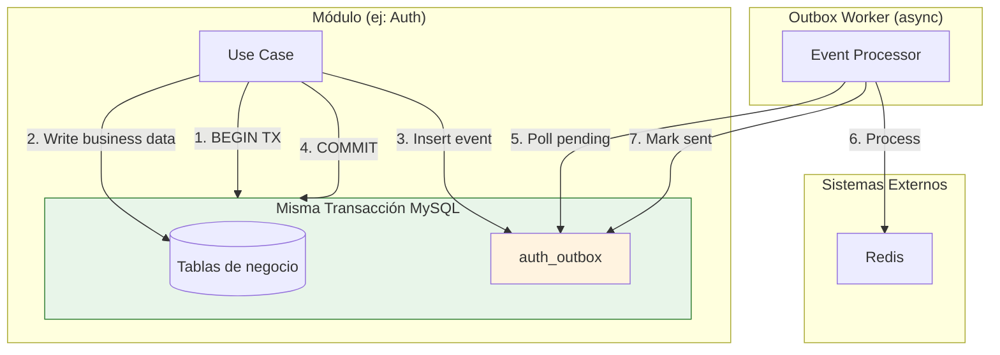
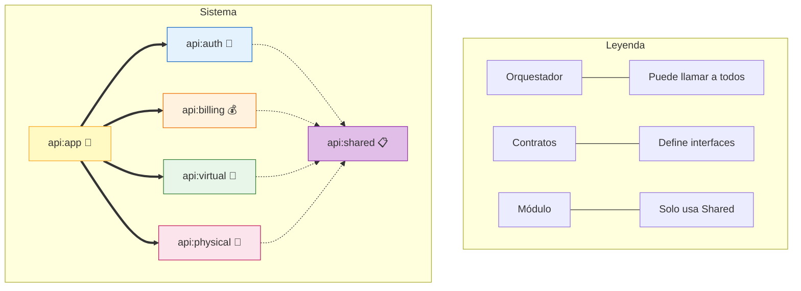

# Diagrama de Dependencias de Módulos

Relaciones y boundaries entre módulos del monolito modular.

## Dependencias de Alto Nivel



---

## Matriz de Dependencias

### Dependencias Permitidas



### Tabla de Dependencias

| Desde | Puede depender de | No puede depender de |
|-------|-------------------|---------------------|
| `api:app` | Auth, Billing, Virtual, Physical, Shared | - |
| `api:auth` | Shared | Billing, Virtual, Physical, app |
| `api:billing` | Shared | Auth, Virtual, Physical, app |
| `api:virtual` | Shared | Auth, Billing, Physical, app |
| `api:physical` | Shared | Auth, Billing, Virtual, app |
| `api:shared` | - | Ningún módulo |

---

## Comunicación entre Módulos

### Patrón: Puertos en Shared



### Ejemplo: Flujo de Compra

El orden correcto es: Payment PENDING → Payment COMPLETED → Purchase PENDING_FULFILLMENT → Purchase ASSIGNED.



**Secuencia**: El checkout crea primero un hold atómico; si no hay cupo no crea
Payment. La Purchase se crea después de que el proveedor confirma el pago
(`Payment → COMPLETED`).

---

## Dependencias por Capa (Clean Architecture)

Cada módulo sigue la misma estructura interna:



### Regla de Dependencia



**Domain no depende de nada externo**: Sin Spring, sin JPA, sin Redis.

---

## Grafo de Módulos Gradle



### build.gradle.kts (api:app)

```kotlin
dependencies {
    implementation(project(":api:shared"))
    implementation(project(":api:auth"))
    implementation(project(":api:billing"))
    implementation(project(":api:virtual"))
    implementation(project(":api:physical"))
}
```

### build.gradle.kts (api:auth)

```kotlin
dependencies {
    implementation(project(":api:shared"))
    // NO puede depender de billing, virtual, physical, ni app
}
```

---

## Eventos y Outbox

### Patrón Transactional Outbox

El commit de negocio y la inserción en outbox ocurren en la **misma transacción MySQL**.



**Garantía**: Si el commit falla, tanto el dato de negocio como el evento se revierten. El worker procesa asincrónicamente solo eventos ya confirmados.

### Eventos por Módulo

| Módulo | Eventos en Outbox |
|--------|-------------------|
| Auth | Token revocation, Blacklist sync, Version update |
| Billing | Payment state change |
| Physical | Capacity assigned, Attendance recorded |
| Virtual | Lesson completed, Progress updated |

---

## Validación con ArchUnit

```java
@ArchTest
static final ArchRule modules_should_not_depend_on_each_other =
    noClasses()
        .that().resideInAPackage("..auth..")
        .should().dependOnClassesThat()
        .resideInAnyPackage("..billing..", "..virtual..", "..physical..");

@ArchTest
static final ArchRule domain_should_not_depend_on_infrastructure =
    noClasses()
        .that().resideInAPackage("..domain..")
        .should().dependOnClassesThat()
        .resideInAnyPackage("..infrastructure..", "org.springframework..");

@ArchTest
static final ArchRule only_app_can_depend_on_all_modules =
    noClasses()
        .that().resideInAnyPackage("..auth..", "..billing..", "..virtual..", "..physical..")
        .should().dependOnClassesThat()
        .resideInAPackage("..app..");
```

---

## Anti-Patrones Detectados por ArchUnit

| Anti-Patrón | Descripción | Regla |
|-------------|-------------|-------|
| Módulo A → Módulo B | Dependencia directa entre módulos | `modules_should_not_depend_on_each_other` |
| Domain → Spring | Entidad con `@Entity` de JPA | `domain_should_be_framework_free` |
| JOIN cross-module | Repository con JOIN a tabla de otro módulo | `repositories_should_not_join_cross_module` |
| FK cross-module | Migración con FK a tabla de otro módulo | Revisión manual de Flyway |
| HTTP interno | RestTemplate/WebClient entre módulos | `no_http_between_modules` |

---

## Resumen de Boundaries



**Principios clave:**
1. `api:app` orquesta, no tiene lógica de dominio
2. `api:shared` define contratos, no implementaciones
3. Módulos solo conocen `shared`, nunca otros módulos
4. Sin HTTP, JOINs, FKs ni brokers entre módulos
