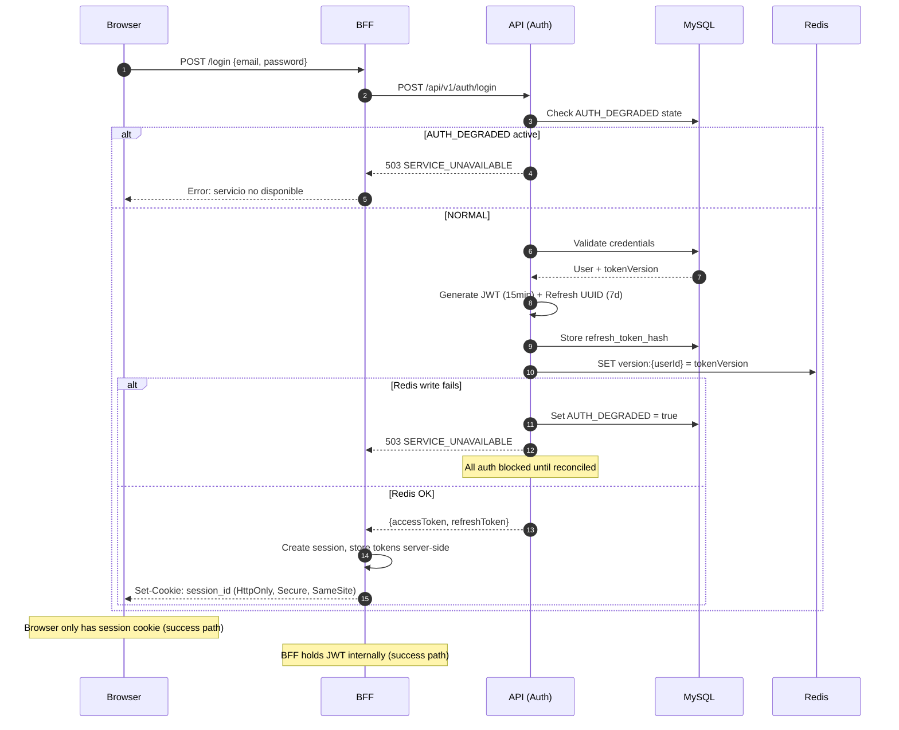
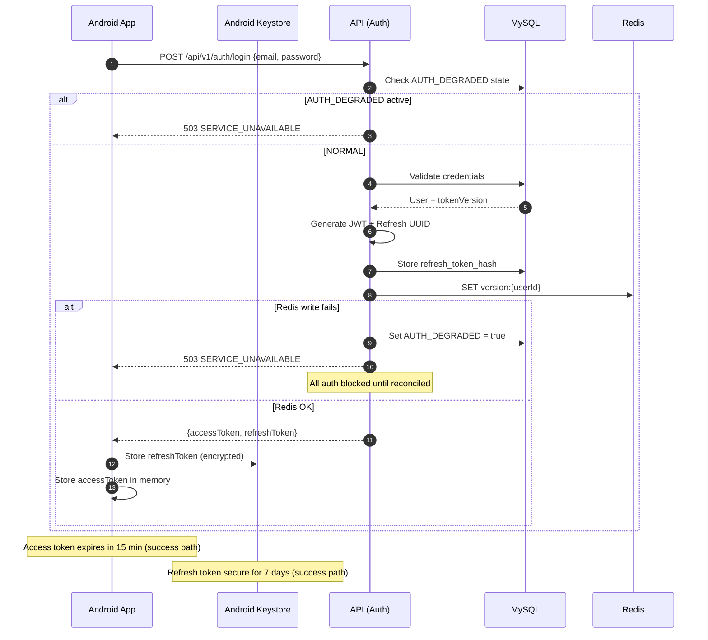
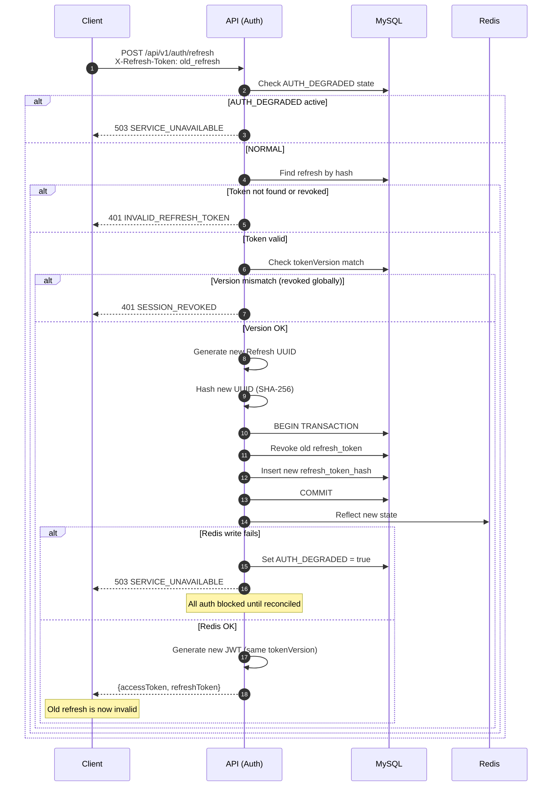
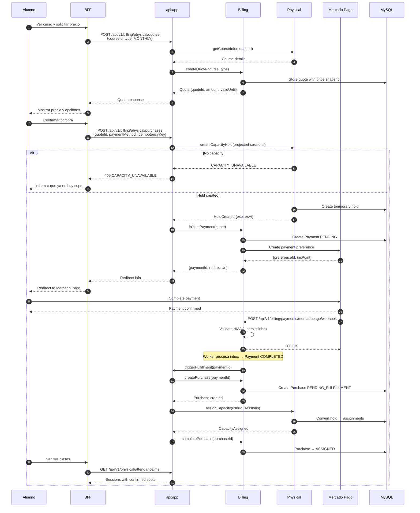
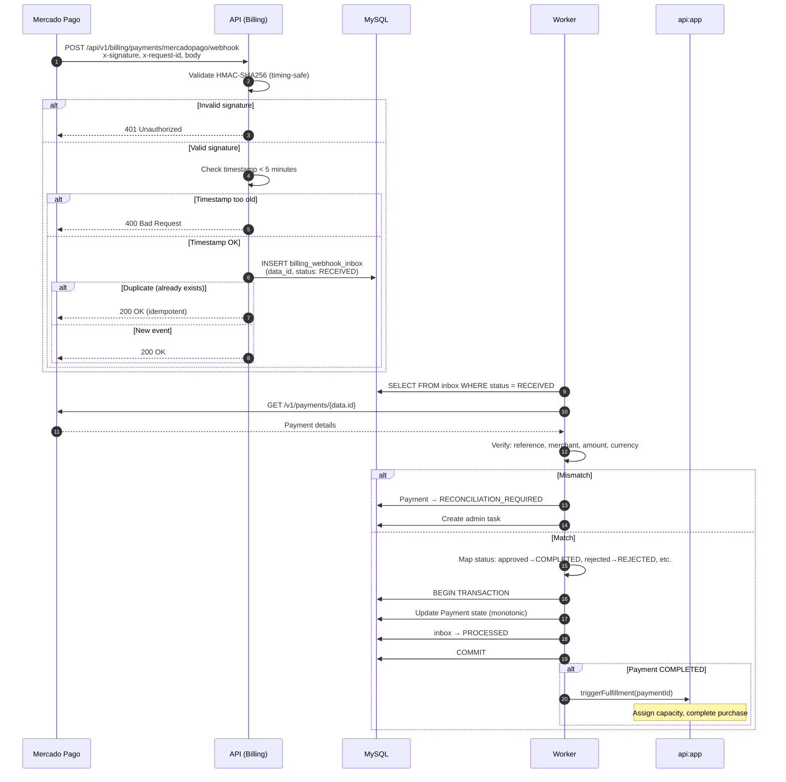
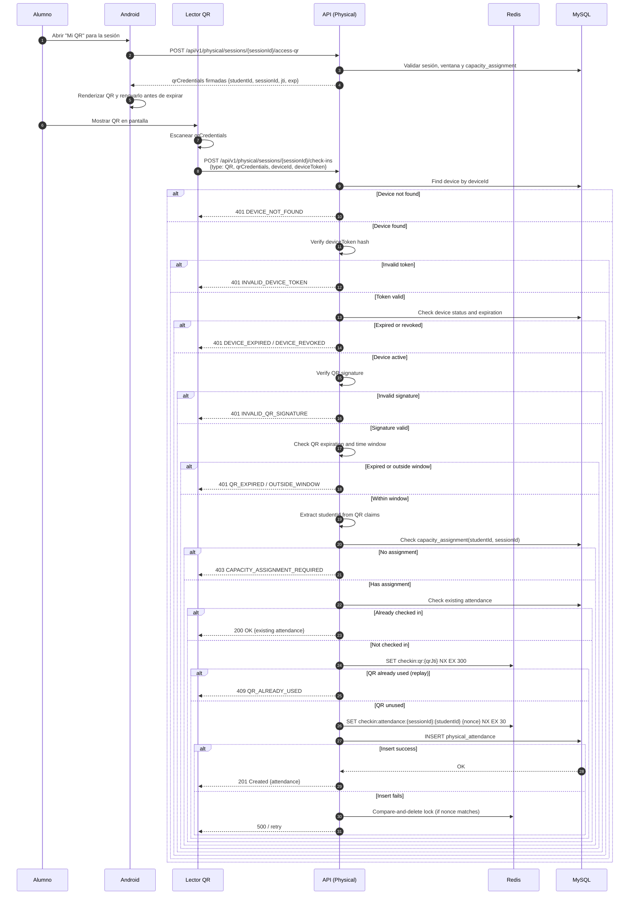
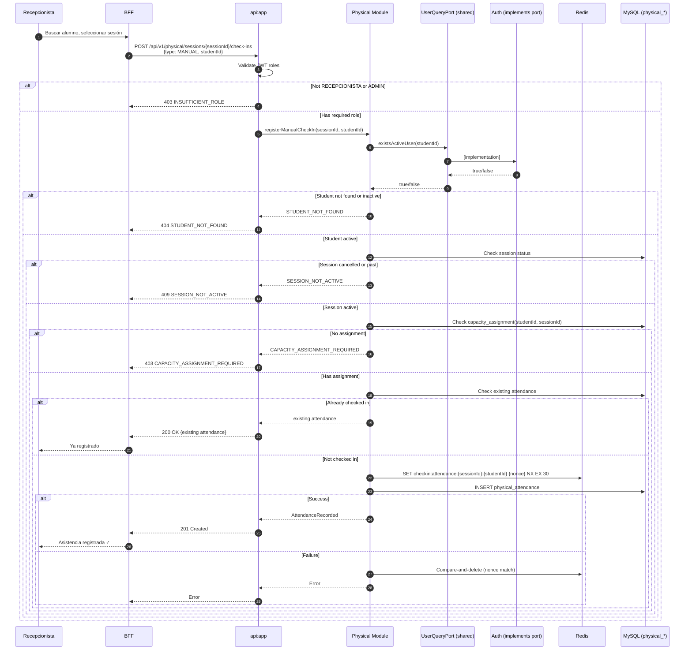
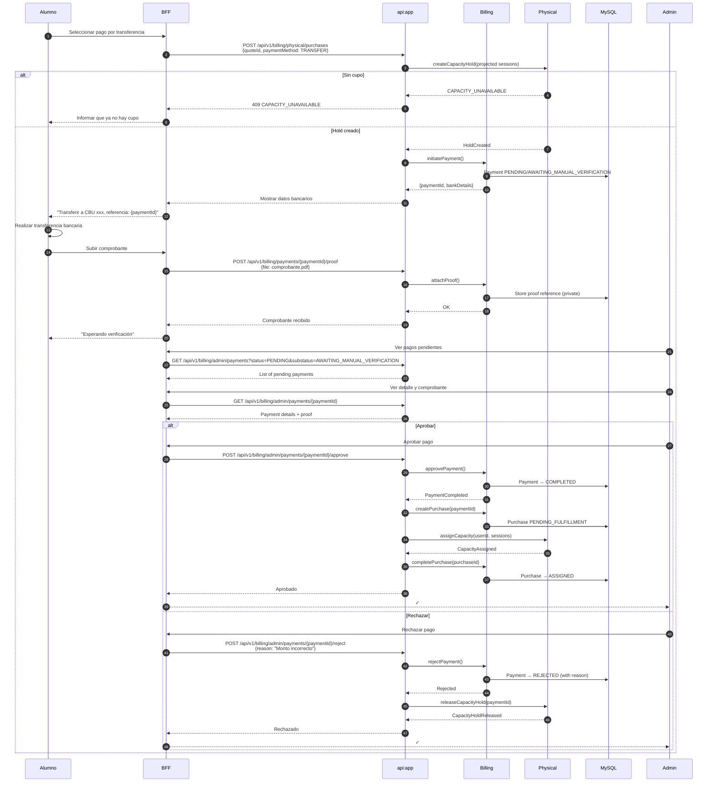
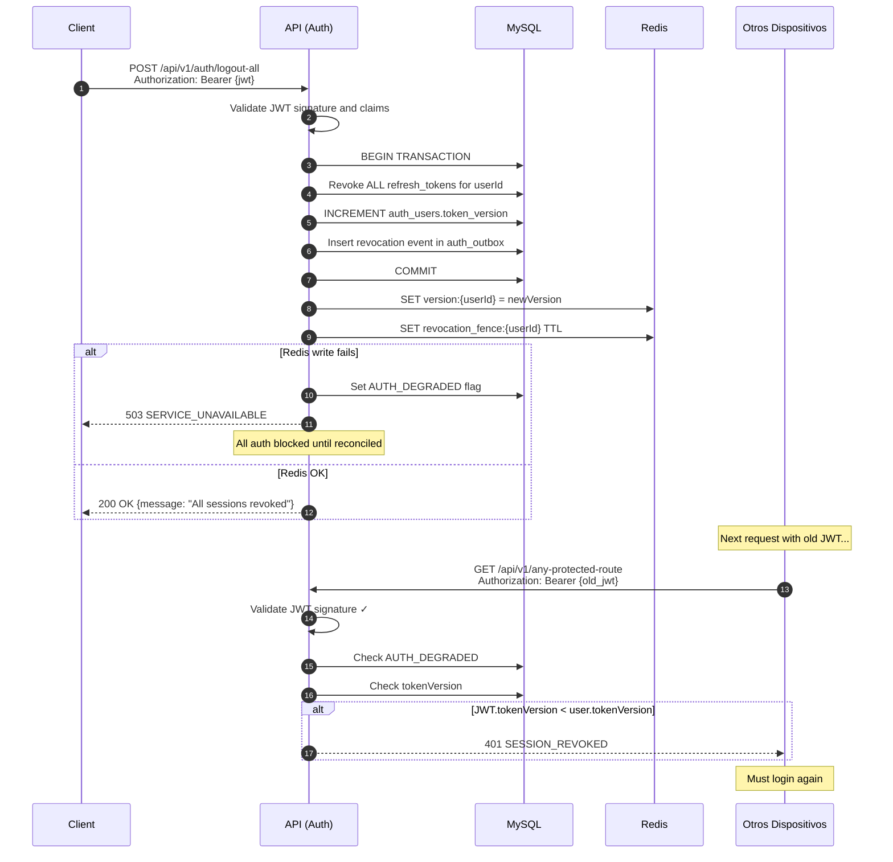

# Diagramas de Secuencia

Flujos principales del sistema Menta Dance en sintaxis Mermaid.

## Índice

1. [Autenticación Web (BFF)](#1-autenticación-web-bff)
2. [Autenticación Android](#2-autenticación-android)
3. [Refresh Token](#3-refresh-token)
4. [Compra Presencial Completa](#4-compra-presencial-completa)
5. [Webhook de Mercado Pago](#5-webhook-de-mercado-pago)
6. [Check-in QR](#6-qr-del-alumno-y-check-in)
7. [Check-in Manual](#7-check-in-manual)
8. [Transferencia Bancaria](#8-transferencia-bancaria)
9. [Revocación Global (Logout-All)](#9-revocación-global-logout-all)

---

## 1. Autenticación Web (BFF)

El navegador nunca ve tokens JWT; solo recibe cookies de sesión del BFF.

---

## 2. Autenticación Android

Android guarda el refresh en Keystore y lo envía via header seguro.

---

## 3. Refresh Token

Rotación obligatoria: el refresh usado se revoca y se emite uno nuevo.

---

## 4. Compra Presencial Completa

Flujo completo: cotización → checkout → pago → asignación de cupo.

---

## 5. Webhook de Mercado Pago

Validación HMAC, inbox durable, verificación con proveedor.

---

## 6. QR del alumno y check-in

Android obtiene una credencial efímera, la muestra como QR y el lector la procesa.

---

## 7. Check-in Manual

Recepcionista registra asistencia sin QR. Physical valida identidad mediante puerto de Auth.

**Nota**: Physical nunca accede a `auth_*` directamente. La validación de identidad se hace mediante `UserQueryPort`, un contrato definido en `api:shared` e implementado por Auth.

---

## 8. Transferencia Bancaria

Pago manual con aprobación de administrador.

---

## 9. Revocación Global (Logout-All)

Invalida todas las sesiones del usuario en todos los dispositivos.

---

## Notas de Implementación

### Principios Transversales

1. **MySQL es fuente de verdad**: Toda operación crítica se confirma primero en MySQL.
2. **Redis es réplica**: Acelera validaciones pero no es autoritativo.
3. **AUTH_DEGRADED fail-closed**: Si Redis no puede reflejar cambios de auth, todo se bloquea.
4. **Idempotencia**: Todos los endpoints de pago y check-in son idempotentes por diseño.
5. **Monotonía de estados**: Los pagos nunca retroceden de estado.

### Locks Redis

| Lock Key | Propósito | TTL |
|----------|-----------|-----|
| `checkin:qr:{jti}` | Prevenir replay de QR | 5 min |
| `checkin:attendance:{sessionId}:{studentId}` | Serializar check-in | 30 sec |
| `blacklist:jti:{jti}` | JWT revocado | hasta exp |
| `version:{userId}` | Token version cache | 24h |
| `revocation_fence:{userId}` | Deny fence post-revocation | 15 min |

### Compensación Redis

Cuando falla el INSERT después de adquirir un lock:
1. Comparar nonce almacenado con nonce propio
2. Solo borrar si coinciden (no borrar lock de otro proceso)
3. Permitir reintento seguro
