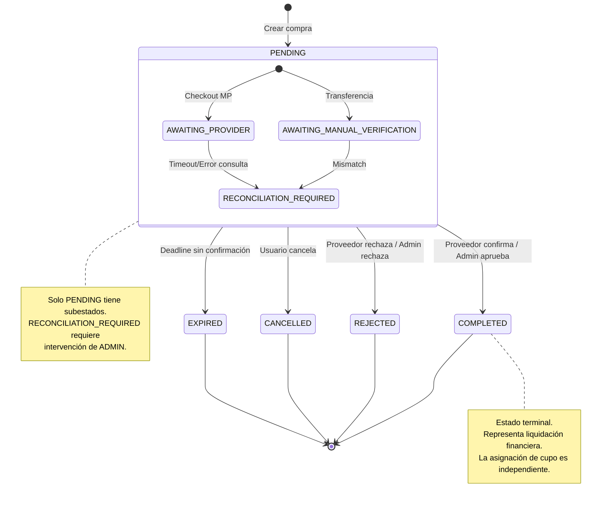
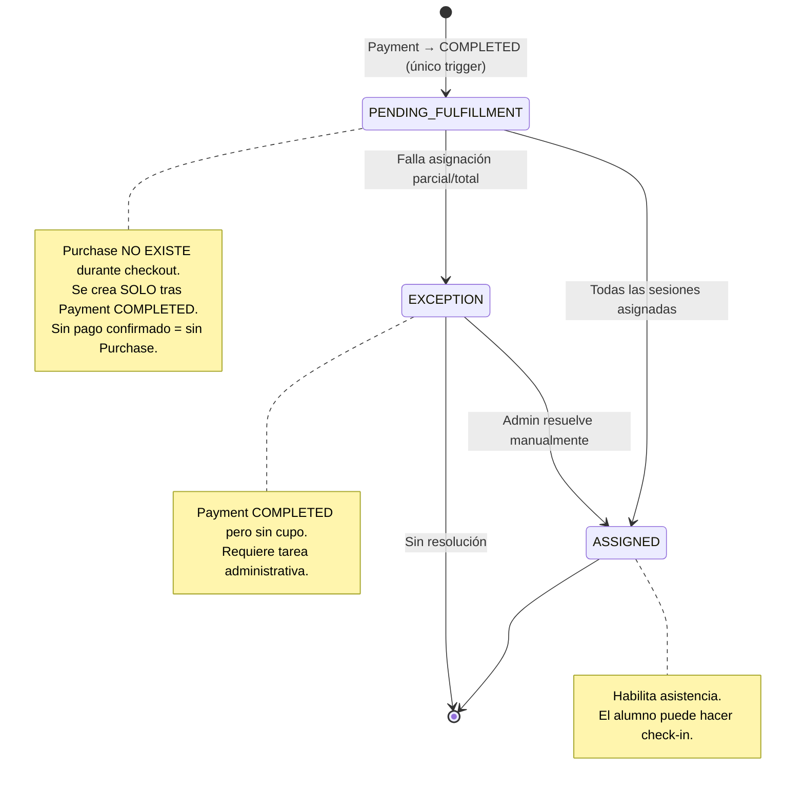
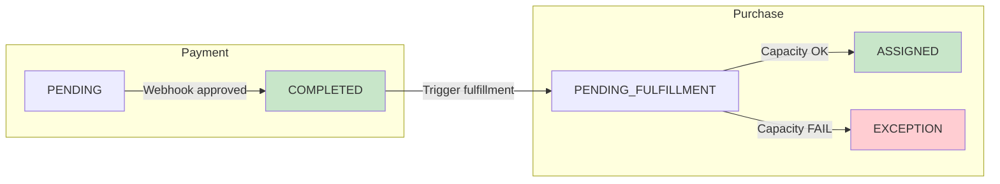
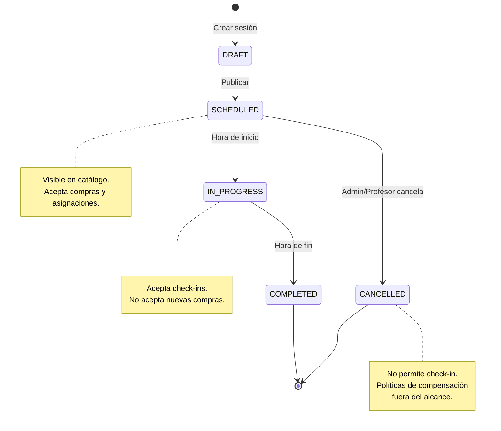
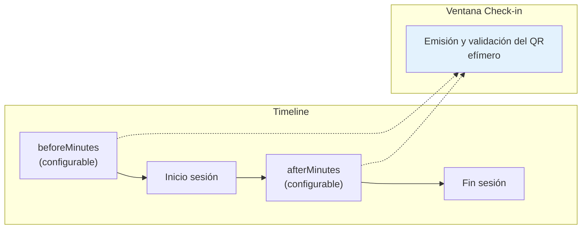
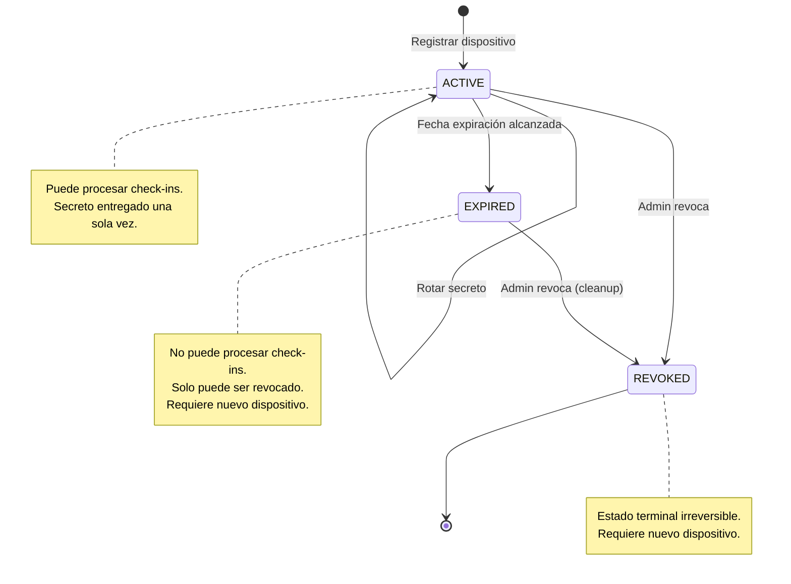
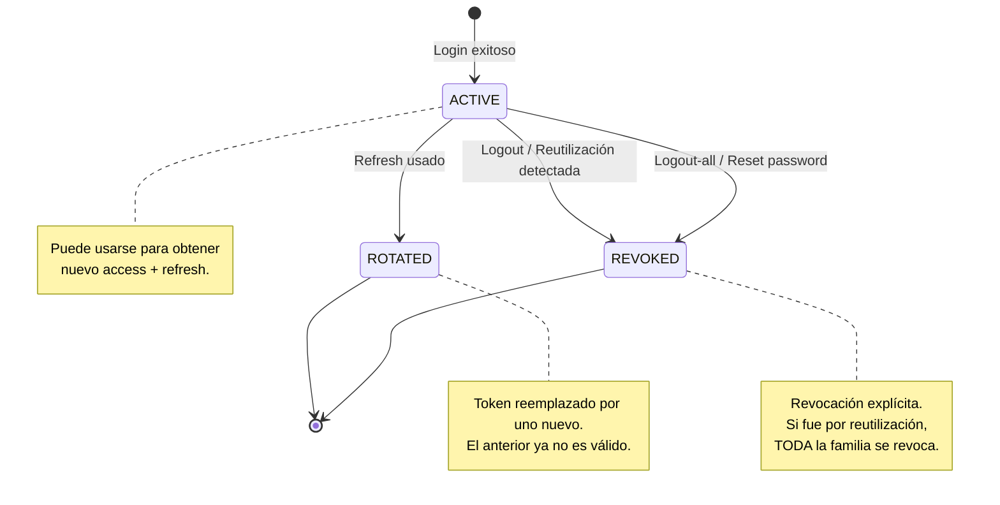
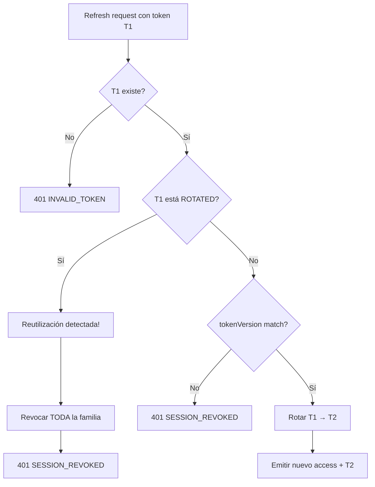
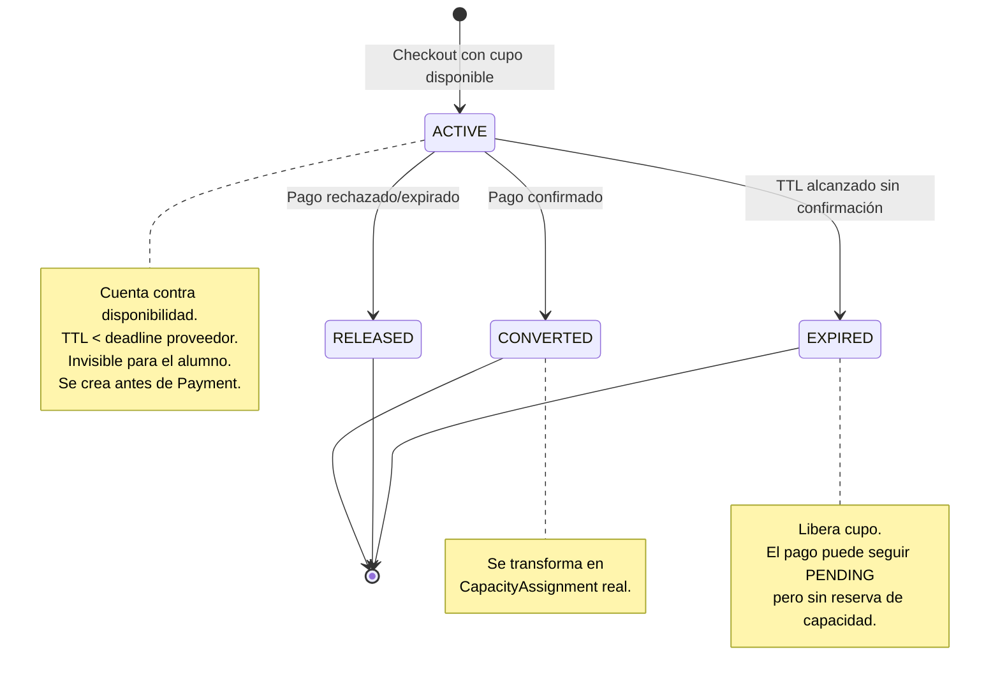
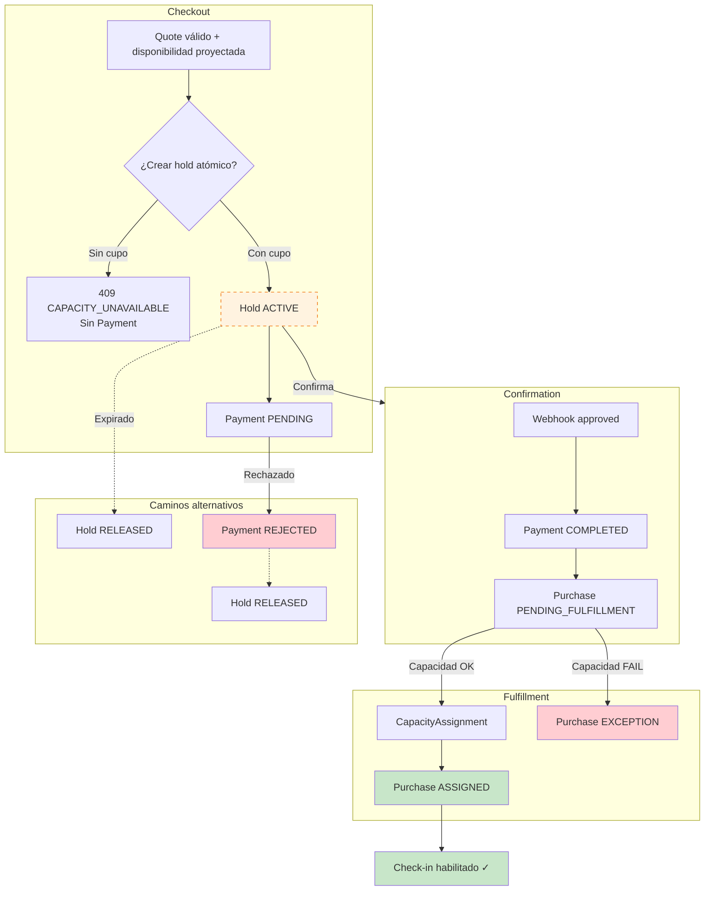

# Diagramas de Estados

Ciclos de vida de las entidades principales del sistema.

## Índice

1. [Payment](#1-payment)
2. [Purchase](#2-purchase)
3. [Session](#3-session)
4. [QR Device](#4-qr-device)
5. [Refresh Token](#5-refresh-token)
6. [Capacity Hold](#6-capacity-hold)

---

## 1. Payment

Estado principal del pago con subestados para `PENDING`.

### Reglas de Transición

| Desde | Hacia | Trigger | Actor |
|-------|-------|---------|-------|
| - | PENDING/AWAITING_PROVIDER | Checkout MP | Sistema |
| - | PENDING/AWAITING_MANUAL_VERIFICATION | Checkout Transferencia | Sistema |
| PENDING | COMPLETED | Webhook `approved` / Admin approve | Proveedor/Admin |
| PENDING | REJECTED | Webhook `rejected` / Admin reject | Proveedor/Admin |
| PENDING | CANCELLED | Webhook `cancelled` | Proveedor |
| PENDING | EXPIRED | Deadline sin confirmación | Sistema |
| AWAITING_* | RECONCILIATION_REQUIRED | Timeout, mismatch, error | Sistema |

**Monotonía**: Una vez en estado terminal, no hay retroceso. Webhooks tardíos o duplicados se ignoran.

---

## 2. Purchase

Estado de fulfillment (asignación de cupo), independiente del Payment.

> **IMPORTANTE**: Purchase **nunca existe** sin un Payment en estado `COMPLETED`.
> No se crea al iniciar el checkout — se crea únicamente después de la confirmación del pago.

### Relación Payment ↔ Purchase

**Secuencia**: Payment PENDING → Payment COMPLETED → Purchase PENDING_FULFILLMENT → Purchase ASSIGNED/EXCEPTION

---

## 3. Session

Estado de una sesión de clase presencial.

### Ventana de Check-in

La ventana de check-in es **configurable por sesión**. No tiene valores fijos predeterminados.

**Nota**: Los valores `beforeMinutes` y `afterMinutes` son configurables por sesión o a nivel de sistema. Dentro de esa ventana Android obtiene y renderiza una credencial QR efímera firmada; el lector la valida contra la API. El diagrama ilustra el concepto, no valores específicos.

---

## 4. QR Device

Ciclo de vida de un lector QR.

### Operaciones de Seguridad

| Operación | Estado requerido | Efecto |
|-----------|------------------|--------|
| `rotate-secret` | ACTIVE | Nuevo secreto, invalida anterior |
| `revoke` | ACTIVE, EXPIRED | → REVOKED (irreversible) |
| Check-in | ACTIVE (no expirado) | Procesa QR |

---

## 5. Refresh Token

Ciclo de vida de un token de refresco.

### Detección de Reutilización

---

## 6. Capacity Hold

Hold técnico temporal obligatorio durante todo checkout presencial, sea
asíncrono o síncrono.

### Hold vs Assignment

| Aspecto | CapacityHold | CapacityAssignment |
|---------|--------------|-------------------|
| Visibilidad | Interno | Alumno puede ver |
| Duración | TTL corto (minutos) | Permanente |
| Permite check-in | No | Sí |
| Cuenta en disponibilidad | Sí | Sí |
| Creado por | Checkout presencial, antes de Payment/proveedor | Confirmación de pago |

---

## Estados Combinados: Flujo Completo de Compra

**Nota**: El Hold (línea punteada) se crea obligatoriamente antes de crear un
`Payment` o iniciar un proveedor, incluso para métodos de pago síncronos. Si no
se puede crear, el checkout responde `409 CAPACITY_UNAVAILABLE` sin pago.

---

## Invariantes de Estado

### Payment
- Estados terminales: `COMPLETED`, `REJECTED`, `CANCELLED`, `EXPIRED`
- Solo `PENDING` tiene subestados
- Transiciones monotónicas (no hay retroceso)

### Purchase
- `ASSIGNED` es el único estado que habilita check-in
- `Payment.COMPLETED` + `Purchase.EXCEPTION` = dinero recibido pero sin cupo

### Session
- `CANCELLED` bloquea check-ins aunque existan asignaciones
- La ventana de check-in es configurable por sesión

### Device
- `REVOKED` es irreversible
- El secreto solo se entrega al crear o rotar

### Refresh Token
- Reutilización revoca toda la familia (paranoid rotation)
- `tokenVersion` global invalida todos los tokens del usuario
