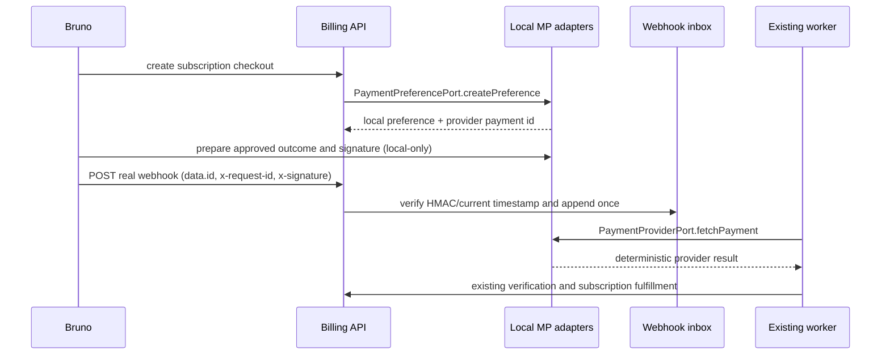

# Design: local-mercadopago-simulator

## Architecture

`api:billing` owns the simulator because it implements Billing's own outbound
ports. It is infrastructure-only and activated solely by a dedicated local
profile layered on the existing E2E runner. No module crosses a repository,
JPA, SQL or HTTP boundary to control it.

The simulator stores ephemeral in-memory deterministic records keyed by the
preference/payment identifiers it emits. `PaymentPreferencePort` creates a
local preference from Billing's existing request and returns a local opaque
`initPoint`. `PaymentProviderPort` reads the prepared provider outcome. The
existing `PaymentVerificationService` remains the sole authority deciding
whether that result matches amount, currency, external reference and merchant.

## Profile and security boundary

Introduce a single explicit profile (for example `e2e-mercadopago`) guarded
against `prod`, `production`, and `staging`. Conditional beans select either
the two real Mercado Pago adapters or both local adapters, never a mixture.
The existing `HmacSha256WebhookSignatureVerifier` stays wired. A profile-only
local webhook preparation component may calculate a current `x-signature`
using the deterministic local HMAC key, but it MUST not bypass or replace
verification and MUST not log the key/signature payload.

## Sequence

## Outcome model

The local adapter MUST expose only test-oriented preparation through a
profile-only infrastructure endpoint or fixture service; the SDD apply phase
will select the narrowest existing contract-compatible mechanism. It supports:

- `approved`: all expected values match;
- `pending` and `rejected`: normal provider statuses;
- `inconsistent`: deterministic mismatch of a verified field to exercise the
  existing reconciliation outcome.

It MUST NOT manufacture a local Billing `Payment` or `Subscription`, mutate
domain state directly, or mark an inbox row processed. Those effects remain
the ordinary checkout and worker paths.

## Test strategy

Tests first prove profile exclusivity, deterministic preference/payment lookup,
outcome preparation, HMAC validity through the real verifier, and that
production adapter beans remain selected outside the profile. Integration and
Bruno tests then prove approved fulfillment, duplicate idempotency, pending /
rejected semantics and inconsistency reconciliation. Existing ArchUnit rules
for Billing's framework-free domain/application layers remain applicable.
