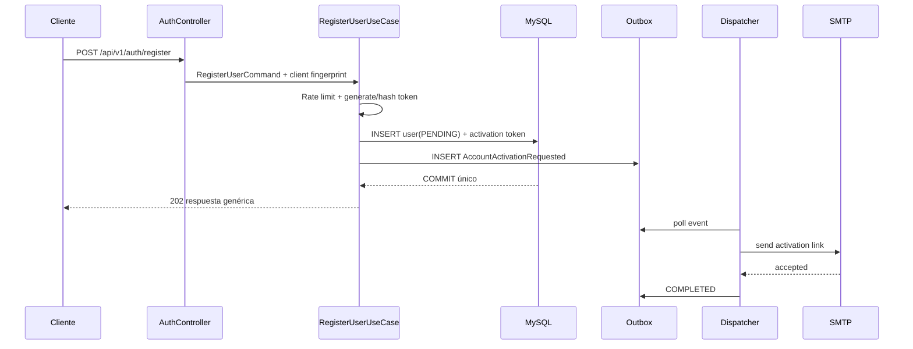
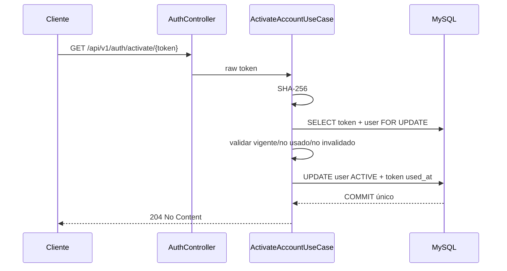

# Diseño: activación de cuentas

## Enfoque técnico

El slice conserva la dirección `domain -> application -> infrastructure`.
`api:auth` posee el ciclo de vida de usuario y token. `api:app` sólo ensambla y
ejecuta handlers de outbox; no decide reglas de activación. No se introduce
dependencia cross-module ni infraestructura en domain/application.

## Decisiones

| # | Decisión | Alternativas | Motivo |
|---|---|---|---|
| 1 | `PENDING_ACTIVATION` explícito | Reutilizar `INACTIVE` | Evita mezclar falta de verificación con baja voluntaria/suscripción |
| 2 | Token aleatorio 32 bytes + Base64 URL-safe; SHA-256 persistido | JWT firmado; BCrypt | El token es opaco, revocable y buscable; 256 bits hacen innecesario un hash lento |
| 3 | TTL 24 h configurable | 1 h; 7 días | Balancea entrega de correo y ventana de exposición; no está fijado por docs |
| 4 | Outbox durable + SMTP handler | SMTP sincrónico; evento en memoria | Evita perder correo tras confirmar usuario/token |
| 5 | Routing por `event_type` exacto | Worker único; pattern matching amplio | Impide aplicar blacklist a eventos no relacionados |
| 6 | Respuesta uniforme para registro/reenvío | `404`/`409` explícitos | Evita enumeración de cuentas |
| 7 | Rate limit Redis fail-closed | Memoria local; fail-open | Debe ser consistente entre instancias y no permitir abuso durante incidentes |

## Modelo de dominio

```text
User
  PENDING_ACTIVATION --activate()--> ACTIVE
  ACTIVE/INACTIVE/SUSPENDED/LOCKED --activate()--> rejected

ActivationToken
  ACTIVE --consume(now)--> USED
  ACTIVE --invalidate(now)--> INVALIDATED
  ACTIVE + expiresAt <= now --> EXPIRED (estado derivado)
```

`User.register(...)` crea sólo `PENDING_ACTIVATION`. `User.create(...)` se
mantiene como factory activa para provisión confiable existente y fixtures, pero
el controller público nunca debe usarla.

## Persistencia

V3 crea:

```sql
CREATE TABLE auth_activation_tokens (
  id BINARY(16) NOT NULL,
  user_id BINARY(16) NOT NULL,
  token_hash CHAR(64) NOT NULL,
  delivery_ciphertext VARBINARY(1024) NULL,
  delivery_nonce BINARY(12) NULL,
  delivery_key_version SMALLINT NULL,
  expires_at DATETIME(3) NOT NULL,
  used_at DATETIME(3) NULL,
  invalidated_at DATETIME(3) NULL,
  created_at DATETIME(3) NOT NULL,
  PRIMARY KEY (id),
  UNIQUE KEY uk_auth_activation_token_hash (token_hash),
  KEY idx_auth_activation_user_active (user_id, used_at, invalidated_at)
);
```

No se agrega FK: el límite de módulo se conserva por ownership y repositorio.
El estado expirado se deriva de `expires_at`; no requiere job de transición.

## Puertos principales

```java
public interface ActivationTokenRepository {
    ActivationToken save(ActivationToken token);
    Optional<ActivationToken> findByHash(String hash);
    void invalidateActiveByUserId(UserId userId, Instant now);
}

public interface ActivationTokenGenerator { String generate(); }
public interface ActivationTokenHasher { String hash(String rawToken); }
public interface ActivationRateLimitPort {
    RateLimitDecision consume(String emailFingerprint, String clientFingerprint);
}
public interface ActivationNotificationPort {
    void sendActivation(String recipient, String activationUrl);
}
```

Los commands de aplicación no reciben `HttpServletRequest`; infrastructure
deriva el fingerprint del cliente y lo entrega como valor opaco.

## Flujo de registro



## Flujo de activación



## Dispatch del outbox

Se introducirá `OutboxEventHandler` con `supports(eventType)` y `handle(row)`.
El worker selecciona exactamente un handler; cero o más de uno es error y deja
la fila `FAILED`. El handler de blacklist conserva la semántica y heartbeat
existentes. El handler SMTP sólo marca `COMPLETED` después de aceptación del
servidor SMTP.

El payload de activación incluye recipient y token en claro porque el worker
debe construir el enlace. Esto implica que el outbox contendría el secreto y
violaría la regla de no persistencia. Por lo tanto, **el evento no guarda el
token**: guarda `activationTokenId`; el handler carga un sobre de entrega
cifrado de vida corta desde una tabla `auth_activation_deliveries` o genera la
entrega dentro de la transacción.

Para evitar persistir el token en claro y mantener durabilidad, V3 agregará a
`auth_activation_tokens` una columna `delivery_ciphertext VARBINARY(1024)`
cifrada con AES-GCM y una clave exclusiva de entorno. El handler descifra sólo
en memoria, envía el correo y limpia `delivery_ciphertext` al completar. Nonce y
versión de clave se guardan junto al ciphertext. La clave nunca se versiona.

> Esta complejidad es intencional: durabilidad y “token nunca persistido en
> claro” no pueden cumplirse simultáneamente sin cifrar el material pendiente de
> entrega.

## Seguridad

- `AUTH_ACTIVATION_DELIVERY_KEY` separado del secreto JWT, 256 bits y validado
  fail-fast en perfiles productivos.
- Keys Redis: `rate:auth-activation:email:{sha256}` y
  `rate:auth-activation:client:{sha256}` con TTL; nunca email/IP en claro.
- Problem Details RFC 9457 con códigos genéricos para token inválido/expirado.
- Filtro/redacción de access logs para `/activate/{token}`.
- Métricas sólo agregadas: emitted, delivered, activated, expired, rate_limited.

## Testing

| Capa | Estrategia |
|---|---|
| Domain | Estado de User y ActivationToken, expiración, uso único, concurrencia lógica |
| Application | Mockito sobre repositorios, generador, hasher, rate limiter y outbox |
| Persistence | `@DataJpaTest` para queries condicionales e invalidación |
| Integration | Testcontainers MySQL + Redis; transacción y dispatcher; SMTP fake/Mailpit |
| Web | MockMvc para rutas, status, RFC 9457, uniformidad y redacción |
| Architecture | Reglas existentes + controllers sólo por port-in |
| Manual | Bruno y Mailpit: register → activate → login |

## Migración y compatibilidad

- V3 es aditiva. Usuarios existentes `ACTIVE` permanecen activos.
- Sólo nuevos registros públicos usan `PENDING_ACTIVATION`.
- La ruta existente `/api/v1/users/register` se mantiene durante esta entrega;
  se documenta como alias temporal del canónico `/api/v1/auth/register` o se
  migra con test de compatibilidad. No habrá dos implementaciones de caso de uso.
- Rollback operativo desactiva el feature; no elimina V3.

## Preguntas diferidas

- El BFF/Android que presenta la pantalla final de activación se diseña en otro
  slice; esta entrega cierra el contrato API y la entrega de correo.
- Rotación de la clave de cifrado de entregas requerirá versionado de clave; V1
  soportará `key_version` aunque sólo haya una clave activa.
