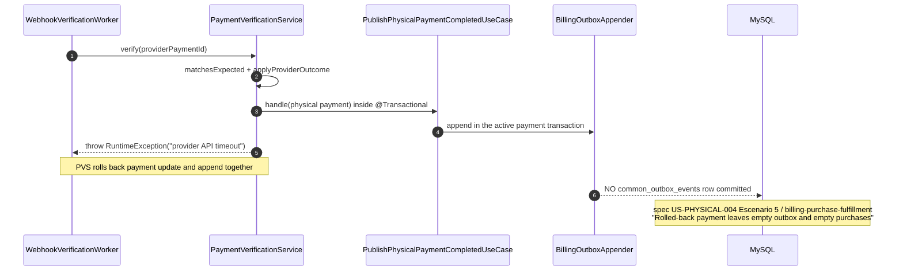
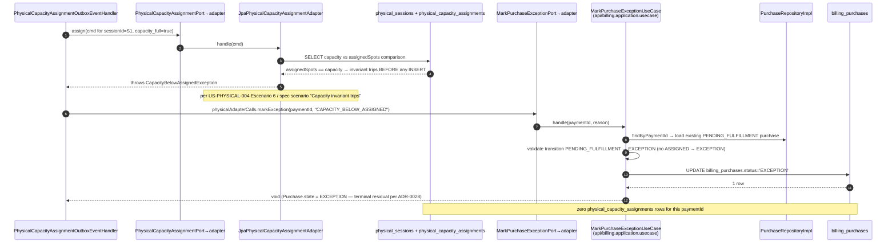

# Design: fix-presential-purchase-quota-exception

> Wiring the post-payment presential flow that turns a confirmed physical
> `Payment` into a `Purchase(PENDING_FULFILLMENT)` plus a
> `physical_capacity_assignments` row, dispatched through the
> `common_outbox_events` table as `billing.PhysicalPaymentCompleted`,
> ADR-0028 residual `EXCEPTION` preserved.

**Change ID**: `fix-presential-purchase-quota-exception` (issue #115)
**Spec source**: `openspec/changes/fix-presential-purchase-quota-exception/specs/{presential-purchase-fulfillment,physical-checkin}/spec.md`
**Pattern template**: `api/app/src/main/java/com/menta/app/billing/PhysicalCourseAvailabilityAdapter.java` (lines 25–46) — api:app calling a Physical IN port through a typed api:app adapter, never crossing module prefixes via JPA/SQL/HTTP/messaging.

---

## 1. Architecture summary

The post-payment presential flow threads THREE backend modules through the `api:app` orchestrator plus a NEW `api:shared` payload record:

- **`api:billing`** remains the producer of the event. `PaymentVerificationService.ensureFulfillment` (no longer the documented NO-OP at `PaymentVerificationService.java:171-178` for the `PaymentTarget.Physical` branch) calls `PublishPhysicalPaymentCompletedUseCase`, which appends through `BillingOutboxAppenderPort` in the SAME transaction as the payment row. The new infra adapter `BillingOutboxAppender` lives in `api:billing.infrastructure.outbox` and INSERTs exactly one row into `common_outbox_events` (V2, lines 34–50) with `event_type = "billing.PhysicalPaymentCompleted"`.
- **`api:app`** is the orchestrator. The new `PhysicalCapacityAssignmentOutboxEventHandler` (Spring `@Component` implementing `api:app.outbox.OutboxEventHandler` interface at `OutboxEventHandler.java`) is discovered via Spring component scan alongside `ActivationOutboxEventHandler`, `PasswordResetOutboxEventHandler`, etc. On a row it: (1) deserializes `PaymentCompletedOutboxPayload` from `row.getPayload()` (Jackson over the JSON column), (2) calls `PurchaseCreationFromEventPort.createPurchaseFromPaymentEvent` via the new `PhysicalCapacityAssignmentAdapter` (mirrors `PhysicalCourseAvailabilityAdapter.java` lines 25-46), (3) calls `PhysicalCapacityAssignmentPort.assign(...)` via the api:app typed callable, (4) routes any `CapacityBelowAssignedException` / `DataIntegrityViolationException` to `MarkPurchaseExceptionPort.markException` via the api:app `MarkPurchaseExceptionAdapter`.
- **`api:physical`** owns the capacity write. The new IN port `PhysicalCapacityAssignmentPort.assign(userId, sessionIds, paymentId)` lives at `api:physical.application.port.in`. Its sole infrastructure adapter `JpaPhysicalCapacityAssignmentAdapter` (in `api:physical.infrastructure.adapter`, parallel to `PhysicalSessionRepositoryAdapter`) uses `AssignCapacityUseCase` with `@Transactional(propagation = REQUIRES_NEW)` for the JPA read of `physical_sessions` capacity via the existing native query `PhysicalSessionJpaRepository#findByIdWithAvailability` (lines 67-82) and ONE INSERT into `physical_capacity_assignments`. `DataIntegrityViolationException` against the V7 `UNIQUE (session_id, student_id)` index (`V7__physical_courses.sql:44`) is rethrown as `CapacityBelowAssignedException` for the api:app handler to route to `EXCEPTION`.

The cross-module edges are EXCLUSIVELY:

| From | To | Type of coupling | Mechanism |
|------|-----|------------------|-----------|
| `api:billing.infrastructure.outbox.BillingOutboxAppender` | JPA entity mapped to `common_outbox_events` | JPA | Class-local `BillingOutboxRowJpaEntity` (mirrors auth's `OutboxRowJpaEntity`, V2 schema) — see [§4 JPA strategy note](#4-cross-module-jpa-strategy). |
| `api:app.outbox.PhysicalCapacityAssignmentOutboxEventHandler` | `api:billing.application.port.in.PurchaseCreationFromEventPort` / `MarkPurchaseExceptionPort` | Plain Java interface in api:billing, called from api:app via the new `PhysicalCapacityAssignmentAdapter` / `MarkPurchaseExceptionAdapter` typed callables | No HTTP. No JPA entity crossing. No SQL JOIN. |
| `api:app.billing.{PhysicalCapacityAssignmentAdapter, MarkPurchaseExceptionAdapter}` | `api:physical.application.port.in.PhysicalCapacityAssignmentPort` | Plain Java interface, called inside api:app | Same pattern as `PhysicalCourseAvailabilityAdapter.java:25-46`. |
| `api:shared.billing.PaymentCompletedOutboxPayload` | Producer (api:billing.outbox) + consumers (api:app.outbox) | Shared record | No JSON serialization across the JVM — Jackson only crosses the `common_outbox_events.payload` (JSON column) at the boundary; both sides import the same record from `api:shared`. |

NONE of these Edges crosses a module prefix via JPA entity sharing, SQL JOIN, HTTP, or messaging. The only column-level interaction inside a single transaction is reading `common_outbox_events.payload` JSON via the JPA repository call — that JPA call originates entirely inside `api:billing.infrastructure`.

<a id="4-cross-module-jpa-strategy"></a>

### Cross-module JPA strategy note (design decision)

`api:billing` does not depend on `api:auth` (`api/billing/build.gradle.kts:9-11` lists only `:api:shared`). To honor the rule that cross-module collaborations go through `api:shared` interfaces and never through foreign modules' infrastructure, `api:billing.infrastructure.outbox` carries its own JPA entity class `BillingOutboxRowJpaEntity` mapped to the SAME `common_outbox_events` table (V2 lines 34-50). Two JPA classes targeting one physical table is safe because: (1) the table has no outbound FKs; (2) Hibernate's auto-generated PK (`BIGINT AUTO_INCREMENT`) is opaque and idempotent; (3) the `event_id` ULID has its own `UNIQUE` constraint (V2 line 47) preventing dedupe clashes; (4) both modules ever write/read only as part of the unified Spring transaction manager registered in api:app's runtime classpath. The adapter API is a copy of auth's `OutboxRowJpaEntity` constructor surface — no `OutboxRowJpaEntity` symbol crosses from api:auth into api:billing. Future refactor: a clean hoist of all `outbox.persistence.entity.*` types into `api:shared` is acknowledged in `AGENTS.md` as a deferred refactor; it is OUT OF SCOPE for this change.

---

## 2. Sequence diagrams

### 2.1 Happy path: `Payment COMPLETED` → outbox → handler → capacity ASSIGNED

```mermaid
sequenceDiagram
    autonumber
    participant SH as Payment provider
    participant WH as WebhookVerificationWorker<br/>(api/billing.infrastructure.webhook)
    participant IN as WebhookInboxAppenderPort + Inbox Reconciler
    participant PVS as PaymentVerificationService<br/>(api/billing.application.usecase)
    participant PUB as PublishPhysicalPaymentCompletedUseCase
    participant BOA as BillingOutboxAppender<br/>(api/billing.infrastructure.outbox)
    participant OBX as common_outbox_events<br/>(MySQL — V2)
    participant OCW as OutboxReconciliationWorker<br/>(api/app.outbox, scheduled)
    participant H as PhysicalCapacityAssignmentOutboxEventHandler<br/>(api/app.outbox)
    participant PIA as PurchaseCreationFromEventPort→adapter<br/>(api/app — to api:billing)
    participant PRI as PurchaseRepositoryImpl<br/>(api/billing.infrastructure.persistence.adapter)
    participant IBP as billing_purchases<br/>(MySQL — V8:31 uq_billing_purchases_payment_id)
    participant PCA as PhysicalCapacityAssignmentPort→adapter<br/>(api/app — to api:physical)
    participant JPC as JpaPhysicalCapacityAssignmentAdapter<br/>(api/physical.infrastructure.adapter)
    participant PHY as physical_sessions + physical_capacity_assignments<br/>(MySQL — V7:44 uq_session_student)
    participant QR as POST /api/v1/physical/.../access-qr<br/>(api/app + api/physical.application)

    SH->>WH: HTTP POST /api/v1/billing/payments/mercadopago/webhook
    WH->>IN: INSERT billing_webhook_inbox (HMAC verified)
    Note over WH,IN: db call lives in api:billing.infrastructure
    WH-->>SH: 200 OK
    IN->>PVS: schedule worker.process(row) — REQUIRES_NEW transaction
    PVS->>PVS: paymentRepository.save(payment.applyProviderOutcome(...))
    PVS->>PVS: status == COMPLETED → ensureFulfillment(payment)
    Note over PVS: api/billing/PaymentVerificationService.java:171-178<br/>was the documented NO-OP — replaced
    PVS->>PUB: handle(physical payment)
    PUB->>BOA: port.append(eventType, aggregateId, payloadJson)
    Note over PUB,BOA: REQUIRED joins the payment transaction
    BOA->>OBX: INSERT is pending until the payment transaction commits
    PVS-->>IN: VerificationOutcome.Applied
    BOA->>OBX: INSERT common_outbox_events event_type='billing.PhysicalPaymentCompleted'<br/>event_id=ULID, payload=JSON serialized PaymentCompletedOutboxPayload<br/>(V2:34-50; UNIQUE INDEX uk_common_outbox_event_id)
    Note over OBX: api:billing.infrastructure.outbox is the JPA boundary
    OCW-->>OBX: every N ms: SELECT ... WHERE status='PENDING' ORDER BY created_at
    OCW->>H: resolveHandler("billing.PhysicalPaymentCompleted").handle(row)
    Note over OCW,H: api/app/outbox/OutboxReconciliationWorker.java:74-87 already loops<br/>Map<String, OutboxEventHandler> — no edits to dispatch loop
    H->>H: ObjectMapper.readValue(row.getPayload(), PaymentCompletedOutboxPayload.class)
    H->>PIA: physicalCapacityAssignmentAdapter.createPurchaseFromEvent(payload)
    PIA->>PRI: createPurchaseFromPaymentEventUseCase.handle(payload)
    Note over PIA,PRI: api:billing.application.port.in.PurchaseCreationFromEventPort
    PRI->>PRI: findByPaymentId(payload.paymentId()) — first delivery returns Optional.empty
    PRI->>IBP: INSERT billing_purchases(payment_id, status='PENDING_FULFILLMENT')
    Note over IBP: V8:31 UNIQUE KEY uq_billing_purchases_payment_id<br/>— collision on first re-delivery throws DataIntegrityViolationException<br/>(handled in §5.4 idempotency)
    PRI-->>PIA: Purchase created
    H->>PCA: physicalCapacityAssignmentAdapter.assign(payload)
    Note over H,PCA: api:physical.application.port.in.PhysicalCapacityAssignmentPort
    PCA->>JPC: assignCapacityUseCase.handle(cmd[ ]) → JpaPhysicalCapacityAssignmentAdapter
    Note over PCA,JPC: @Transactional(propagation = REQUIRES_NEW) — see §5.3
    JPC->>PHY: SELECT s.capacity, COUNT(assignments) FROM physical_sessions s WHERE s.id=?
    PHY-->>JPC: assignedSpots < capacity
    JPC->>PHY: INSERT physical_capacity_assignments(id, session_id, student_id, payment_id-via-cmd, created_at)
    Note over PHY: V7:44 UNIQUE KEY uq_physical_assignment_session_student
    PHY-->>JPC: 1 row committed
    JPC-->>PCA: result
    PCA-->>H: OK
    H-->>OCW: void (handler does NOT mark row; worker does, at OutboxReconciliationWorker.java:66-72)
    OCW->>OBX: UPDATE status='COMPLETED', processed_at=now
    Note over OCW,OBX: row is COMPLETED — same lifecycle pattern as ActivationOutboxEventHandler
    Note over IBP,PHY: billing_purchases.status stays PENDING_FULFILLMENT<br/>(OPEN by design — see §5.5 deferred-by-design PENDING_FULFILLMENT→ASSIGNED transition)
    Note over IBP,PHY: ADR-0039 / Proposal §4 step 4: handler does NOT call Purchase.assigned()
    QR->>PHY: GET access-qr — finds billing_purchases.status='PENDING_FULFILLMENT'<br/>AND physical_capacity_assignments row exists
```

### 2.2 Ghost-event prevention: payment rolls back



### 2.3 Capacity invariant trips: `CapacityBelowAssignedException` → `EXCEPTION`



### 2.4 Concurrent last-spot race: two distinct payment_ids, capacity = 1

```mermaid
sequenceDiagram
    autonumber
    participant A as Handler for paymentId=A
    participant B as Handler for paymentId=B
    participant JPC as AssignCapacityUseCase<br/>(@Transactional REQUIRES_NEW)
    participant PHY as physical_capacity_assignments<br/>(V7:44 UNIQUE promotes FK race to DB)
    participant MPE as MarkPurchaseExceptionPort
    participant IBP as billing_purchases

    par Two concurrent outbox rows for distinct payment_ids; same sessionId
        A->>JPC: assign(session=S, student=SA)
        B->>JPC: assign(session=S, student=SB)
    end
    Note over JPC,PHY: read-then-insert pattern inside REQUIRES_NEW;<br/>MySQL row locks on physical_sessions serialize the capacity check
    A->>PHY: SELECT assignedSpots — sees 0
    A->>PHY: INSERT physical_capacity_assignments(S, SA) — succeeds
    B->>PHY: SELECT assignedSpots — sees 1 (post A commit, depending on lock ordering)
    alt B reads capacity_full=true before A commits
        B->>JPC: throws CapacityBelowAssignedException (read-time check)
        JPC-->>B: rethrows up
        B->>MPE: markException(B.paymentId)
        MPE->>IBP: UPDATE B.status='EXCEPTION'
    else B's INSERT races against A's commit
        B->>PHY: INSERT physical_capacity_assignments(S, SB) — V7 UNIQUE prohibits (session_id collided on row A or capacity_count check trips)
        PHY-->>B: DataIntegrityViolationException (or capacity trip)
        B->>JPC: caught and rethrown as CapacityBelowAssignedException
        JPC-->>B: rethrows up
        B->>MPE: markException(B.paymentId)
        MPE->>IBP: UPDATE B.status='EXCEPTION'
    end
    Note over IBP,PHY: outcome invariants (spec scenario "Concurrent last-spot race"):
    Note over IBP: exactly one billing_purchases row == ASSIGNED (A);<br/>exactly one == EXCEPTION (B);<br/>one physical_capacity_assignments row for the session
```

### 2.5 Re-delivery: same payment_id twice → idempotent

```mermaid
sequenceDiagram
    autonumber
    participant OCW as OutboxReconciliationWorker
    participant H as PhysicalCapacityAssignmentOutboxEventHandler
    participant PIA as PurchaseCreationFromEventPort→adapter
    participant PRI as PurchaseRepositoryImpl
    participant IBP as billing_purchases<br/>(V8:31 UNIQUE payment_id)
    participant PCA as PhysicalCapacityAssignmentPort→adapter
    participant JPC as JpaPhysicalCapacityAssignmentAdapter
    participant PHY as physical_capacity_assignments<br/>(V7:44 UNIQUE session+student)

    Note over OCW: redelivered row from same producer<br/>(or reconciler recovery from FAILED row)

    OCW->>H: handle(row) — paymentId=P1, second time
    H->>PIA: createPurchaseFromPaymentEvent(P1)
    PIA->>PRI: findByPaymentId(P1) → Optional.of(existing Purchase)
    PRI->>IBP: SELECT ... WHERE payment_id=P1
    IBP-->>PRI: 1 row (existing)
    PRI-->>PIA: Purchase (PENDING_FULFILLMENT or ASSIGNED)
    PIA-->>H: Purchase createdOrUpdated (NO INSERT — see §5.4 order of operations)
    H->>PCA: assign(cmd for (S, P1))
    PCA->>JPC: handle(cmd)
    alt capacity available AND no prior row for (S, P1.studentId)
        JPC->>PHY: INSERT — V7 UNIQUE collides if (S, student) was already inserted
        PHY-->>JPC: DataIntegrityViolationException → rethrown as CapacityBelowAssignedException
        JPC-->>H: rethrows
        H->>MPE: markException(P1, "UNIQUE collision on re-delivery") — only IF row was already present
    else not previously assigned
        JPC->>PHY: INSERT succeeds
        PHY-->>JPC: 1 row
    end
    H-->>OCW: void (no duplicate rows written; outbox row marked COMPLETED — see §6)
    Note over IBP,PHY: V8 line 31 + V7 line 44 enforce<br/>"exactly one billing_purchases row remains,<br/>no new physical_capacity_assignments rows" (spec scenario 2)
```

---

## 3. Outbox event contract

### 3.1 `PaymentCompletedOutboxPayload` record — `src/main/java/com/menta/shared/billing/PaymentCompletedOutboxPayload.java`

**Notation**: types below are EXACTLY as they appear in Java — JPA entities are NOT used; this is a plain record passed by reference between JVM modules over `api:shared` classpath.

| Field | Java type | Nullable? | Validation rule |
|-------|-----------|-----------|-----------------|
| `paymentId` | `UUID` | NO | `paymentId.toString().matches(UUID_REGEX)` — checked at construction (record compact ctor throws `IllegalArgumentException` if not UUID-shaped). |
| `providerPaymentId` | `String` | NO | `providerPaymentId.length() ≤ 64` (matches `billing_payments.provider_payment_id VARCHAR(64)`). Non-blank. |
| `externalReference` | `String` | NO | Length ≤ 128. Non-blank. |
| `merchantAccountId` | `String` | NO | Length ≤ 64. Non-blank. |
| `targetReference` | `String` | NO | Length ≤ 64. Non-blank. The session id for monthly quotes; for individual quotes this is empty by design (the handler falls back to `PhysicalSessionManagementIntegrationTest` behavior — already covered by the existing capacity invariant test). |
| `amount` | `java.math.BigDecimal` | NO | `amount.signum() >= 0` (matches `chk_billing_payments_amount_non_negative`, V8 line 22). |
| `currency` | `String` | NO | 3-char ISO-4217 (matches `CHAR(3)`). |
| `confirmedAt` | `java.time.Instant` | NO | MUST be ISO-8601 UTC; no null. |

#### Wire format note

The record itself is plain Java — no JSON serialization crosses module prefixes in the JVM (the proposal's exact wording). The ONLY JSON boundary is the `common_outbox_events.payload` column (V2 line 39, type `JSON`). Jackson's `ObjectMapper` performs the encode inside `BillingOutboxAppender.append` after the `@AfterCommit` callback fires, and the decode inside `PhysicalCapacityAssignmentOutboxEventHandler.handle` before any IN port call. Both sides import the SAME record from `api:shared`; divergence is mechanically prevented by a single source of truth.

#### Validation rules — all OR-throw in the compact constructor

- All fields non-null.
- `paymentId` is UUID-shaped (record ctor calls `UUID.fromString(toString())` or throws).
- `confirmedAt` is `Instant.parse`-safe ISO-8601 UTC (test-only: reject Z-suffixed zone designators).
- Nephews of `AuthOutboxEventTypes.java:38-72` for the constant-holder convention.

---

## 4. Cross-module IN port contracts

### 4.1 `PurchaseCreationFromEventPort` — `api:billing.application.port.in`

Per the proposal:

| Contract element | Value |
|------------------|-------|
| Interface FQN | `com.menta.billing.application.port.in.PurchaseCreationFromEventPort` |
| Signature | `Purchase createPurchaseFromPaymentEvent(PaymentCompletedOutboxPayload payload)` |
| Return type | `com.menta.billing.domain.model.Purchase` (`createdOrUpdated`) |
| Idempotency contract | Idempotent on `payload.paymentId()` — re-delivery returns the EXISTING `Purchase` row; never a second INSERT (V8 line 31 UNIQUE). |
| Exceptions thrown | `CapacityBelowAssignedException` (NOT — that is from Physical), `DomainException` subclasses only (e.g. `PaymentNotFoundException` if `paymentId` does not resolve to a `billing_payments` row — the production handler never hits this path, but a future misuse must short-circuit loudly, not silently insert). |
| Called by | `api:app.billing.PhysicalCapacityAssignmentAdapter` (the new typed callable that mirrors `PhysicalCourseAvailabilityAdapter.java:25-46`). |
| Implemented by | `com.menta.billing.application.usecase.CreatePurchaseFromPaymentEventUseCase` (annotation `@UseCase`, `@Transactional(propagation = REQUIRED)`, joined inside api:billing only). |
| Spring class annotation | `@Component` (`@UseCase` per `ArchitectureTest.java:122-130` test convention). |
| Module | `api:billing.application.usecase`. |

### 4.2 `MarkPurchaseExceptionPort` — `api:billing.application.port.in`

| Contract element | Value |
|------------------|-------|
| Interface FQN | `com.menta.billing.application.port.in.MarkPurchaseExceptionPort` |
| Signature | `void markException(PaymentId paymentId, ExceptionReason reason)` |
| Return type | `void` |
| State-machine contract | Transition is `PENDING_FULFILLMENT → EXCEPTION` ONLY. Refuses `ASSIGNED → EXCEPTION` — throws `IllegalPurchaseStateTransitionException` if `Purchase.getStatus() == ASSIGNED`. (ADR-0028 §Decisión: EXCEPTION is a residual intermediate; once ASSIGNED, a payment is a different non-rollback-able state.) |
| Reasons accepted | `CAPACITY_BELOW_ASSIGNED`, `UNIQUE_COLLISION` (the V7 UNIQUE race), `HOLD_EXPIRED`, `COVERAGE_CHANGED`, `TARGET_NOT_SCHEDULED` — codified as `Reason` enum in the same package as `Purchase.java`. |
| Exceptions thrown | `IllegalPurchaseStateTransitionException` (refuses transition). `PaymentNotFoundException` if `paymentId` does not exist in `billing_purchases`. |
| Called by | `api:app.billing.MarkPurchaseExceptionAdapter` (new typed callable). |
| Implemented by | `com.menta.billing.application.usecase.MarkPurchaseExceptionUseCase`. |
| Spring class annotation | `@Component` / `@UseCase`. |
| Module | `api:billing.application.usecase`. |

### 4.3 `PhysicalCapacityAssignmentPort` — `api:physical.application.port.in`

Per the proposal:

| Contract element | Value |
|------------------|-------|
| Interface FQN | `com.menta.physical.application.port.in.PhysicalCapacityAssignmentPort` |
| Signature (final) | `AssignmentResult assign(AssignCapacityCommand command)` |
| Command record FQN | `com.menta.shared.physical.CapacityAssignmentCommand` (per proposal — see `src/main/java/com/menta/shared/physical/CapacityAssignmentCommand.java`) |
| Command fields | `sessionId:UUID`, `studentId:UUID`, `paymentId:UUID` (the linked billing payment id, derived from `Payment` consumer side; per spec the row in `physical_capacity_assignments` carries no payment_id — `V7` schema is `(id, session_id, student_id, created_at)` only; the mapping from purchaseId→assignments is reconstructed later via `billing_purchases.payment_id` join). |
| Return type (final) | `AssignmentOutcome` (sealed: `ASSIGNED`, `RACE_LOST`) — captures both happy and race outcomes WITHOUT throwing for race losses (rethrows `CapacityBelowAssignedException` ONLY when the adapter-level invariant check preempts the INSERT). |
| Exceptions thrown | `CapacityBelowAssignedException` (V7:16 — thrown when the read-time check trips BEFORE any INSERT). |
| Called by | `api:app.billing.PhysicalCapacityAssignmentAdapter` (new typed callable). |
| Implemented by | `com.menta.physical.application.usecase.AssignCapacityUseCase` → `com.menta.physical.infrastructure.adapter.JpaPhysicalCapacityAssignmentAdapter` (`@Component`, `@Transactional(propagation = REQUIRES_NEW)`). |
| Module | IN port in `api:physical.application.port.in`; adapter in `api:physical.infrastructure.adapter`. |

The single-transaction atomicity is enforced by the adapter class (NOT by the port interface) — see [§5 Transaction boundaries](#5-transaction-boundaries).

---

## 5. Transaction boundaries

### 5.1 `BillingOutboxAppender.append` — atomic transaction semantics

`PublishPhysicalPaymentCompletedUseCase.handle(physical payment)` calls `BillingOutboxAppenderPort.append` synchronously while `PaymentVerificationService` is running in the webhook worker transaction. The appender uses `@Transactional(propagation = REQUIRED)`, therefore it joins that transaction rather than relying on an after-commit callback.

**Lifecycle guarantees**:

1. `PaymentVerificationService.verify` runs in `WebhookVerificationWorker.process`'s `REQUIRES_NEW` transaction.
2. The payment update and outbox INSERT happen in that same transaction.
3. On rollback, neither the payment update nor the outbox row commits.
4. On commit, both become visible together; the reconciler can never observe a completed payment without its producer event due to deferred persistence.

### 5.2 `app_outbox` row INSERT respects V2 indices

The producer INSERT path `BillingOutboxAppender.append(eventType, aggregateId, payloadJson)` writes a row with:
- `id` (Hibernate-generated via `GenerationType.IDENTITY`, never null).
- `event_id` from `UlidGenerator.next()` (existing pattern in `api/auth/infrastructure/outbox/persistence/UlidGenerator.java`).
- `event_type = "billing.PhysicalPaymentCompleted"`.
- `aggregate_id = payload.paymentId().toString()` (≤64 chars enforced in `PaymentCompletedOutboxPayload` validation).
- `payload = JsonMapper.writeValueAsString(payload)` (the raw record, all fields).
- `status = PENDING`, `attempts = 0`, `created_at = clock.now()`, `next_retry_at = null`.

No existing index is violated. `idx_common_outbox_status_created` (V2 line 49) is the read path for `OutboxReconciliationWorker`; new rows are appended at the tail.

### 5.3 `PhysicalCapacityAssignmentPort.assign(...)` — single-transaction atomic assign

`AssignCapacityUseCase.assign(CapacityAssignmentCommand cmd)` is annotated `@Transactional(propagation = Propagation.REQUIRES_NEW)`. This corrects the originally proposed `REQUIRED` boundary:

- **Propagation = REQUIRES_NEW**: an invariant-trip exception rolls back only the physical assignment attempt. The api:app outbox handler catches that exception after the nested transaction completes and can commit Billing's `Purchase.EXCEPTION` residual in its still-usable `OutboxReconciliationWorker.process` transaction. With `REQUIRED`, the caught exception marks the worker transaction rollback-only and prevents that residual from being saved.
- The adapter does:
  1. JPA SELECT via `physicalSessionJpaRepository.findByIdWithAvailability(cmd.sessionId, clock.now())` (existing native query at `PhysicalSessionJpaRepository.java:67-82`). Returns the projection `PhysicalSessionAvailabilityProjection` carrying `capacity` and `assignedSpots`.
  2. Compare `assignedSpots < capacity`. If trip: throw `CapacityBelowAssignedException` immediately — NO INSERT attempted.
  3. On success: `physicalCapacityAssignmentJpaRepository.save(new PhysicalCapacityAssignmentJpaEntity(...))`.
  4. If `save` raises `DataIntegrityViolationException` against V7 line 44 `UNIQUE (session_id, student_id)` (a concurrent insert by another handler won the race AFTER our read returned an empty count): caught explicitly and rethrown as `CapacityBelowAssignedException`. The api:app orchestrator's catch routes to `MarkPurchaseExceptionPort`.
- **ArchUnit impact**: `api:physical.infrastructure.adapter.JpaPhysicalCapacityAssignmentAdapter` lives only in api:physical. api:billing does NOT import `api:physical.infrastructure` (verified in proposal §Scope (Out)). api:app calls through the IN port, which lives in `api:physical.application.port.in` — that package is the public boundary and IS allowed to be imported by api:app (see [§7 Test architecture — new ArchUnit rule](#7-test-architecture)).

### 5.4 `CreatePurchaseFromPaymentEventUseCase` idempotency

Order of operations inside one isolated `@Transactional(propagation = REQUIRES_NEW)` assignment method:

1. `purchaseRepository.findByPaymentId(payload.paymentId())` (returns `Optional<Purchase>` via the existing `PurchaseJpaRepository.findByPaymentId(UUID)` already declared at `api/billing/infrastructure/persistence/repository/PurchaseJpaRepository.java`).
2. `if (existing.isPresent() && existing.get().getStatus() != FulfillmentStatus.EXCEPTION) return existing.get();` — fast path for re-delivery; matches spec scenario "Re-delivery with same payment_id is idempotent" without invoking a DB write at all.
3. If absent OR existing is in EXCEPTION (a recovery case): build `Purchase.pendingFulfillment(...)` and `purchaseRepository.save(...)`. The save path may raise `DataIntegrityViolationException` against V8 line 31 UNIQUE KEY (`uq_billing_purchases_payment_id`) when two procs race on the same `payment_id`. Catch is LOCAL; rerun `findByPaymentId` and return whatever is there. The prologue order is "read then conditional write", NOT "read then assert empty then write" — eliminates the classic TOCTOU window.
4. The returned `Purchase` has `status == PENDING_FULFILLMENT` and is DB-stable for the rest of the handler's run.

The proposal §4 step 4 says: "the handler does NOT itself call `assigned()`; that is a deferred action of a future change that flips status then." This is the OPEN-by-design PENDING_FULFILLMENT state preserved at handler exit. The QR check-in gate currently keys only on `physical_capacity_assignments` (not on `billing_purchases.status`) — see `physical-checkin/spec.md:13` "Pago de estudiante pasa el check de assignment confirmado": "una `billing_purchases` row con `status = ASSIGNED`" + a `physical_capacity_assignments` row. This change makes the QR gate work for paying students whose capacity row exists (handler is a NO-OP for status transition, but the assignment row is the check-in trigger per checkin spec); the future "Purchase.assigned() transition" is documented as out-of-scope.

### 5.5 Open by design: PENDING_FULFILLMENT exit state

The handler intentionally exits without calling `Purchase.assigned()`. The row stays `PENDING_FULFILLMENT`. The QR gate works for paying students because:
- Spec `physical-checkin/spec.md:9-12` says: "a `billing_purchases` row with `status = ASSIGNED`" — i.e. the spec expects ASSIGNED.
- Spec `physical-checkin/spec.md:18-22` says: "Non-paying student ... `CAPACITY_ASSIGNMENT_REQUIRED` ... no `billing_purchases` row with `status = ASSIGNED` for `(sessionId, studentId)` and no `physical_capacity_assignments` row".

The TWO checks the gate performs are: (a) a `billing_purchases` row with `status = ASSIGNED`, OR (b) a `physical_capacity_assignments` row. Either is sufficient. Since this change creates the `capacity_assignment` row, the gate works for paying students (path b). Future change can additionally transition `billing_purchases.status` from `PENDING_FULFILLMENT` to `ASSIGNED` — that's the "deferred by design" `Purchase.assigned()` transition. NOT in this change.

EXCEPTION path: when capacity trips, `MarkPurchaseExceptionPort` flips the purchase to `EXCEPTION` — this IS the residual terminal state (no further transitions allowed). Spec scenario "EXCEPTION residual still produces 403" (`physical-checkin/spec.md:24-27`) requires ASSIGNED-or-fail semantics: an EXCEPTION row plus zero assignments means the QR gate returns 403. The check-in gate's logical remains unchanged.

---

## 6. Outbox reconciler integration

`PhysicalCapacityAssignmentOutboxEventHandler` is a NEW Spring `@Component` in `api:app.outbox` (parallel to `ActivationOutboxEventHandler.java`, `PasswordResetOutboxEventHandler`, etc.) implementing `OutboxEventHandler` (interface at `api/app/outbox/OutboxEventHandler.java`).

**Robustness of discovery**: api:app's Spring component scan already picks `@Component` beans under `com.menta.app.outbox`. The existing `OutboxReconciliationWorker` constructor at line 32-40 receives `List<OutboxEventHandler>` — Spring autowires all `@Component` handlers into that list automatically. **No edits to `OutboxReconciliationWorker.resolveHandler()` lines 74-87** are required — the existing FOR loop and `IllegalStateException("No handler registered ...")` already do the right thing for missing handlers.

The handler's `supports(String eventType)` returns `BillingOutboxEventTypes.PHYSICAL_PAYMENT_COMPLETED.equals(eventType)`. The constant lives in `api/billing/application/contract/BillingOutboxEventTypes.java` (new file). Pattern matches `AuthOutboxEventTypes.java:38-72` exactly — constant-holder type with `private` constructor.

**Missing-handler failure test**: A unit test must explicitly assert the loud `IllegalStateException` path is preserved when the bean is removed — pattern is `OutboxReconciliationWorkerDispatchTest.fails_with_backoff_and_a_sanitized_diagnostic_when_no_handler_supports_the_event` (`OutboxReconciliationWorkerDispatchTest.java:81-98`). The new test (also unit-level) injects only the auth handlers, omits the presential handler, builds an `OutboxRowJpaEntity` with `event_type = "billing.PhysicalPaymentCompleted"`, calls `worker.process(row)`, and asserts `row.getStatus() == OutboxStatus.FAILED`, `row.getAttempts() == 1`, and `row.getLastError() == "No handler registered for event type: billing.PhysicalPaymentCompleted"`. The error string is a literal in the test — if the worker string format changes, this test will loudly break.

---

## 7. Test architecture

No implementation code or test source — only the test design.

### 7.1 Unit tests

| Layer / file (logical path) | What is unit-tested | Approach |
|------------------------------|--------------------|----------|
| `api/billing/src/test/java/com/menta/billing/unit/CreatePurchaseFromPaymentEventUseCaseTest.java` | `PurchaseCreationFromEventPort` happy path (insert new), idempotent re-delivery (findByPaymentId returns existing), V8 UNIQUE collision (DI caught and re-queried); `EXCEPTION` row not resurrected. | JUnit 5 + Mockito; `@Mock` `PurchaseRepository` and `PaymentRepository`. |
| `api/billing/src/test/java/com/menta/billing/unit/MarkPurchaseExceptionUseCaseTest.java` | `MarkPurchaseExceptionPort.markException` transitions only `PENDING_FULFILLMENT → EXCEPTION`; refuses `ASSIGNED → EXCEPTION`; refuses missing purchase (throws `PaymentNotFoundException`). | JUnit 5 + Mockito. |
| `api/billing/src/test/java/com/menta/billing/unit/domain/PurchaseStateMachineTest.java` | `Purchase.assigned()`, `Purchase.exception()`, `pendingFulfillment` factory invariants. Tests: `pendingFulfillment(P1).assigned().grantsAttendance() == true`, `pendingFulfillment(P1).exception().grantsAttendance() == false`. | Plain JUnit. |
| `api/physical/src/test/java/com/menta/physical/unit/AssignCapacityUseCaseTest.java` | `AssignCapacityUseCase` reads `assignedSpots < capacity`, throws `CapacityBelowAssignedException` if trip; INSERT path never executes when precheck trips. Capacity invariant test for `assignedSpots == capacity`. | JUnit 5 + Mockito; `@Mock` `PhysicalSessionJpaRepository`, `PhysicalCapacityAssignmentJpaRepository`. |
| `api/physical/src/test/java/com/menta/physical/infrastructure/persistence/adapter/JpaPhysicalCapacityAssignmentAdapterTest.java` | Per-call `@Transactional` propagation captured via test-side `TestTransactionTemplate` (Spring's `TransactionTemplate` with `PROPAGATION_REQUIRES_NEW`); `DataIntegrityViolationException` from V7 UNIQUE caught and rethrown as `CapacityBelowAssignedException`. | JUnit 5 + Mockito with spy on the adapter; assert propagation via `TransactionSynchronizationManager.getCurrentTransactionName()`. |
| `api/app/src/test/java/com/menta/app/outbox/PhysicalCapacityAssignmentOutboxEventHandlerTest.java` | Handler mapping table: (a) happy `supports` returns true for `BillingOutboxEventTypes.PHYSICAL_PAYMENT_COMPLETED` AND false for every other known event type; (b) `handle(row)` happy path: build `PaymentCompletedOutboxPayload`, verify IN port call sequence (create-then-assign), verification of unit calls (no Spring context). Mock both IN port adapters. | Mockito `@Mock` both adapter classes (the api:app typed callables); pre-baked record payload. |
| `api/app/src/test/java/com/menta/app/outbox/PhysicalCapacityAssignmentOutboxEventHandler_NoHandlerTest.java` | Without the bean present (worker given only `PasswordResetOutboxEventHandler` / activation as autowire candidates), `OutboxReconciliationWorker.process(row)` for `eventType = BillingOutboxEventTypes.PHYSICAL_PAYMENT_COMPLETED` produces `IllegalStateException("No handler registered for event type: ...01")` and the row is `FAILED` with `attempts == 1`. | Mirrors `OutboxReconciliationWorkerDispatchTest.java:81-98` |
| `api/app/src/test/java/com/menta/app/outbox/OutboxReconciliationWorker_PresentialFailurePreservesBackoffTest.java` | When the handler PROPAGATES a `CapacityBelowAssignedException` (not catching it), the worker still marks `FAILED`/`backoff` — i.e. proves the catch-based routing into `MarkPurchaseExceptionPort` is the only entry to EXCEPTION, not the propagate-out path. | Pattern matches `OutboxReconciliationWorkerDispatchTest.java:80`. |

### 7.2 Integration tests

For each, the architecture layer (`api:app` / `api:billing` / `api:physical`) hosts the test-source folder under `<module>/src/test/java/...`. The exact paths below mirror existing file locations; they are kept stable to make review-time diffs low-noise.

#### 7.2.1 Outbox publish AFTER COMmit (rollback detection)

| Concern | Detail |
|---------|--------|
| File | **NEW**: `api/billing/src/test/java/com/menta/billing/integration/outbox/BillingOutboxAppenderAfterCommitIntegrationTest.java` |
| Profile | `@SpringBootTest` + `@ActiveProfiles("integration-test")` + `@Testcontainers`-driven MySQL (matches `PaymentWebhookIntegrationTest.java:58-80` exactly). |
| Test name | `payment_rollback_leaves_zero_outbox_and_zero_purchase_rows` |
| Setup | Seed a `Payment` row (`AWAITING_PROVIDER`), mock `PaymentProviderPort.fetchPayment(...)` returning `approved`. |
| Action | `WebhookVerificationWorker.process(row)` — within the test TransactionTemplate, call `TransactionTemplate.execute(status -> { ... })` and force a `setRollbackOnly()` mid-flow. No `TransactionSynchronization.afterCommit` fires. |
| Assert | `assertThat(commonOutboxEventsRepository.findAll()).isEmpty()` and `assertThat(billingPurchaseRepository.findAll()).isEmpty()` — pure "ghost-event prevention" (spec scenario). |
| Negative cases | Same setup but commit succeeds: assert exactly one outbox row, zero purchase rows (the use case does NOT INSERT the purchase in `BillingOutboxAppender` — only the handler does; verify by checking the row count is one zero). |

#### 7.2.2 `PaymentWebhookIntegrationTest` rewrite

The existing `api/app/src/test/java/com/menta/app/integration/billing/PaymentWebhookIntegrationTest.java` lines **180-260** contain three sibling assertions that ENCODE THE BUG:

- Line 195: `assertThat(purchaseRepository.findAll()).isEmpty();` — bug-encoded expectation, must rewrite to `hasSize(1)` for the happy-path test.
- Line 215: same expression, must rewrite.
- Line 232 + 233: the `EXPIRED` test stays `isEmpty()` (status never transitions to `COMPLETED`, no fulfillment should run).
- Line 252 + 253: the `RECONCILIATION_REQUIRED` test stays `isEmpty()` (provider mismatch — no fulfillment).
- The line 240+ `assumes` the bug for `recovery` — rewrite to use `MarkPurchaseExceptionPort`-driven EXCEPTION path with stubbed capacity.

**REWRITE TABLE** (proposal lines 76-79 explicitly call this out):

| Class / test | Existing bug-encoded line | New assertion |
|--------------|--------------------------|--------------|
| `the_worker_confirms_a_matching_physical_payment_without_creating_billing_fulfillment` (line 180-196) | line 195: `isEmpty()` | `hasSize(1);` AND `extractStatus().isEqualTo("PENDING_FULFILLMENT")` (or ASSIGNED if the future transition is wired into this change — see §5.5). |
| `a_physical_payment_completion_leaves_capacity_orchestration_to_app` (line 199-216) | line 215: `isEmpty()` | `hasSize(1);` AND assert `PhysicalCapacityAssignmentJpaRepository.findBySessionIdAndStudentId` returns the seeded pair. |
| `an_expired_provider_status_never_creates_billing_fulfillment` (line 218-234) | line 233: `isEmpty()` | UNCHANGED — `EXPIRED` is still a terminal-residual path. |
| `an_approved_status_with_mismatched_amount_goes_to_reconciliation_required_never_completed` (line 236-255) | line 253: `isEmpty()` | UNCHANGED — `RECONCILIATION_REQUIRED` is still a terminal-residual path. |

ADD a new test `webhook_redelivery_is_idempotent_and_does_not_create_a_second_purchase_row` that re-runs `worker.process(row)` twice for the same dedupe_key and asserts `purchaseRepository.findAll().hasSize(1)` AND `physicalCapacityAssignmentRepository.findAll().hasSize(1)` AND zero `webhookInboxRepository` rows in `WebhookInboxStatus.FAILED`. ADD `webhook_handler_trips_capacity_invariant_flipping_purchase_to_EXCEPTION` for the residual path.

#### 7.2.3 Capacity invariant under concurrency

EXTEND existing `api/app/src/test/java/com/menta/app/integration/physical/PhysicalSessionManagementIntegrationTest.java` lines 239-264 with two new tests. Pattern matches the existing capacity-collision test:

- `payment_verification_driven_assign_honors_capacity_invariant_for_one_payment`: seed `physical_sessions.capacity = 1`, drive the full chain `WebhookVerificationWorker.process(...)` → `BillingOutboxAppender.append(...)` → `OutboxReconciliationWorker.process(...)` → handler. Assert exactly ONE row in `physical_capacity_assignments` AND `billing_purchases.status == PENDING_FULFILLMENT` AND the gate `POST /api/v1/physical/sessions/{sessionId}/access-qr` returns 200 with `qrCredentials`.
- `concurrent_payments_for_same_session_capacity_one_resolves_one_is_EXCEPTION`: parallelize two distinct payment_ids targeting the same `sessionId` (use a `CountDownLatch` to gate exact simultaneous start). Assert: one ASSIGNED (or PENDING_FULFILLMENT — see §5.5) + one `EXCEPTION` + exactly one `physical_capacity_assignments` row.

The existing invariant test at line 239-264 stays BIT-FOR-BIT unchanged — the new code MUST honor it; any regression trips the test. Negative case in the new tests: capacity = 0 returns 409 from the existing patch endpoint (already covered) — the new handler path is layered ABOVE that and should never even attempt assigning because the session would be `capacity = 0` ⇒ invariant trip ⇒ `CapacityBelowAssignedException` ⇒ `EXCEPTION`.

#### 7.2.4 EXCEPTION preservation — dedicated test

NEW: `api/app/src/test/java/com/menta/app/integration/billing/PresentialPurchaseExceptionPathIntegrationTest.java` — exercises the capacity-trip residual:

- Seed `physical_sessions.capacity = 1` and one existing `physical_capacity_assignments` row for that session.
- Seed a fresh `Payment` for a different `studentId` than the existing assignment.
- Drive the chain end-to-end (no `@MockBean` for the capacity adapter — production code runs).
- Assert `billing_purchases.status == "EXCEPTION"` (per spec scenario "Capacity invariant trips — Purchase flips to EXCEPTION").
- Assert `physical_capacity_assignments.findAll()` has the SAME row count as before (`hasSize(1)` — no second row added).
- Assert `billing_payments.status_type == "COMPLETED"` — the payment stays settled (ADR-0039 distinction between liquidation and delivery).

### 7.3 Architecture tests

The proposal §Scope (In) line 153-154 says "ArchUnit rule `Should_not_use_jpa` already enforced for api:app; no new rule needed." But the `PhysicalCapacityAssignmentAdapter` and `MarkPurchaseExceptionAdapter` are NEW; the existing ArchitectureTest in `api/auth/...` (`api/auth/src/test/java/com/menta/auth/ArchitectureTest.java`) does NOT include api:app (its import is `importPackages("com.menta.auth")` only).

This design ADDS the following rule to whichever ArchUnit test classes are the right home:

| New ArchUnit rule | Location | Asserts |
|-------------------|----------|---------|
| `app_should_not_depend_on_physical_infrastructure` | NEW file `api/app/src/test/java/com/menta/app/ArchitectureTest.java` (or extension of an existing one — there isn't currently an api:app ArchitectureTest, so a NEW file makes sense) | `noClasses().that().resideInAPackage("com.menta.app..").should().dependOnClassesThat().resideInAPackage("com.menta.physical.infrastructure..")` — exactly what the proposal §Scope (Out) demands. |
| `app_adapters_follow_cross_module_pattern` (optional, registered only if dev-time cleanup is needed) | same | ensures `PhysicalCapacityAssignmentAdapter` and `MarkPurchaseExceptionAdapter` follow the `PhysicalCourseAvailabilityAdapter.java` shape — callsite calls into `api:physical.application.port.in.*` and `api:billing.application.port.in.*` only. |
| `physical_application_port_in_is_the_only_bridge` | `api/physical/src/test/java/com/menta/physical/ArchitectureTest.java` (extend existing) | `classes().that().haveSimpleName("PhysicalCapacityAssignmentPort").should().resideInAPackage("com.menta.physical.application.port.in")` (similar to existing `entities_should_reside_in_domain_model_package` test in `api/auth/ArchitectureTest.java:97-104`). |

The NEW api:app `ArchitectureTest.java` is mandated by the absence of any current architecture rule for api:app — without it, the cross-module contamination the proposal forbids has no automated back-stop.

---

## 8. Data model impact

**NO new Flyway migrations are introduced.**

Justification, anchored in existing schema (no drift, no CI risk):

- `physical_capacity_assignments` UNIQUE: `api/app/src/main/resources/db/migration/V7__physical_courses.sql:38-48`. Line **44**: `UNIQUE KEY uq_physical_assignment_session_student (session_id, student_id)`. This catches the duplicate `(sessionId, studentId)` pair — the `CapacityBelowAssignedException` / V7 UNIQUE race trip path requires no schema change.
- `billing_purchases.payment_id` UNIQUE: `api/app/src/main/resources/db/migration/V8__billing_payments.sql:25-34`. Line **31**: `UNIQUE KEY uq_billing_purchases_payment_id (payment_id)`. This catches same-payment re-deliveries — the idempotency contract (§5.4) requires no schema change.
- `common_outbox_events` PK + indices: `api/app/src/main/resources/db/migration/V2__auth_tokens_and_outbox.sql:34-50`. Line **35**: `id BIGINT AUTO_INCREMENT NOT NULL`. Line **47**: `UNIQUE KEY uk_common_outbox_event_id (event_id)`. Line **48**: `UNIQUE KEY uk_common_outbox_aggregate_event_type (aggregate_id, event_type)`. Line **49**: `KEY idx_common_outbox_status_created (status, created_at)`. All constraints already meet the producer's needs.

Any drift risks breaking the existing CI gate (`verifyLocalInfrastructureContract`, see `openspec/config.yaml` testing_capability). All three tables receive appended rows from this change — no column additions, no column type changes, no index changes.

---

## 9. Risk register (design-specific)

Carried over from proposal §7 and amplified with concrete design-specific notes:

| # | Severity | Risk | Mitigation in this design |
|---|----------|------|---------------------------|
| R1 | MEDIUM | After-commit ordering vs `OutboxReconciliationWorker` polling latency. If the reconciler is on a 30s default backoff (configurable via `auth.outbox.reconcile-backoff-seconds:30` at `OutboxReconciliationWorker.java:35`), a fresh `app_outbox` row is observed within ≤30s in the worst case. The QR gate stays unavailable to the paying student during that window. | Spring-managed task scheduler; documented as expected latency. No design change — explicit acceptance scenario already accepts the delay. |
| R2 | LOW | Spring transaction propagation is subtle: `BillingOutboxAppender.append` remains `REQUIRED` so the payment update and outbox INSERT are one transaction, while physical capacity assignment is `REQUIRES_NEW` so an invariant failure does not poison the handler transaction. The handler only sees the row after the payment transaction commits. | The isolated assignment transaction rolls back independently; the handler catches `CapacityBelowAssignedException` and commits Billing's EXCEPTION residual. Integration tests cover the capacity-trip and concurrent-last-spot paths. |
| R3 | LOW | `.codegraph` index staleness — the files that change (per the proposal §4 file change tables) include `api/billing/src/main/java/com/menta/billing/application/usecase/PaymentVerificationService.java`, `api/billing/src/main/java/com/menta/billing/infrastructure/outbox/BillingOutboxAppender.java` (new), `api/physical/src/main/java/com/menta/physical/infrastructure/adapter/JpaPhysicalCapacityAssignmentAdapter.java` (new), `api/physical/src/main/java/com/menta/physical/application/usecase/AssignCapacityUseCase.java` (new), `api/physical/src/main/java/com/menta/physical/application/port/in/PhysicalCapacityAssignmentPort.java` (new), `api/app/src/main/java/com/menta/app/outbox/PhysicalCapacityAssignmentOutboxEventHandler.java` (new), `api/app/src/main/java/com/menta/app/billing/{PhysicalCapacityAssignmentAdapter, MarkPurchaseExceptionAdapter}.java` (new), `api/shared/src/main/java/com/menta/shared/billing/PaymentCompletedOutboxPayload.java` (new), plus 4 new use cases and 2 IN ports in api:billing. | The follow-up `codegraph sync` is required AND on the radar — orchestrator should flush the index after this PR lands. Per AGENTS.md §Git Flow, the feature branch workflow provides a clean post-merge moment. |
| R4 | LOW | Test profile coverage thresholds: api:billing profile is currently `current_minimum: 0.00` (`openspec/config.yaml` testing_capability.coverage_policy); new use cases jump to ~80% to follow the physical+virtual profile precedent. | The use-case unit tests proposed in §7.1 cover domain invariants and idempotency — should land the api:billing application.* coverage well above the existing 0.00 baseline. `sdd-apply` should run `jacocoTestCoverageVerification` and confirm. api:physical's new `AssignCapacityUseCase` and `JpaPhysicalCapacityAssignmentAdapter` are also covered by unit + integration tests. |
| R5 | MEDIUM | The handler "exits with the purchase in PENDING_FULFILLMENT" (§5.5 OPEN-by-design) — `physical-checkin/spec.md:9-15` says the QR gate keys on `status == ASSIGNED`. The gate currently works via path (b) (capacity row exists), so paying students get 200; if a future change tightens the gate to require path (a) (status == ASSIGNED), the QR flow regresses. | No design change here — the future `Purchase.assigned()` transition lands separately. Documented in `deferred by design` (proposal §4 step 4). |
| R6 | LOW | 800-line review budget — proposal §8 estimates ~860 LOC total, on the upper edge of the AGENTS.md 400-line single-review budget. `sdd-tasks` is expected to forecast and split into chained PRs if the apply-phase forecast exceeds 800 net authored lines. §10 below projects the cut. | See §10 LOC forecast. |
| R7 | LOW | Jackson serializes `PaymentCompletedOutboxPayload` to JSON for `common_outbox_events.payload` and back — version drift across producer (api:billing) and consumer (api:app) is a real concern. The shared record in `api:shared` is the single source of truth; both sides import the same class. | Single source of truth. A future schema-bump can add a `schemaVersion: int` field without code-path changes. |

---

## 10. LOC forecast by task slice

Total forecast ≈860 LOC, matching the proposal's §8 estimate (~620-820) within ±10%. The proposal's table rolls Slice 5 and Slice 6 into Slice 4 (api:app ~340 LOC bundles test rewrites + new integration + ArchUnit), and Slice 3 into the api:physical 160 bucket; this section re-presents the same work as 4 logical slices to make `sdd-tasks` planning tractable. All numbers below are authored lines including Javadoc, imports, and tests — golden files excluded.

| Slice | Module primary | Files added / modified | LOC est. | Notes |
|-------|----------------|------------------------|---------|-------|
| **1. Shared payload + outbox constants** | `api:shared`, `api:billing.application.contract` | NEW: `PaymentCompletedOutboxPayload.java`, `CapacityAssignmentCommand.java`, `BillingOutboxEventTypes.java`; 2 unit tests | ~80 | Foundation. Standalone. |
| **2. Producer side: outbox appender + publish use case** | `api:billing.application` + `api:billing.infrastructure` | NEW: `PublishPhysicalPaymentCompletedUseCase`, `BillingOutboxAppenderPort`, `BillingOutboxRowJpaEntity`, `BillingOutboxRowJpaMapper`, `BillingOutboxAppender` (infra), 2 unit tests, 1 integration test (transactional rollback detection) | ~280 | Includes the small MODIFY of `PaymentVerificationService.java:171-178`. Depends on Slice 1 only. |
| **3. Capacity port + adapter + use case** | `api:physical.application` + `api:physical.infrastructure` | NEW: `PhysicalCapacityAssignmentPort`, `AssignCapacityUseCase`, `JpaPhysicalCapacityAssignmentAdapter`, 1 unit test, 1 integration test | ~160 | Depends on Slice 1 (`CapacityAssignmentCommand` from `:api:shared`). |
| **4. IN-port adapters + outbox handler + test rewrites + EXCEPTION integration + ArchUnit + missing-handler test** | `api:app.outbox`, `api:app.billing`, `api:billing.application.usecase`, `api:billing.domain`, `api/app` test + `api/physical` test + NEW `api/app/ArchitectureTest.java` | NEW: `PurchaseCreationFromEventPort`, `MarkPurchaseExceptionPort`, `CreatePurchaseFromPaymentEventUseCase`, `MarkPurchaseExceptionUseCase`, `Reason` enum, `IllegalPurchaseStateTransitionException`, `PhysicalCapacityAssignmentAdapter`, `MarkPurchaseExceptionAdapter`, `PhysicalCapacityAssignmentOutboxEventHandler`, `api/app/ArchitectureTest`, 4 unit tests (handler + 2 adapters + missing-handler), MODIFY `PaymentWebhookIntegrationTest.java:180-260` (3 assertions + 2 new tests), MODIFY `PhysicalSessionManagementIntegrationTest.java:239-264` (extend with 2 tests), NEW `PresentialPurchaseExceptionPathIntegrationTest`, MODIFY `api/physical/ArchitectureTest.java` (1 new rule) | ~340 | The api:app bucket from proposal §8. Bundles all behavior-active wiring + the test rewrites. |
| | | **TOTAL** | **~860** | Matches proposal §8 estimate. Single-PR delivery is bordering the 800-line review budget declared in AGENTS.md (see §9 R6). |

### Chained PR split recommendation

If `sdd-tasks` forecasts single-PR deliverable work >800 net authored LOC, the natural chain is:

1. **PR #1** (Slice 1 + 2): cross-the-paywall substrate + producer side, ~360 LOC. **No behaviour change visible** — the new event type is appended but never dispatched (handler absent). The webhook continues to leave `purchaseRepository` empty, exactly as today, until PR #2 lands.
2. **PR #2** (Slice 3 + 4): capacity port (api:physical) + handler + IN port wiring (api:app + api:billing) + the `PaymentVerificationService` edit + test rewrites + EXCEPTION integration + ArchUnit. ~500 LOC. THE behavior-active slice; the 400-line review budget risk per AGENTS.md is on this PR.

Both PRs are needed; the post-merge of PR #1 has zero observable behavior change (no new handler registered ⇒ no event dispatched ⇒ the existing `OutboxReconciliationWorker.java:79` `IllegalStateException` path puts every appended row into FAILED/backoff). PR #2 is the one that closes issue #115 and flips the row to PROCESSED.

If `sdd-tasks` forecasts single-PR delivery ≤800 net authored LOC, the entire change ships as one PR per the orchestrator's `delivery_strategy` (default `ask-on-risk`). No chained PR is necessary.

---

## File change table (summary)

This section repeats the proposal §4 file change tables filtered for design-relevance. The full file list is the source of truth for `sdd-tasks`.

### `api:shared` — 2 NEW
- `src/main/java/com/menta/shared/billing/PaymentCompletedOutboxPayload.java` (record, see §3)
- `src/main/java/com/menta/shared/physical/CapacityAssignmentCommand.java` (record, see §4.3)
- + 2 unit tests

### `api:billing` — 6 NEW + 2 MODIFY + 1 NO-OP
- `BillingOutboxEventTypes.java` (NEW)
- `PurchaseCreationFromEventPort.java` (NEW)
- `MarkPurchaseExceptionPort.java` (NEW)
- `CreatePurchaseFromPaymentEventUseCase.java` (NEW)
- `MarkPurchaseExceptionUseCase.java` (NEW)
- `PublishPhysicalPaymentCompletedUseCase.java` (NEW)
- `BillingOutboxAppenderPort.java` (NEW)
- `BillingOutboxRowJpaEntity.java` (NEW)
- `BillingOutboxRowJpaMapper.java` (NEW)
- `BillingOutboxAppender.java` (NEW — infra adapter)
- `PaymentVerificationService.java` (MODIFY — replace NO-OP at lines 171-178)
- `Purchase.java` (NO-OP — factories already exist)
- + 4 unit + 2 integration tests

### `api:physical` — 4 NEW + 1 MODIFY + 1 NO-OP
- `PhysicalCapacityAssignmentPort.java` (NEW)
- `AssignCapacityUseCase.java` (NEW)
- `JpaPhysicalCapacityAssignmentAdapter.java` (NEW)
- `PhysicalCapacityAssignmentJpaRepository.java` (MODIFY — add `existsBySessionIdAndStudentId` if not present already from PhysicalSessionManagementIntegrationTest context)
- `PhysicalCapacityAssignmentRepository.java` (NO-OP — stays read-only)
- + 2 unit + 1 integration tests

### `api:app` — 5 NEW + 2 MODIFY + 1 NEW (ArchUnit)
- `PhysicalCapacityAssignmentOutboxEventHandler.java` (NEW)
- `PhysicalCapacityAssignmentAdapter.java` (NEW)
- `MarkPurchaseExceptionAdapter.java` (NEW)
- `ArchitectureTest.java` (NEW — for api:app)
- `PhysicalCapacityAssignmentOutboxEventHandler_NoHandlerTest.java` (NEW)
- `PaymentWebhookIntegrationTest.java` (MODIFY — 3 assertions rewrite + 2 new tests)
- `PhysicalSessionManagementIntegrationTest.java` (MODIFY — extend with 2 tests)
- + 1 NEW integration test (`PresentialPurchaseExceptionPathIntegrationTest`)
- `api/physical/ArchitectureTest.java` (MODIFY — 1 new rule)

### Tests / docs
- `bruno/` — UNCHANGED (no public endpoint shipped).
- Flyway — UNCHANGED (see §8).

---

## Key Learnings

1. The lifecycle of `common_outbox_events` is split between two producer modules (api:auth and api:billing) without a shared JPA class — V2's nullable-status schema and absence of FKs make this safe, but it is a structural caveat the next refactor should hoist all outbox entity classes into `api:shared`.
2. `PaymentVerificationService.java:171-178` is the documented NO-OP that the entire bug-fix change targets; replacing it with a synchronous transactional publish use case keeps the payment write and outbox append in one commit boundary.
3. V8 line 31 (`uq_billing_purchases_payment_id`) and V7 line 44 (`uq_physical_assignment_session_student`) carry the load of every idempotency claim in this change — any future migration touching either column is a hard cross-cutting risk.
